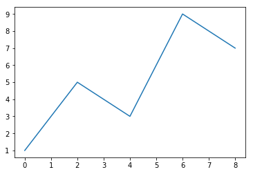
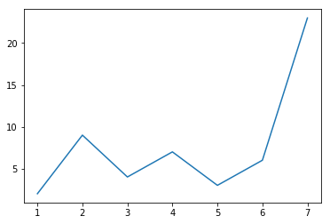
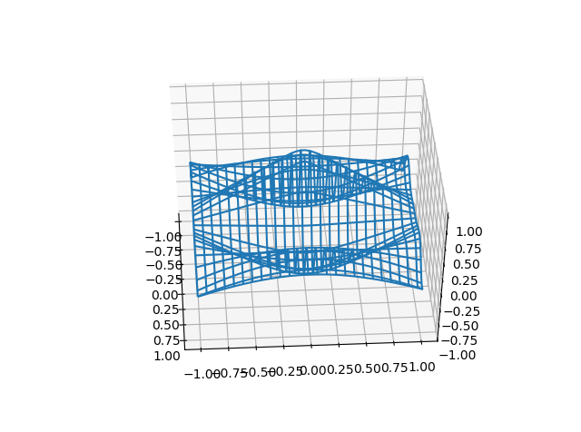
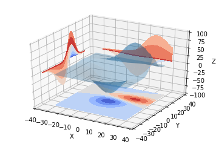
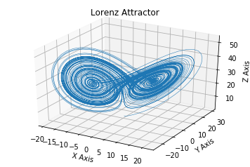

---------

绘图库-Matplotlib
====

### 为什么要绘图？

#### 一个图表数据的直观分析：

可视化前

可视化后

绘制之前先重启编辑器，清除之前执行的代码结果


* Matplotlib是最流行的Python二维底层绘图库，主要用做数据可视化图表绘制
* 名字取材于MATLAB，模仿MATLAB构建
* 支持所有2D作图和部分3D作图
* 生成印刷质量图像
* 官方绘图示例展示：http://matplotlib.org/gallery.html
    * 本地版：Matplotlib图例


## 绘制我的第一个图表

```python
# 载入Matplotlib的pyplot子库
import matplotlib.pyplot as plt 
```


```python
plt.plot(
    [0,2,4,6,8],  # X轴坐标值
    [1,5,3,9,7],  # Y轴坐标值
) 

plt.show()  # 显示图像
```





数据


```python
x = [1,2,3,4,5,6,7]
y = [2,9,4,7,3,6,23]
x,y
```


    ([1, 2, 3, 4, 5, 6, 7], [2, 9, 4, 7, 3, 6, 23])


绘图


```python
plt.plot(x,y)
```


    [<matplotlib.lines.Line2D at 0x7a15748>]





```python
# 旧版的Ipython 绘图后需要手动显示图像
plt.plot(x,y)
plt.show()   #显示图像
```


绘图体验


```python
"""
==========================
Rotating 3D wireframe plot
==========================

A very simple 'animation' of a 3D plot.  See also rotate_axes3d_demo.
"""

from __future__ import print_function

from mpl_toolkits.mplot3d import axes3d
import matplotlib.pyplot as plt
import numpy as np
import time
```


```python
%matplotlib qt5
```


```python

def generate(X, Y, phi):
    '''
    Generates Z data for the points in the X, Y meshgrid and parameter phi.
    '''
    R = 1 - np.sqrt(X**2 + Y**2)
    return np.cos(2 * np.pi * X + phi) * R


fig = plt.figure()
ax = fig.add_subplot(111, projection='3d')

# Make the X, Y meshgrid.
xs = np.linspace(-1, 1, 50)
ys = np.linspace(-1, 1, 50)
X, Y = np.meshgrid(xs, ys)

# Set the z axis limits so they aren't recalculated each frame.
ax.set_zlim(-1, 1)

# Begin plotting.
wframe = None
tstart = time.time()
for phi in np.linspace(0, 180. / np.pi, 100):
    # If a line collection is already remove it before drawing.
    if wframe:
        ax.collections.remove(wframe)

    # Plot the new wireframe and pause briefly before continuing.
    Z = generate(X, Y, phi)
    wframe = ax.plot_wireframe(X, Y, Z, rstride=2, cstride=2)
    plt.pause(.001)

print('Average FPS: %f' % (100 / (time.time() - tstart)))

```




    Average FPS: 26.295642


```python
"""
.. versionadded:: 1.1.0
   This demo depends on new features added to contourf3d.
"""

from mpl_toolkits.mplot3d import axes3d
import matplotlib.pyplot as plt
from matplotlib import cm
```


```python
fig = plt.figure()
ax = fig.gca(projection='3d')
X, Y, Z = axes3d.get_test_data(0.05)
ax.plot_surface(X, Y, Z, rstride=8, cstride=8, alpha=0.3)
cset = ax.contourf(X, Y, Z, zdir='z', offset=-100, cmap=cm.coolwarm)
cset = ax.contourf(X, Y, Z, zdir='x', offset=-40, cmap=cm.coolwarm)
cset = ax.contourf(X, Y, Z, zdir='y', offset=40, cmap=cm.coolwarm)

ax.set_xlabel('X')
ax.set_xlim(-40, 40)
ax.set_ylabel('Y')
ax.set_ylim(-40, 40)
ax.set_zlabel('Z')
ax.set_zlim(-100, 100)

plt.show()
```





```python
# Plot of the Lorenz Attractor based on Edward Lorenz's 1963 "Deterministic
# Nonperiodic Flow" publication.
# http://journals.ametsoc.org/doi/abs/10.1175/1520-0469%281963%29020%3C0130%3ADNF%3E2.0.CO%3B2
#
# Note: Because this is a simple non-linear ODE, it would be more easily
#       done using SciPy's ode solver, but this approach depends only
#       upon NumPy.

import numpy as np
import matplotlib.pyplot as plt
from mpl_toolkits.mplot3d import Axes3D
```


```python
def lorenz(x, y, z, s=10, r=28, b=2.667):
    x_dot = s*(y - x)
    y_dot = r*x - y - x*z
    z_dot = x*y - b*z
    return x_dot, y_dot, z_dot


dt = 0.01
stepCnt = 10000

# Need one more for the initial values
xs = np.empty((stepCnt + 1,))
ys = np.empty((stepCnt + 1,))
zs = np.empty((stepCnt + 1,))

# Setting initial values
xs[0], ys[0], zs[0] = (0., 1., 1.05)

# Stepping through "time".
for i in range(stepCnt):
    # Derivatives of the X, Y, Z state
    x_dot, y_dot, z_dot = lorenz(xs[i], ys[i], zs[i])
    xs[i + 1] = xs[i] + (x_dot * dt)
    ys[i + 1] = ys[i] + (y_dot * dt)
    zs[i + 1] = zs[i] + (z_dot * dt)

fig = plt.figure()
ax = fig.gca(projection='3d')

ax.plot(xs, ys, zs, lw=0.5)
ax.set_xlabel("X Axis")
ax.set_ylabel("Y Axis")
ax.set_zlabel("Z Axis")
ax.set_title("Lorenz Attractor")

plt.show()
```




