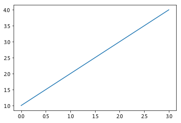
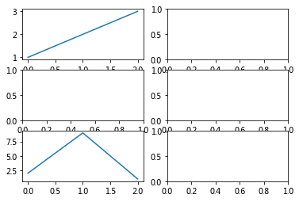

Matplotlib-绘图区域
===

---


```python
import numpy as np
import matplotlib.pyplot as plt
import pandas as pd

# plt.style.use('seaborn')
plt.rcParams['font.family'] = ['Arial Unicode MS', 'Microsoft Yahei', 'SimHei', 'sans-serif'] 
```

绘图，简写


```python
plt.plot([3, 9, 2, 4])
```


    [<matplotlib.lines.Line2D at 0x8b23160>]


等价于正常写法，面向过程(常用)


```python
plt.figure(1)  # 创建figure父窗口，默认编号为1
plt.subplot(111)  # 创建ax子窗口，默认：1行 1列 选中第1个
plt.plot([1,2,3])
```


    [<matplotlib.lines.Line2D at 0x8bbdef0>]


面向对象写法（了解），将窗口对象赋值给变量


```python
fig = plt.figure(2)  # 创建父对象
ax = fig.add_subplot(111)  # 创建子对象
ax.plot([1,2,3,4])  # 给子对象绘图

```


    [<matplotlib.lines.Line2D at 0x62feb70>]





```python
# 前两句合并
fig, ax = plt.subplots()
ax.plot([1,2,3,4])
```


    [<matplotlib.lines.Line2D at 0x63093c8>]


## 创建多个figure父对象


```python
plt.figure()  # 不写父对象号码，默认是1
plt.plot([1,2,3,4])

plt.figure(
    2,  # 图像编号，创建和选择图像使用
    figsize=(18, 5),  # 图片大小
    facecolor='#cccccc',  # 背景颜色
    dpi=300,  # 分辨率，电脑看72，打印300起
)
plt.plot([2,9,3])

plt.plot([3,12,1,5])  # 绘制到父对象2

plt.figure(1)
plt.plot([0,1,9])  # 绘制到父对象1


```


    [<matplotlib.lines.Line2D at 0x63191d0>]


## 创建多个ax子对象


```python
# 绘制3行2列共6个子图，当前绘制第1个(从左上角横排往右下角)
plt.subplot(321) # 如果是横纵行列都是个位数，可以去掉逗号
plt.plot([1,2,3])

plt.subplot(3, 2, 2)
plt.subplot(3, 2, 3)
plt.subplot(3, 2, 4)
plt.subplot(3, 2, 5)
plt.plot([2,9,1])

plt.subplot(3, 2, 6)


```


    <matplotlib.axes._subplots.AxesSubplot at 0x9f1ecf8>





## fig父对象和ax子对象结合


```python
# 图1
plt.figure(1)

plt.subplot(1,2,1)
plt.plot([1,2,3])

plt.subplot(1,2,2)
plt.plot([3,9,1])

# 图2
plt.figure(2, figsize=(18, 5))

plt.subplot(1,3,1)
plt.subplot(1,3,2)
plt.subplot(1,3,3)
plt.plot([2,-5,1])


```


    [<matplotlib.lines.Line2D at 0xa5f2f60>]


## 面向对象的fig、ax结合的简写 （了解）


```python
fig, ax = plt.subplots()  # 创建父图和子图
ax.plot([1,2,3])
ax.set_title('你好再见')

fig2, ax2 = plt.subplots(3, 2)  # 子图：3行2列
ax2
ax2[1, 1].plot([3,1,9])  # 索引坐标获取子图
ax2[1, 1].set_title('第2行第2列')

fig3, ax3 = plt.subplots(
    figsize=(12, 3),
    nrows=2,
    ncols=3,
    sharex=False,
    sharey=True,
)

ax3[0,0].plot([100, 200, 900])
ax3[0,1].plot([1,2,9])

```


    [<matplotlib.lines.Line2D at 0xc334be0>]


-----

复杂绘图区域：pyplot子绘图区域
===

设定网格,选中网格,确定选中行列区域数量,编号从0开始

常用于数据面板，仪表板


```python
plt.figure(figsize=(18, 10))

plt.subplot2grid(
    (4, 3),  # 4行3列
    (0, 0),  # 选中0行0列单元格
    colspan=3, # 合并3列
)
plt.plot([3,5,9,29,4])


plt.subplot2grid(
    (4, 3),
    (1, 0),
    colspan=2,
    rowspan=2,  # 合并2行
)
plt.bar([1,2,3,4,5],[3,9,4,1,8])

plt.subplot2grid(
    (4, 3),
    (1, 2),
    rowspan=2,   #合并2行
)
plt.scatter([1,2,3,4,5],[3,5,9,4,2])

plt.subplot2grid((4, 3),(3, 0))
plt.pie([1,2,3,4])
plt.axis('equal')

plt.subplot2grid((4, 3),(3, 1))
plt.pie([2,9,1,8])
plt.axis('equal')

plt.subplot2grid((4, 3),(3, 2))
plt.pie([1,2,9,8,5])
plt.axis('equal')

```


    (-1.1138856103720687,
     1.1006612298966945,
     -1.1153284973014734,
     1.11725100866372)


```python
plt.figure(figsize=(18, 10))

plt.subplot2grid(
    (4,3),
    (3,0),
    colspan=1,  #选中一个
)
#选中了什么都没画

plt.subplot2grid(
    (4,3),
    (0,0),
    colspan=1,  #选中一个
)
plt.pie([45,55])
plt.axis('equal')

plt.subplot2grid(
    (4,3),
    (0,1),
    colspan=2,  #合并2列
)

plt.subplot2grid(
    (4,3),
    (1,0),
    rowspan=2,  #合并2行
    colspan=3,   #合并3列
)

```


    <matplotlib.axes._subplots.AxesSubplot at 0xdd12278>


