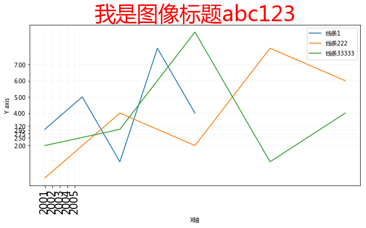
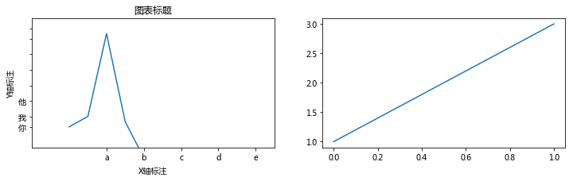

# Matplotlib-图像组件

-----


```python
import matplotlib.pyplot as plt
plt.rcParams['font.family'] = ['Arial Unicode MS', 'Microsoft Yahei', 'SimHei', 'sans-serif']
```


```python
plt.figure(figsize=(10, 5))

n1, = plt.plot(
    [1,2,3,4,5],
    [3,5,1,8,4],
    label='线条1',
)

n2, = plt.plot(
    [1,3,5,7,9],
    [0,4,2,8,6],
    label='线条222',
)

n3, = plt.plot(
    [1,3,5,7,9],
    [2,3,9,1,4],
    label='线条33333',
)

# 图像组件

# 标题
plt.title(
    '我是图像标题abc123',
    color='#ff0000',
    fontsize=36,
)

# 卓标准标注
plt.xlabel('X轴')
plt.ylabel('Y axis')

# 刻度和刻度标注
plt.yticks([2,2.5,2.75,2.95,3.2,4,5,6,7])
plt.xticks(
    [1,1.2,1.4,1.6,1.8],  # 坐标值
    [2001, 2002, 2003, 2004, 2005],  # 坐标值刻度标注
    rotation=90,  # 标注旋转角度
    fontsize=18,  # 字体大小
)

# 坐标范围,会和上面代码影响
#plt.axis([3,7, 2,5])  # x轴起始坐标，x轴结束坐标，y轴起始坐标，y轴结束坐标
# plt.xlim([-50, 50])  # x轴
# plt.ylim([-20, 20])  # y的


#图例
plt.legend()

# 图例位置可用参数：
# best 默认
# right
# center,center left,center right
# lower center,lower left,lower right
# upper center,upper left,upper right
plt.legend(
    handles=[n1, n2,n3],  # 给指定数据绘制图例
    loc='best',  # 图例位置
    frameon=True  # 有无边框
)

# 网格
plt.grid(linewidth=0.2, alpha=0.5)

# 保存图像
# plt.savefig('test')
plt.savefig(
    'test2.jpg',  # 图像路径
    dpi=300,  # 分辨率
    bbox_inches='tight'  # 剪除当前图表周围的空白部分
)

```





# 面向对象的组件书写（了解）


一般简单绘图使用面向过程写法，复杂绘图使用面向对象写法


```python
#创建父对象，图像宽高可选
fig = plt.figure(figsize = (12, 3))

#创建子对象，1行2 列，选中第1 个子图

ax2 = fig.add_subplot(122)
ax2.plot([1,3])

ax = fig.add_subplot(121)
ax.plot([1,3,19,2,-5])

# 图表标题
ax.set_title('图表标题')

# 坐标轴标注
ax.set_xlabel('X轴标注')
ax.set_ylabel('Y轴标注')

# 刻度设置和刻度标注
ax.set_xticks([2,4,6,8,10])  #x 轴刻度设置
ax.set_yticks([1,3,6,9,12,15,18,20])  # y轴刻度设置


ax.set_xticklabels(['a','b','c','d','e'])  # x轴刻度标注
ax.set_yticklabels(['你','我','他'])  # y轴刻度标注

# 坐标范围
ax.axis([-2,11,-3,22])  # X轴-2到11,Y轴-3到22
```


    [-2, 11, -3, 22]




