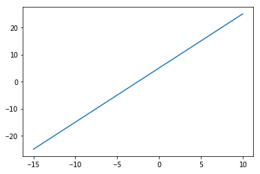
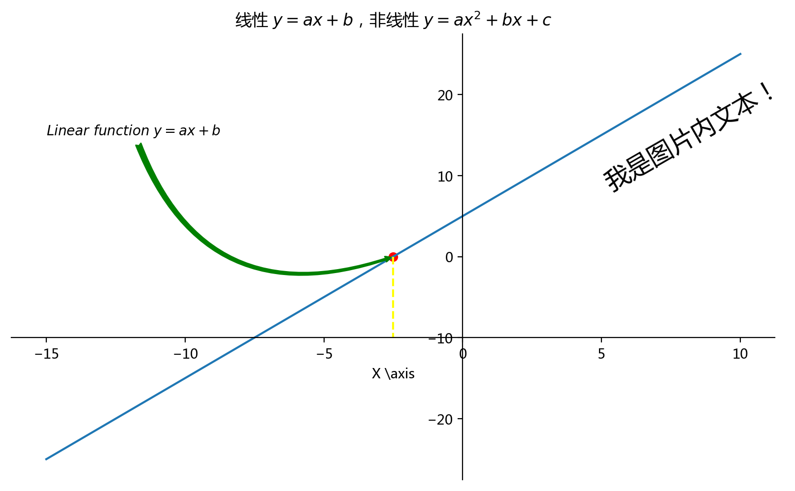
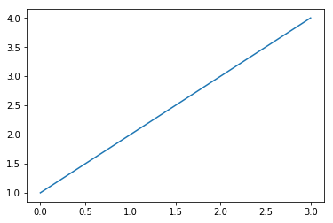

----

数学计算展示图像
=====


绘制一个简单线性函数图像


```python
import numpy as np
import matplotlib.pyplot as plt
import pandas as pd
plt.rcParams['font.family'] = ['Arial Unicode MS', 'Microsoft Yahei', 'SimHei', 'sans-serif']
```


```python
#数据
x = np.array([-15, -5, 0, 5, 8, 10])
# x = [-15, -5, 0, 5, 8, 10]
a = 2
b = 5

# 线性函数 y=ax+b
# y = []
# for i in x:
#     y.append(a * i + b )
    
    
    
y = a * x + b
y
    
    
    
# 绘制
plt.plot(x,y)
# plt.show()
```


    [<matplotlib.lines.Line2D at 0x4fb39b0>]





```python
# 绘制
plt.figure(figsize=(10,6),dpi=200)

plt.plot(x,y)

#组件

# 标题，可以使用$引入部分latex文本排版语法和公式
plt.title('线性 $y=ax+b$，非线性 $y=ax^{2}+bx+c$') 

# 坐标轴标注，当字符串里有反斜杠等转义特殊字符时,字符串前加`r`,表示显示原始字符串
plt.xlabel(r'X \axis') 

###############

# 操作轴线

# gca，get corrent axis，获取轴
ax = plt.gca()

#交换轴线
# ax.xaxis.set_ticks_position('top')
# ax.yaxis.set_ticks_position('right')

#去除上侧和右侧的空白轴线
ax.spines['right'].set_color('none')
ax.spines['top'].set_color('none')

#移位轴线
ax.spines['bottom'].set_position(['data', -10])
ax.spines['left'].set_position(['data', 0])

###########

#添加注解标记

#编标记点

x0 = -2.5
y0 = a * x0 + b
plt.scatter(x0,y0,color='red')

#标记线
plt.plot(
    [x0,x0],
    [y0,-10],
    linestyle = '--',
    color = 'yellow',
)

# 任意位置增加文本
plt.text(
    5,  #x轴 坐标
    20,  #y 轴坐标
    '我是图片内文本！',
    fontsize=18,
    rotation=30,
    
)
# 任意位置增加带箭头的注释文本
plt.annotate(
    r'$Linear\ function\ y=ax+b$',  #显示字符串，空格在$内不显示，用反斜杠转义
    xytext=(-15, 15),  # 文本位置
    xy=(x0, y0),  # 箭头指向位置
    
    arrowprops=dict(  # 字典类型，定义箭头样式
        arrowstyle = 'fancy',  # 箭头样式，例如 ->,<-,|-|,simple,fancy
        color = 'green',  # 箭头颜色
        connectionstyle="arc3,rad=.5",  # 箭头弧度
    ),
    # 下面两个参数将绝对坐标位置设为相对坐标
    
#     xycoords = 'data',  # 相对默认坐标系偏移   
#     textcoords = 'offset points',  # 相对坐标，相对箭头原点偏移

)
plt.show()
```





----

使用 Pycharm 或其他编辑器绘图


----

pylab，自动载入 numpy 和 Matplotlib


```python
%pylab inline
```

    Populating the interactive namespace from numpy and matplotlib
    


```python
plot([1,2,3,4])
```


    [<matplotlib.lines.Line2D at 0x7ab6320>]




