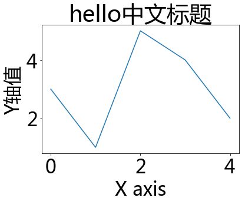

Matplotlib-绘图注意事项
===

---

# 图像在Retina屏幕中显示模糊

在Mac电脑绘图，Retina屏下图像显示很模糊，解决方法，Jupyter-notebook绘图前先执行下面魔术命令：

>%config InlineBackend.figure_format = 'retina'

---

# 中文显示乱码

Matplotlib默认不支持中文字符，因为默认设置字体是sans-serif英文字体不能显示汉字

解决方法：修改Matplotlib默认设置，加入中文字体支持

```python
import matplotlib.pyplot as plt
plt.rcParams['font.family'] = ['Arial Unicode MS', 'Microsoft Yahei', 'SimHei', 'sans-serif'] #  全局设置支持中文字体，默认 sans-serif
```

* Arial Unicode MS字体Windows(**注意非精简版才有**)／MacOS系统自带(支持中日韩英文字)，sans-serif字体为默认英文字体
* 某些中文字体在绘图时坐标轴负号会显示乱码，例如 SimHei 黑体
* 注意：由于Matplotlib只支持ttf字体，Ubuntu内的中文字体都为ttc格式，所以需要**安装一个中文ttf字体**：步骤如下：
    * 下载 `arial unicode ms.ttf` 字体到 /home 目录
    * 拷贝字体到 usr/share/fonts 下：
        * `sudo cp ~/arial\ unicode\ ms.ttf /usr/share/fonts/arial\ unicode\ ms.ttf`
    * 删除matplotlib字体缓存：`rm -rf ~/.cache/matplotlib/fontList.json`
    * 重启 Restart notebook Kernel，重新执行Matplotlib代码，会重新生成缓存


效果：
```python
plt.plot([3,1,5,4,2])

plt.title('hello中文标题')
plt.xlabel('X axis')
plt.ylabel('Y轴值')

plt.show()
```



---

图像美感问题
===

默认的Matplotlib生成图像不太好看，可在头部载库代码中加一句配置代码修改其样式

注意：修改样式代码应写在修改字体代码前，否则会覆盖字体设置导致中文出错

`plt.style.use('seaborn')`

----

图像输出方式
===

**注意：**

* b魔术命令后面不能加Python注释
* b切换输出方式时有可能需要重启Jupyter Notebook内核才能生效，例如qt5和notebook后端
* bGUI输出需要调用后端/事件挂钩，使用前**需安装后端库**，例如pyqt5（104M，Anaconda自带）
    * `pip install pyqt5`

```python
# 1:使用Plt.show()方式输出图像，所有Python环境通用
plt.show()

# 2：%matplotlib 魔术命令方式，仅用于IPython系列环境
# （如IPython命令行，或Jupyter Notebook）
# 不需plt.show()就可以输出图像

# 默认使用qt5后端，GUI界面显示图像，图像可操作
%matplotlib
%matplotlib qt5
%matplotlib auto

# 直接在页面内输出图像
%matplotlib inline

# Jupyter Notebook专用显示方式，在页面内插入GUI界面，图像可操作
# 子图代码要放到一个cell中，输出图像调整完成后需及时点击右上角*停止交互*，否则后面cell的图像也会画到同一个图像中
# （因为本质上图像都在同一个默认figure()中，而每次执行图形都会刷新重置）
%matplotlib notebook
```
例子：

```python
import matplotlib.pyplot as plt

# 常用，加plt.show()，默认图像网页输出
plt.plot([1,5,3,9,7])
plt.show()

# 不需要plt.show()，GUI输出
%matplotlib
plt.plot([1,5,3,9,7])

# 不需要plt.show()，网页输出
%matplotlib inline
plt.plot([1,5,3,9,7])

# 不需要plt.show()，notebook输出，切换可能需要重启notebook内核
%matplotlib notebook
plt.plot([1,5,3,9,7])

```


