Matplotlib常见图表
===

---

Matplotlib绘图一般用于数据可视化

* 常用的图表有：
* 折线图
* 散点图／气泡图
* 条形图／柱状图
* 饼图
* 直方图
* 箱线图
* 热力图

需要学习的不只是如何绘图，更要知道什么样的数据用什么图表展示效果最好


```python
#绘图前先载入库

import matplotlib.pyplot as plt
plt.rcParams['font.family'] = ['Arial Unicode MS', 'Microsoft Yahei', 'SimHei', 'sans-serif'] #  全局设置支持中文字体，默认 sans-serif
```

-----
# 折线图

折线图（坐标系图）

折线图用于显示随时间或有序类别的变化趋势， 主要看数据变化趋势


```python
plt.plot([3,5,7,1])  #只有一个数据，默认y轴数据（x轴自增）

```


    [<matplotlib.lines.Line2D at 0x4a8a668>]


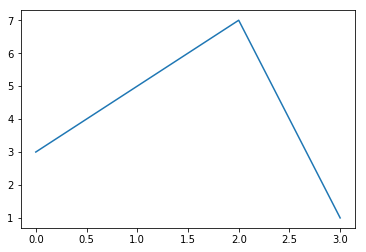


```python
plt.plot(
    [3,5,7,1,4],  # x轴
    [3,7,9,3,1],  #y 轴
    color='green',  #线条颜色
    linewidth=1,  #线条粗细
    linestyle='-.',#线条样式
    
    marker= '^',   #标记样式
    markersize = 10,  #标记尺寸
    markerfacecolor = 'r',
    alpha = 0.3,  #透明度
)
```


    [<matplotlib.lines.Line2D at 0x7eade48>]


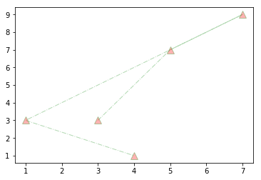


线条和标记节点格式字符
===

如果不设置颜色，系统默认会取一个不同颜色来区别线条 图像打印时，黑白打印机不能区分颜色,需要风格区分

颜色字符  |  风格字符  |  标记字符1 |  标记字符2
----- |  ----- |  ----- |  ----- | 
r 红色  |  - 实线  |  o 实心圈标记 | 1 下花三角标记
g 绿色  |  -- 虚线,破折线 |  . 点标记  |  2 上花三角标记
b 蓝色  |  -. 点划线 |  , 像素标记,极小的点 | 3 左花三角标记
w 白色  |  : 点虚线,虚线  |   v 倒三角标记 | 4 右花三角标记
      |   ''  留空或空格,无线条  |  ^ 上三角标记 | s 实心方形标记
c 青色   |    |  > 右三角标记 |  p 实心五角标记
m 洋红   |    |  < 左三角标记 |  h 竖六边形标记
y 黄色   |    |  * 星形标记 |  H 横六边形标记
k 黑色   |    |  + 十字标记 |  D 菱形标记
 |  |  x x标记  |  d 瘦菱形标记
#00ff00 16进制  |      |  `  | ` 垂直线标记 
0.8 灰度值字符串  |    

## 案例：绘制2017年7月国际外汇市场美元／人民币汇率走势图

时间	收盘价

2017年7月3日	6.8007

2017年7月4日	6.8007

2017年7月5日	6.8015

2017年7月6日	6.8015

2017年7月7日	6.8060

2017年7月10日	6.8036

2017年7月11日	6.8025

2017年7月12日	6.7877

2017年7月13日	6.7835

2017年7月14日	6.7758

2017年7月17日	6.7700

2017年7月18日	6.7463

2017年7月19日	6.7519

2017年7月20日	6.7595

2017年7月21日	6.7669

2017年7月24日	6.7511

2017年7月25日	6.7511

2017年7月26日	6.7539

2017年7月27日	6.7430

2017年7月28日	6.7374

2017年7月31日	6.7265


```python
plt.plot(
    range(3,24),  # x轴
    [6.800,6.800,6.801,6.801,6.8060,6.8036,6.8025,6.7877,6.7835,6.7758,6.7700,6.7463,6.7519,6.7595,6.7669,6.7511,6.7511,6.7539,6.7430,6.7374,6.7265],  #y 轴
    color='red',  #线条颜色
    linewidth=1,  #线条粗细
    linestyle='-.',#线条样式
    
    marker= 'o',   #标记样式
    markersize = 10,  #标记尺寸
    markerfacecolor = 'yellow',
    #alpha = 0.3,  #透明度
    
)
```


    [<matplotlib.lines.Line2D at 0x973e9b0>]


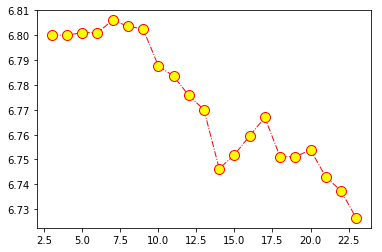


```python
#日期
date = [3,4,5,6,7,10,11,12,13,14,17,18,19,20,21,24,25,26,27,28,31]
#汇率
eurcny = [6.8007,6.8007,6.8015,6.8015,6.8060,6.8036,6.8025,6.7877,6.7835,6.7758,6.7700,6.7463,6.7519,6.7595,6.7669,6.7511,6.7511,6.7539,6.7430,6.7374,6.7265]
plt.plot(
    date,
    eurcny,
    
    color = 'g',
    linestyle = '-.',
    linewidth = 2,
    
    marker = 'o',
    markersize = 7,
    markerfacecolor = '#ff00ff'
    )
plt.plot(eurcny)
```


    [<matplotlib.lines.Line2D at 0x94e2a90>]


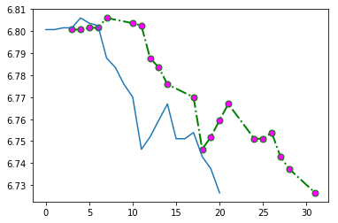

---

散点图／气泡图
===
散点图可以显示若干数据系列中各数值之间是否存在相关性

坐标系中,每个值用一个点（x轴，y轴确定）表示


```python
# 数据
x = [1,3,5,7,9,11,13,15,17]
y = [2,-5,19,3,5,8,12,6,1]

# 绘图
plt.scatter(x, y)

plt.show()
```


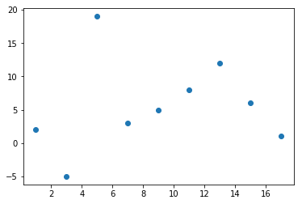


散点图常见样式


```python
plt.scatter(
    x, # x轴
    y, # y轴

    color='r', # 颜色
    marker='^', # 样式
    linewidth=20, # 线宽
    alpha=0.3, # 透明度
    # 散点大小，用于绘制气泡图，在散点图的基础上又增加了1个维度
    s = [10,30,50,70,100,200,300,400,500], # 单独设置大小
)
# 绘制多类散点
plt.scatter([1,3,5,7,9], [2,4,6,8,10])

plt.show()
```


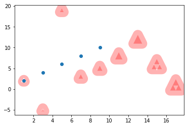


```python


```


## 案例：可视化居民年龄／收入和超市销售额的对应关系

* 数据：
    * 顾客年龄
    * 顾客年收入
    * 顾客年购物金额
* 需求
    * 分析出超市销售额和居民年龄、收入的关系
    * 解释关系产生的原因
    * 提出解决建议
    
* 分析出超市销售额和居民年龄、收入的关系

数据：

年龄  收入  销售额

34  350 123

40  450 114

37  169 135

30  189 139

44  183 117

36  80  121

32  166 133

26  120 140

32  75  133

36  40  133

数据


```python
#年龄
age = [34,40,37,30,44,36,32,26,32,36]
#收入
income = [350,450,169,189,183,80,166,120,75,40]
#销售额
sales = [123,114,135,139,117,121,133,140,133,133]


```

## 数据可视化

分析年龄和销售额的关系


```python
plt.scatter(
    age, # x轴
    sales, # y轴

    color='r', # 颜色
    marker='o', # 样式
    linewidth=2, # 线宽
    #alpha=0.3, # 透明度
    # 散点大小，用于绘制气泡图，在散点图的基础上又增加了1个维度
    #s = [10,30,50,70,100,200,300,400,500], # 单独设置大小
)
```


    <matplotlib.collections.PathCollection at 0x95ee2b0>


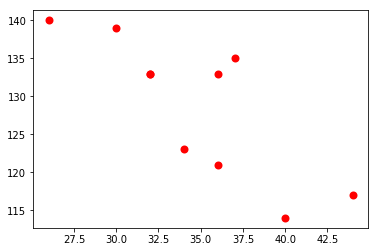


```python
plt.scatter(
    age, # x轴
    income, # y轴

    color='g', # 颜色
    marker='o', # 样式
    linewidth=2, # 线宽
    #alpha=0.3, # 透明度
    # 散点大小，用于绘制气泡图，在散点图的基础上又增加了1个维度
    #s = [10,30,50,70,100,200,300,400,500], # 单独设置大小
)
```


    <matplotlib.collections.PathCollection at 0x955c5c0>


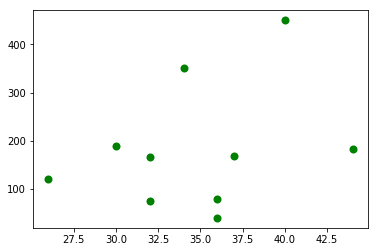


```python
plt.scatter(
    income, # x轴
    sales, # y轴

    color='g', # 颜色
    marker='o', # 样式
    linewidth=2, # 线宽
    #alpha=0.3, # 透明度
    # 散点大小，用于绘制气泡图，在散点图的基础上又增加了1个维度
    #s = [10,30,50,70,100,200,300,400,500], # 单独设置大小
)
```


    <matplotlib.collections.PathCollection at 0x956c278>


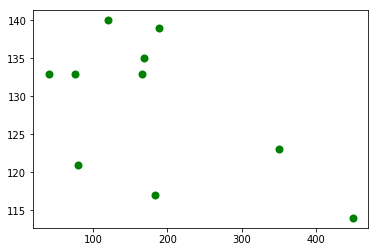


### 分析年龄和销售额的关系


```python
plt.scatter(age,sales)
```


    <matplotlib.collections.PathCollection at 0x9612da0>


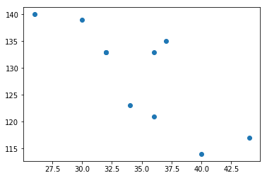


### 分析收入和销售额的关系


```python
plt.scatter(income,sales)
```


    <matplotlib.collections.PathCollection at 0xaec8438>


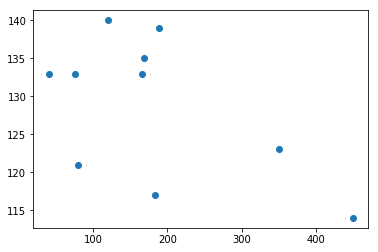


```python
# 将三列数据画入一张图

# plt.scatter(age, sales)
# plt.scatter(income, sales)
# 数据有数量级差异，不能直接绘制

# 散点图表显示三维数据
plt.scatter(
    age, 
    sales,
    s = income,
    alpha=0.5,
)
```


    <matplotlib.collections.PathCollection at 0xe4de908>


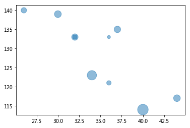

----

结论：
* 随着年龄的增加，销售额逐渐下降
* 随着收入的增加，销售额逐渐下降

解释：
* 老年人喜欢逛超市，买些折扣商品，或者菜品，老年人爱买打折降价商品，不愿多花钱

* 高收入人群有自己的高端购物渠道，在普通超市购物较少

改进建议：
* 营销针对人群，加大营销力度
    * 青年人，25-32岁之间的青年人
    * 年收入20万以下的人群


------


条形图／柱状图
====

* 条形图（横向）
* 柱状图（纵向）

条形图和柱状图用来比较各独立类别下的某单独  **数据的大小**

条形图


```python
x = [1,2,3,4,5]
y = [3,6,1,8,2]

# 柱状图，x轴为单个柱子，y轴为柱子高度，Width用于柱子粗细
plt.bar(
    x,
    y,
    width=0.5, # 横条粗细
    color='r',  #颜色
    alpha =0.6,  #透明度
)
plt.xticks(x,['a','b','c','小绿','小红'])
plt.yticks(y,['白雪原','小白','小黑','小绿','小红'])

```


    ([<matplotlib.axis.YTick at 0xc2e2e10>,
      <matplotlib.axis.YTick at 0xc2e2748>,
      <matplotlib.axis.YTick at 0xc2de710>,
      <matplotlib.axis.YTick at 0xc313208>,
      <matplotlib.axis.YTick at 0xc313710>],
     <a list of 5 Text yticklabel objects>)


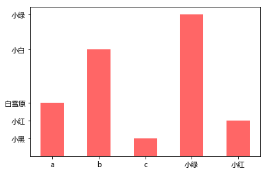


```python
plt.barh(
    x,
    y,
    
    height=0.5,  #粗细
    
)
```


    <BarContainer object of 5 artists>


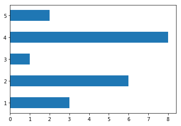


```python
# 条形图，注意x，y含义
plt.barh(
    x, # 横条离开x轴的距离
    y, # 横条长度
    
    height=0.5, # 横条粗细
    color='r',  #颜色
    alpha =0.6,  #透明度
)
# y轴标注
plt.yticks(x,['a','b','c','d','e'])
plt.show()
```


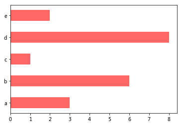


多个图表可绘制到一张图中


```python
plt.bar(x,y)
plt.barh(x,y)
plt.show()
```


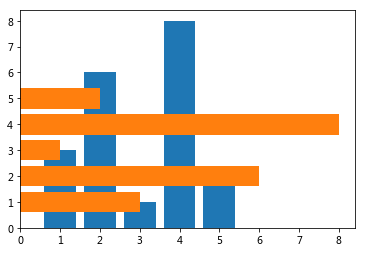


## 案例：某班级男生和女生各科成绩平均分数据可视化

学科 | 男生| 女生
----- | ---- | ----
语文 | 85.5 | 94
数学 | 91 | 82
英语 | 72 | 89.5
物理 | 59 | 62
化学 | 66 | 49


```python
#男生平均分，语文 数学 英语 物理 化学 
boy = [85.5,91,72,59,66]
#女生平均分
girl = [94,82,89.5,62,49]
#科目
course = [1,2,3,4,5]

```


```python
# 条形图，注意x，y含义
plt.figure(figsize=(14,6))
plt.bar(
    course,
    girl, # 横条长度
    
    width = 0.3, # 横条粗细
    color='red',  #颜色
    #alpha =0.6,  #透明度
)
course2 = [1.3,2.3,3.3,4.3,5.3]
plt.bar(
    course2,
    boy, # 横条长度
    
    width = 0.3, # 横条粗细
    color='green',  #颜色
    alpha =0.6,  #透明度
)
course3 = [1.15,2.15,3.15,4.15,5.15]
plt.xticks(course3,['语文','数学','英语','物理','化学'])
plt.title('12班级男生和女生各科成绩平均分数据可视化')
plt.grid(linewidth=0.3)

#进阶 拓展
#plt.text(3,40,'女生')  #图像内添加文字
for i,j in zip(course,girl):
#     print(i)
#     print(j)
    
    plt.text(
    i,
    j,
    '%.1f' % j,  # 数据转为一位小数
        ha='center', # 水平对齐
        va='bottom', # 垂直对齐
        alpha = 0.5,
    )
for i,j in zip(course2,boy):
#     print(i)
#     print(j)
    
    plt.text(
    i,
    j,
    '%.1f' % j,  # 数据转为一位小数
        ha='center', # 水平对齐
        va='bottom', # 垂直对齐
        alpha = 0.5,
    )
###############       

plt.show()
```


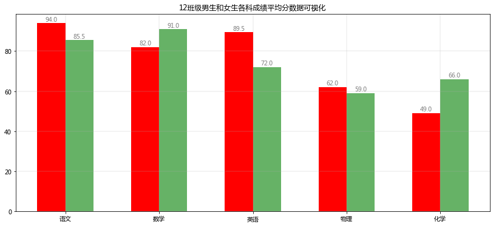


```python
x 
boy
list(zip(x,boy))
```


    [(1, 85.5), (2, 91), (3, 72), (4, 59), (5, 66)]

-----

饼图
===

饼图用于显示各项相对总和的百分比大小


```python
a = [1,2,3,4,5,6,7,8,9,0]

plt.pie(a)
plt.show()
```


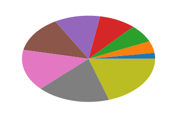


```python
a = range(1,20)

plt.pie(a)
plt.show()
```


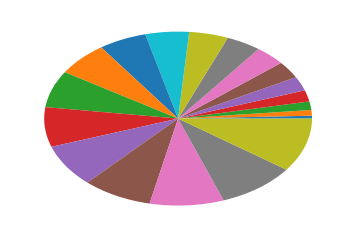


## 案例：2017年9国军费占比数据可视化


国家 | 军费占比
----| ----
美国 | 0.5548467
中国 | 0.14444868
印度 | 0.05094268
沙特 | 0.04846696
俄国 | 0.046753
日本 | 0.04418206
英国 | 0.04161112
德国 | 0.03799276
法国 | 0.03075605


```python
# 国名
mark = ['America','China','India','Saudi','Russia','Japan','Britain','Germany','France']
# 各国占9国总军费的比例
percent = [0.5548467,0.14444868,0.05094268,0.04846696,0.046753,0.04418206,0.04161112,0.03799276,0.03075605]

plt.figure(figsize=(12,12))
plt.pie(
    percent,   #百分比
    labels = mark, #名称
    autopct='%1.1f%%',  # 显示百分比方式
    startangle=-108,  # 饼图起始的角度,度数,默认0为右侧水平180度开始，逆时针旋转
    explode=[0,0.1,0,0,0,0,0,0,0],
    
)
plt.axis('equal')  #正圆形饼图,x/y轴尺寸相等.默认是扁图,
plt.show()
```


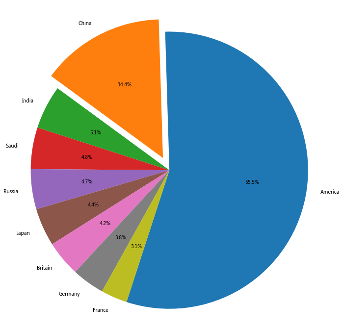

----

直方图
====

直方图是表达数据的分布情况的统计图表，一般用来表示同等区间内,某类数值出现的个数或频率(频率=出现次数/总数)

* x轴表示分组数据，y轴表示分布情况
* 从频率分布直方图可以直观估计出：
    * 众 数：频率分布直方图中最高矩形的底边中点的横坐标
    * 中位数：把频率分布直方图分成两个面积相等部分的平行于Y轴的直线横坐标
    
#### 直方图与柱状图的区别：

* 直方图：分区之间连续无间断，表示连续变量；值用矩形面积表示
* 条形图：各柱之间有间隙，表示孤立的、不连续分类变量；值用矩形长度表示

直方图适用于大于30条数据的分布情况查看

### 案例：1班和2班语文成绩统计数据可视化


```python
# 成绩数据
h1 = [ 88.2,  83.5,  68.8,  85.4,  78.6,  69.3,  60.6,  91.2,  52.7,
        85.9,  57.1,  68. ,  66.6,  78.2,  78.8,  85. ,  89.1,  74.4,
        93.6,  75.7,  54.3,  55. ,  90.9,  79.4,  94.4,  86.7,  82.4,
        76.7,  78.7,  72.3,  83.9,  78.6,  80. ,  70.5,  87.1,  80.3,
        87.9,  65.1,  67.4,  61.5,  49.7,  77.1,  91.4,  72. ,  61.5,
        73.9,  76.9,  88.2,  51.2,  53.9]

h2 = [ 79.5,  99. ,  80. ,  71. ,  79.2,  85.6,  79.2,  68.8,  68.7,
        96.5,  63.8,  81.8,  76.9,  80. ,  73.8,  77.1,  79.6,  76.8,
        73.9,  73.2,  66. ,  76.2,  76.4,  65.3,  75.2,  74.5,  87.5,
        78.4,  95. ,  72.6,  86. ,  71.7,  71. ,  87.7,  83.9,  76.8,
        72.3,  67. ,  67.8,  79.6,  81.9,  83. ,  65.6,  91.6,  75.5,
        77.6,  82.8,  87.5,  75.1,  79.4]
```


```python
# 1班成绩直方图
plt.hist(h1)

plt.show()
```


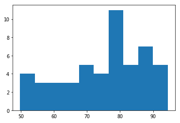


```python
plt.hist(
    h1,  # 直方图数据
    10,  # 直方个数
    density=0,  # 默认0 数据出现个数，1 出现个数归一化为出现的频率
    histtype='bar',  # 直方图样式：默认bar，stepfilled填充颜色，step不填充只有线条
    facecolor='b',  # 直方图颜色
    #edgecolor = 'r',  # 直方图边框颜色
    alpha=0.3,
)
plt.hist(h2,10,alpha=0.3)
```


    (array([ 5.,  3.,  8., 11.,  9.,  5.,  5.,  1.,  1.,  2.]),
     array([63.8 , 67.32, 70.84, 74.36, 77.88, 81.4 , 84.92, 88.44, 91.96,
            95.48, 99.  ]),
     <a list of 10 Patch objects>)


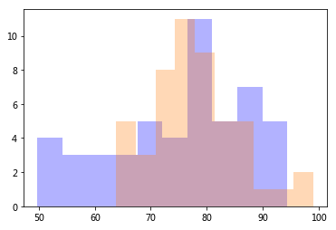

------

箱线图
====

箱线图又名盒须图，是一种用作显示一组数据离散情况的统计图表，常用作多组数据的综合统计比较

四分位数：

* 第一四分位数(Q1)，又称“较小四分位数”，等于该样本中所有数值由小到大排列后第25%的数字。
* 第二四分位数(Q2)，又称“中位数”，等于该样本中所有数值由小到大排列后第50%的数字。
* 第三四分位数(Q3)，又称“较大四分位数”，等于该样本中所有数值由小到大排列后第75%的数字。

箱线图主要包含5个统计量，从上到下，从高到低：

* 最大非异常值，上边线
* Q3，箱体上边缘上四分位数
* Q2，中位数线
* Q1，箱体下边缘下四分位数
* 最小非异常值，下边线

除了上面5个统计量，上下边缘外侧可能还有异常值

* Q3和Q1的差值，即四分位数差
* 大于Q3 1.5倍四分位数差的值，或者小于Q1 1.5倍四分位数差的值，划为异常值


```python
a = [15,5,9,22,4,-5,45,-22]

plt.boxplot(a)

plt.show()
```


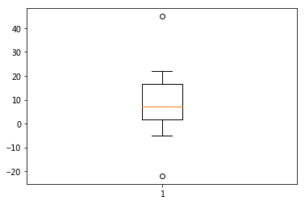


## 案例：某班级a/b/c三组学员数学成绩统计分析可视化

组别\编号 | 1 | 2 | 3 | 4 | 5 | 6 | 7 | 8
---- | ---- | ---- |---- | ---- | ---- |---- | ---- 
a | 42 | 55 | 79 | 68 | 15 | 98	 |  
b | 32 | 59 | 77 | 100 | 92 | 88 |  5 | 0
c | 92 | 98 | 78 | 65 | 97 | 100 |  0 | 


```python
a = [42,55,79,68,15,98]
b = [32,59,77,100,92,88,5,0]
c = [92,98,78,65,97,100,0]

```


```python

plt.figure(figsize=(12,6))
plt.boxplot(
    (a,c,b),# 数据
    labels = ('a','c','b'),
    showfliers = True,  # 是否显示异常值，默认显示
    whis = 1.5,  # 指定异常值参数：默认1.5倍四分位差
    showmeans = True, # 是否显示平均值，默认不显示
    meanline = True, # 是否用线标示平均值，默认用点

    widths = 0.5, # 柱子宽度

    vert = True, # 默认True纵向，False横向
    patch_artist = True,  # 是否填充颜色
    boxprops = {'facecolor':'#ffff00','color':'green'}, # 箱体样式
)
plt.show()
```


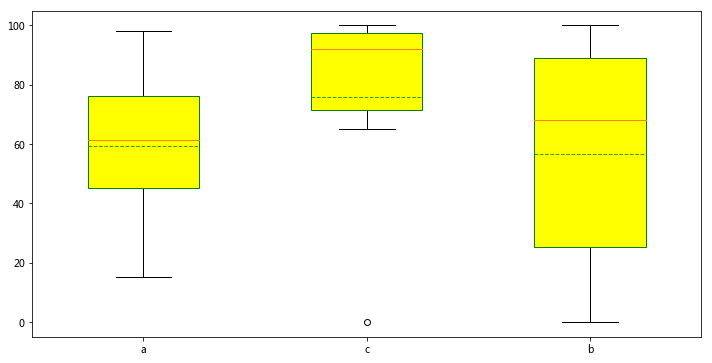


中位数对极端值不敏感

平均分对极端值非常敏感（去掉最高分最低分）


```python
单个数据查看数据分布和离散程度的图表

* 直方图是个单个数据，信息更丰富(数据不能太少，一般不能少于30条)
* 箱线图适合多个数据比较
```

## 热力图

热力图以二维形式展示数据的大小，主要用于数据的重要程度／相关度展示

```python
a = [
    [1, 2, 3],
    [4, 5, 6],
    [7, 8, 9]
]

plt.imshow(a)

plt.show()
```

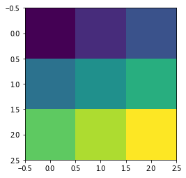


```python
plt.imshow(
    a,  # 数据
    cmap='gray',  # 配色，gray灰度
    origin='lower', # 水平翻转，默认upper,lower
    interpolation='lanczos', # 渲染，模糊
)

plt.colorbar() #侧栏

plt.show()
```

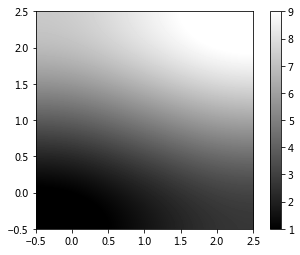

### 叠加图像到背景上

```python
img = plt.imread('xiangnong.jpg')  # 将图像转为数组
extent = (0, 25, 0, 25)  # 按 左右下上 位置拉伸填充图像
plt.imshow(img, extent=extent)

# 将新图叠加到上图之上
plt.scatter([12.5, 15.5],[19, 19.5], s=[100, 200], color='g', alpha=0.7)

plt.show()
```

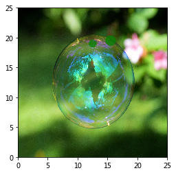


```python
plt.figure(figsize=(10,12))
img = plt.imread('06.jpg')  # 将图像转为数组
extent = (0, 200, 0, 200)  # 按 左右下上 位置拉伸填充图像
plt.imshow(img, extent=extent)

# 将新图叠加到上图之上
plt.scatter([110,100 ],[150,155], s=[90, 100], color='r', alpha=0.7)

plt.show()
```


