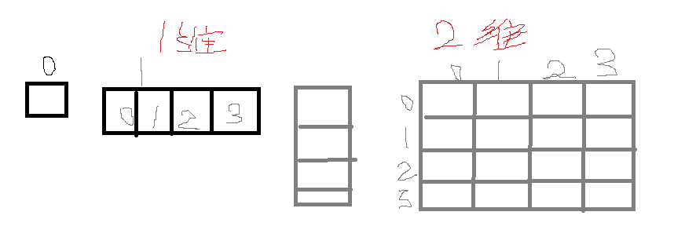

Series 
---

---

Pandas 的一维数据结构




```python
import numpy as np
import pandas as pd
```

# 创建

## 列表创建 Series


```python
#默认索引
a = pd.Series([3,4,5,6])
a 
```


    0    3
    1    4
    2    5
    3    6
    dtype: int64


```python
#自定义索引
b = pd.Series([3,4,5,6],index = ['a','b','c','d'])
b
```


    a    3
    b    4
    c    5
    d    6
    dtype: int64


```python
# 值可以存储不同类型

c = pd.Series(['小明',18,177,True],index = ['name','age','height','gender'])
c
```


    name        小明
    age         18
    height     177
    gender    True
    dtype: object


## 字典创建Series


```python
d = pd.Series({'name':'小明','age':18,'height':177,'gender':True})
d
```


    name        小明
    age         18
    height     177
    gender    True
    dtype: object


```python
# 覆盖自带的索引

d = pd.Series(
    {'name':'小明','age':18,'height':177,'gender':True},
    index = ['name','age','height','address']
)

d
```


    name        小明
    age         18
    height     177
    address    NaN
    dtype: object


# 其他方式创建Serise


```python
# 标量创建

pd.Series(10)
pd.Series(10,index=range(10))
```


    0    10
    1    10
    2    10
    3    10
    4    10
    5    10
    6    10
    7    10
    8    10
    9    10
    dtype: int64


```python
range(10)   #迭代器
```


    range(0, 10)


```python
list(range(10))
```


    [0, 1, 2, 3, 4, 5, 6, 7, 8, 9]


```python
pd.Series(range(10))
```


    0    0
    1    1
    2    2
    3    3
    4    4
    5    5
    6    6
    7    7
    8    8
    9    9
    dtype: int64


```python
# numpy 的arange 序列创建
np.arange(10)
np.arange(5,9)
np.arange(9,4,-1)
```


    array([9, 8, 7, 6, 5])


```python
pd.Series(np.arange(5), index=np.arange(9, 4, -1))
```


    9    0
    8    1
    7    2
    6    3
    5    4
    dtype: int32


---

查询
---

---


```python
class1 = pd.Series([100, 25, 59, 90, 61], index=['ming', 'hua', 'hong', 'huang', 'bai'])

class1
```


    ming     100
    hua       25
    hong      59
    huang     90
    bai       61
    dtype: int64


# 查询 键(index)和 值（values）


```python
#值 数组
class1.values

```


    array([100,  25,  59,  90,  61], dtype=int64)


```python
#键
class1.index
```


    Index(['ming', 'hua', 'hong', 'huang', 'bai'], dtype='object')


```python
#键的本质也是数组
class1.index.values
```


    array(['ming', 'hua', 'hong', 'huang', 'bai'], dtype=object)


```python
class1.values[2]
```


    59


# 索引查询


```python
class1
```


    ming     100
    hua       25
    hong      59
    huang     90
    bai       61
    dtype: int64


```python
#查询单值
#Series 有两套索引，默认索引，自定义索引。
class1['hong']
class1[2]
```


    59


```python
#查询多值
class1[[1,3,4]]
```


    hua      25
    huang    90
    bai      61
    dtype: int64


```python
class1[['hua','huang','bai']]
```


    hua      25
    huang    90
    bai      61
    dtype: int64


# class1[[1, 'hua', 'huang']] #错误，两套索引并存,但不能混用

# 切片查询


```python
class1
```


    ming     100
    hua       25
    hong      59
    huang     90
    bai       61
    dtype: int64


```python
class1[:3] #默认索引不包含结束值
```


    ming    100
    hua      25
    hong     59
    dtype: int64


```python
class1.index
```


    Index(['ming', 'hua', 'hong', 'huang', 'bai'], dtype='object')


```python
class1[2:]
```


    hong     59
    huang    90
    bai      61
    dtype: int64


```python
class1[:'huang'] #自定义索引，包含结束值
```


    ming     100
    hua       25
    hong      59
    huang     90
    dtype: int64


```python
class1['hong':]
```


    hong     59
    huang    90
    bai      61
    dtype: int64


```python
#步长
class1[::2]
```


    ming    100
    hong     59
    bai      61
    dtype: int64


```python
#倒排
class1[::-1]
```


    bai       61
    huang     90
    hong      59
    hua       25
    ming     100
    dtype: int64


### 向量化运算

#### 并行编程


```python
class1
```


    ming     100
    hua       25
    hong      59
    huang     90
    bai       61
    dtype: int64


```python
#原生python ，遍历序列运算
#速度慢，效率低
for i in class1:
    print(i)
    print(i+10)
```

    100
    110
    25
    35
    59
    69
    90
    100
    61
    71
    


```python
# 向量化运算
class1 + 10
```


    ming     110
    hua       35
    hong      69
    huang    100
    bai       71
    dtype: int64


```python
# 布尔运算
class1 < 60
```


    ming     False
    hua       True
    hong      True
    huang    False
    bai      False
    dtype: bool


```python
# 应用运算函数
np.median(class1)
```


    61.0


```python
#平均值
np.mean(class1)
class1.mean()
```


    67.0


### 类似Python字典的操作

* 保留字in操作
* 使用.get()方法


```python
class1
```


    ming     100
    hua       25
    hong      59
    huang     90
    bai       61
    dtype: int64


```python
'xiao' in class1 #判断一个值是否存在于一个键中，
'hua' in class1
```


    True


```python
class1.get('xiao',60) #判断一个值是否存在于一个键中，存在直接输出，不存在用默认值替换
```


    60


```python
class1.get('hua',60)
```


    25


U，update，修改
---

### read查询选中赋值即可修改


```python
class1
```


    ming     100
    hua       25
    hong      59
    huang     90
    bai       61
    dtype: int64


#### 修改值  ，values 


```python
class1[1]
class1[1] = 58
class1
```


    ming     100
    hua       58
    hong      59
    huang     90
    bai       61
    dtype: int64


```python
class1[['hua','hong']]
class1[['hua','hong']] = 61,62
class1
```


    ming     100
    hua       61
    hong      62
    huang     90
    bai       61
    dtype: int64


```python
class1['hua','hong'] = [50,51]
class1['hua','hong'] = 68,88  #单层括号也可以直接修改。

class1
```


    ming     100
    hua       68
    hong      88
    huang     90
    bai       61
    dtype: int64


##### 修改键，index


```python
class1
```


    ming     100
    hua       68
    hong      88
    huang     90
    bai       61
    dtype: int64


```python
class1.index
```


    Index(['ming', 'hua', 'hong', 'huang', 'bai'], dtype='object')


```python
class1.index = ['xiaoming','xiaohua','xiaohong','xiaohuang','xiaobai']
class1
```


    xiaoming     100
    xiaohua       68
    xiaohong      88
    xiaohuang     90
    xiaobai       61
    dtype: int64


```python
# 修改单独选中的索引值
# class1.index.values[0] = 'aa' #错误的修改方法，修改后索引不能调用
class1
```


    xiaoming     100
    xiaohua       68
    xiaohong      88
    xiaohuang     90
    xiaobai       61
    dtype: int64


```python
#复制副本而非引用视图，类似深拷贝
# class2 = class1.copy()
# class2.index.values[1] = 'bbb' #错误的修改方法，修改后索引不能调用
# class2
```


```python
class1.values[3] = 99

```


```python
class1
```


    xiaoming     100
    xiaohua       68
    xiaohong      88
    xiaohuang     99
    xiaobai       61
    dtype: int64


```python
class1.index.values[4]
```


    'xiaobai'


```python
# class1['aa']  #没有更改底层，会报错，索引不能调用
```


```python
# 正确的修改索引选中值的方法
class3 = class1.rename({'xiaoming':'hui','xiaobai':'hei'})   #修改了视图
class3
```


    hui          100
    xiaohua       68
    xiaohong      88
    xiaohuang     99
    hei           61
    dtype: int64


```python
class1  #class1 原 数据值没有修改
```


    xiaoming     100
    xiaohua       68
    xiaohong      88
    xiaohuang     99
    xiaobai       61
    dtype: int64


```python
class3['xiaohua'] 
```


    68


```python
class1
```


    xiaoming     100
    xiaohua       68
    xiaohong      88
    xiaohuang     99
    xiaobai       61
    dtype: int64


