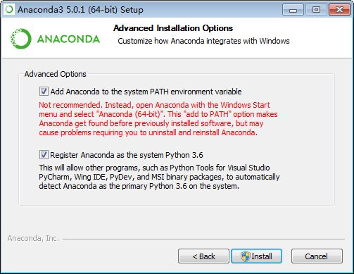
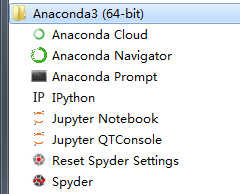

Anaconda
---
---


---

Anaconda 是什么？
---

Anaconda [,ænə'kɒndə] 水蟒

* Anaconda是一个起源于科学计算的Python发行版（软件）
* Python和Anaconda的关系 ≈ Linux和Ubuntu的关系
* Anaconda用于构建一个数据科学开发环境，它本身就构成一个数据科学生态圈
* Anaconda支持 Linux、MAC、Windows系统
* Anaconda内置了
    * Conda包和环境管理器
    * Python内核
    * IPython/Jupyter/Spyder等代码编辑器/IDE
    * Numpy/Matplotlib/Pandas等150多个常用的科学计算包(库)

---

Anaconda相比通用Python原生环境的优势
===

* 包管理功能：解决Python安装第三方库，在 不同环境/不同依赖库 下导致安装失败的问题
* 环境管理功能：类似Virtualenv，解决 多个单独项目环境/多版本Python 的并存、切换的问题
* 集中安装和配置好了大量Python科学计算相关类库，一键安装环境，直接可用，提高效率
`Continuum.io`同时推出一个最小化科学计算环境`Miniconda`，只包含cond管理器和Python内核，不包括开发工具和第三方库，小巧灵活，适合自定义环境

---

Anaconda下载和安装
---

* 官方源：https://www.continuum.io/downloads
* 国内源：https://mirrors.tuna.tsinghua.edu.cn/help/anaconda/
* 官方下载很慢，建议从国内源下载，
    * 下载地址：https://mirrors.tuna.tsinghua.edu.cn/anaconda/archive/
* 如在Windows下的Anaonda(Python3)，下载页面最下方的最新版，注意选择自己对应的：
    * 操作系统(MAC,Windows,Linux)，
    * 32位(x86)还是64位(x86 64)

**安装注意事项：**

* 操作系统以管理员身份安装软件（管理员用户名最好非中文且没有空格）
* Anaconda安装路径不能出现空格和中文字符
* 安装过程的选项
    * All Users
        * 选择安装的用户，一般选所有用户
    * Add Anaconda to the system PATH environment variable
        * 是否把Anaconda加入环境变量，一般选中，
        * 选中后可以在Windows自带控制台执行Anaconda命令
        * 如不选中只能在Aanconda自带控制台Prompt内执行命令，且某些模块执行可能出错
        * 选中安装后，卸载时需要注意Path是否清理
    * Register Anaconda as the system Python 3.6
        * 是否把Anaconda自带的python3.6作为系统默认Python环境，如果本操作系统没有其他Python环境，一般选中。
        * 如果系统内已经安装了Python环境，可以替换为Anaconda的Python


* Anaconda安装的Python本质和原生Python一样，
    * 只是把文件解压到一个目录，
    * 然后在系统环境变量添加了可执行文件的路径
    * （PATH的路径是相同命令下，前面优先级最高，覆盖后面）

* 如果你电脑在安装Anaconda之前已经安装了原生Python环境，又不想失效，
* 可以在安装Anaconda后将原生Python所在文件夹整个拷贝到Anaconda目录/envs下，
* 它就变成了一个Anaoncda的子环境，可以用conda环境管理器来正常管理和使用

Anaconda写入系统PATH的路径：

```
E:\Anaconda3;
E:\Anaconda3\Library\mingw-w64\bin;
E:\Anaconda3\Library\usr\bin;
E:\Anaconda3\Library\bin;
E:\Anaconda3\Scripts;
```

---

安装后，Shell输入下面命令查看成功与否

```
python -V

conda -V
```

---

## Anaconda快捷方式



如果找不到Anaconda Prompt控制台的快捷方式：

打开Aanconda Navigator - Environments - root - 点击右侧绿色三角，找到Anaconda控制台打开（未设置环境变量也可使用）

Anaconda Prompt控制台打开常用软件：

```
jupyter notebook
jupyter qtconsole
jupyter lab
spyder
```

---

Anaconda卸载和重装
---

**卸载：**

* 执行安装目录下的Uninstall-Anaconda.exe卸载程序
* 或：直接删除快捷方式和安装目录即可
    * 如需要可以清理下PATH环境变量：windows7-计算机右键-属性-高级系统设置-环境变量-系统变量-path
**重装：**卸载后，重新安装即可

---

Anaconda常用目录:
---

* **根目录**
    * python.exe：Python解释器，带控制台窗口
    * pythonw.exe：Python解释器，不带控制台窗口，用于GUI程序
    * Uninstall-Anaconda3.exe，卸载Anaconda
* **Scripts**：Anaconda自带的软件和工具，执行命令的工具都在这里
* **pkgs**: Anaconda安装的所有包，urls.txt内有所有包的URL列表
* **envs**：Anaconda的新建环境


