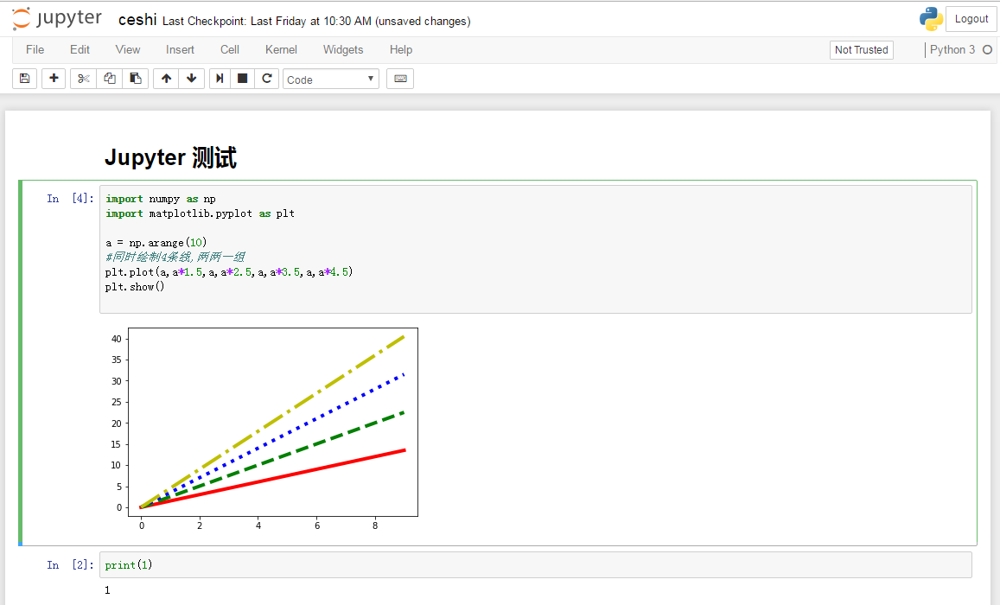
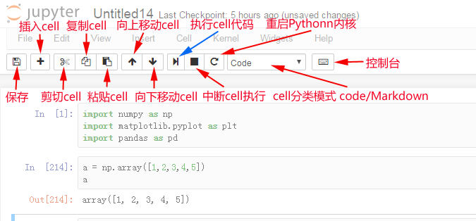

交互式编辑器 Jupyter notebook
---

---


---

为什么使用Jupyter Notebook？
---

一个完整的Jupyter Notebook数据报告演示

---

交互式计算
---

* 软件开发工程：工程/目标明确，按部就班
    * 需求分析，设计架构，开发模块，测试
* 探索/研究/学习：艺术/目标不明确，摸索前进
    * 目的是抽象的洞察目标，而不是机械的完成任务
    * 通过执行代码来理解问题
    * 迭代式地改进代码来改进解决方法
* 实时运行的代码、叙事性的文本和可视化被整合在一起，方便使用代码和数据来完成文档、讲述故事

* 科学计算领域通过 Matlab、IDL 和Mathematica等程序语言首先熟悉了人机交互式的计算方式，Jupyter则是最新的集大成者

交互式编程工具
---

* 操作系统自带Shell
* Python自带IDLE
* IPython，增强版Shell
    * **Jupyter Notebook**：网页版交互式代码笔记工具
    * JupyterLab：下一代Jupyter Notebook，模块化和可扩展接口，基于网页的IDE,测试版
    * nteract 客户端：桌面版Jupyter Notebook，基于Electron，测试版
    * JupyterHub：服务器端多人权限Jupyter Notebook系统
    * 其他编辑器和IDE对交互式编程的支持：如VScode/PyCharm

---

Jupyter Notebook
---

Jupyter项目是一个交互式的Python生态系统，最常用的是Jupyter Notebook

* Jupyter Notebook，原名IPython Notbook，是IPython的加强网页版
* 名字源自Julia、Python 和 R（数据科学的三种开源语言）
* 是一款程序员和科学工作者的编程/文档/笔记/展示软件
* .ipynb文件格式是用于计算型叙述的JSON文档格式的正式规范
交互式的编程环境，友好的界面，便于分享的文档格式，对排版语法、绘图、数学公式的支持，使她成为最流行的Python科学计算工具

* 使用场景：编程(探索、学习、数据方向)，文档，笔记，教学，演讲，数据分析报告等等
* Jupyter Notebook ≈ Python + MATLAB + Word + Excel + PowerPoint

---

打开方式
---

Jupyter Notebook是一个采用C/S架构的网站，通过Tornado建立WEB服务器端，使用浏览器作为客户端

### 1：命令行进入对应目录

用Windows控制台（windows键+R，输入cmd回车）或Anaconda Prompt进入想作为开发目录的磁盘盘符，进入文件夹，查看目录

```
e:
cd python
dir
```
### 2：输入命令
会自动弹出浏览器窗口打开notebook

```
jupyter notebook
# 或 jupyter-notebook
```

* 本地notebook的默认URL为：http://localhost:8888
* 如果想换其他浏览器打开，只输入本地域名端口回车打不开，会提示输入密码，需要拷贝命令窗口的完整URL到新浏览器才可以打开（带token参数的url,注意参数的空格去掉）
* 注意，不要直接打开notebook，想让notebook打开指定目录，只要进入此目录后执行命令即可


### 3：使用完成，关闭notebook服务

快捷键CTRL+C，（Linux/MACOS，5秒内输入y关闭服务，否则服务不会关闭需要再按 CTRL+C）

**注意：**

* (只关闭网页并没有关闭notebook服务，后台仍在运行
* 如果虚拟机或宿主机电脑开启某些WEB相关服务(如网络代理或去广告服务)，可能会导致Jupyter Notebook无法运行**

---

### 界面操作
notebook分为目录界面和内容界面

### 1：目录界面操作


* 新建notebook文档
    * notebook的文档格式是.ipynb，一种类JSON的文本格式
* 启动终端（如果服务端是Windows不支持）
* 导入导出文档（直接在系统目录内复制粘贴后点击右上角按钮刷新页面）
* Running-Shutdown，关闭文档

### 2：内容界面操作



---

## cell操作（重要）
**cell**：一对In Out会话被视作一个代码单元，称为cell

Jupyter支持两种模式：

* 编辑模式（Enter）
    * 命令模式下回车Enter或鼠标双击cell进入编辑模式
    * 可以操作cell内文本或代码，剪切／复制／粘贴移动等操作
* 命令模式（Esc）
    * 按Esc退出编辑，进入命令模式
    * 可以操作cell单元本身进行剪切／复制／粘贴／移动等操作
    * 好的编程习惯是：编辑内容完成后随手按ESC进入命令模式

## 工具栏操作cell



---

#### 快捷键操作Cell

Cell有两种工作模式：

* 编辑模式（Enter）
    * 命令模式下回车Enter或鼠标单击cell进入编辑模式
    * 可以操作cell内文本或代码，剪切／复制／粘贴移动等操作
* 命令模式（Esc）
    * 按Esc退出编辑，进入命令模式
    * 可以操作cell单元本身进行剪切／复制／粘贴／移动等操作

好的编程习惯是：编辑内容完成后随手按ESC进入命令模式

---

**两种模式都可使用的快捷键**

* Shift+Enter，执行本单元代码，并跳转到下一单元
* Ctrl+Enter，执行本单元代码，留在本单元

次要的快捷键：

cell行号前的 * ，表示代码正在运行

    命令模式：按ESC进入
    
        Y，cell切换到Code模式
        M，cell切换到Markdown模式
        A，在当前cell的上面添加cell
        B，在当前cell的下面添加cell
        双击D，删除当前cell
        Z，回退
        Shift+M，合并cell，向下合并
        L，为当前cell加上行号

    编辑模式：按Enter进入
    
        多光标操作：Ctrl键点击鼠标（Mac:CMD+点击鼠标）
        回退：Ctrl+Z（Mac:CMD+Z）
        重做：Ctrl+Y（Mac:CMD+Y)
        补全代码：变量、方法后跟Tab键
        Ctrl+Shift+减号，分割cell，在光标处
        为一行或多行代码添加/取消注释：Ctrl+/（Mac:CMD+/）
        屏蔽自动输出信息：可在最后一条语句之后加一个分号

---

应用：执行HTML/CSS/JavaScript
---

#### 在cell中以Markdown模式执行HTML/CSS/JS

（HTML支持，CSS只支持行内样式，JS不支持）

#### IPython专用魔术命令 %%HTML 载入HTML/CSS/JS

在cell中以原生HTML方式执行，HTML/CSS/JS全支持
* 优点：书写简单，推荐
* 缺点：非IPython环境不支持

```html
%%HTML

<a href="###" class="class3" style="color:#ff0;">aaaaaaaaaaa</a>
<a href="###" id="id3">bbbbbbbbbbbbbbbb</a>
<style>
.class3{background:#0f0;}
</style>
<script>
var ida3 = document.getElementById('id3');
ida3.style.background = '#f00';
</script>
```

####应用：Jupyter Notebook隐藏代码

用于ipynb文件和HTML文件，默认只显示解释和执行结果，点击按钮隐藏/显示代码，输出数据分析报告时用

```html
%%HTML

<script>
code_show=true;
function code_toggle() {
 if (code_show){
 $('div.input').hide();
 } else {
 $('div.input').show();
 }
 code_show = !code_show
}
$( document ).ready(code_toggle);
</script>
<form action="javascript:code_toggle()"><input type="submit" value="点击按钮显示/隐藏文档代码！"></form>
```

