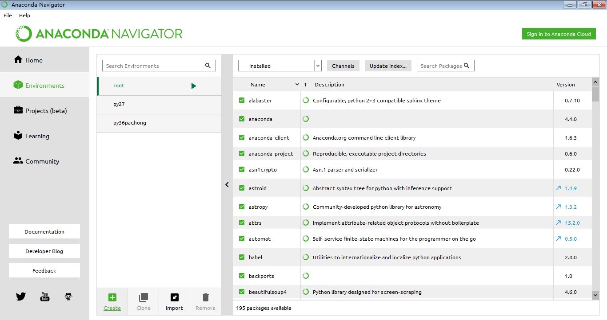

Python包和环境管理器
===

---

Python管理分为两大类：

---
原生Python环境：

* **包管理**
    * pip：Python自带的原生包管理器
* **环境管理**
    * virtualenv环境管理器：比较流行的第三方环境管理器
        * VirtualenvWrapper:Virtualenv辅助工具，简化隔离环境管理
    * Pyvenv：Python3.4以上官方原生完全支持(3.3新建环境无pip)，操作类似virtualenv，使用较少
##### pip包管理和Virtualenv环境管理见单独文档

---

Anaconda环境：

* 包管理
    * pip：Python自带的原生包管理器
    * conda：Anaconda环境的包管理器
* 环境管理
    * conda：Anaconda环境的环境管理器

-----

## conda包和环境管理器

conda是Anaconda自带的包和环境管理器

* 优点：
    * 可以同时管理Python环境和Python包
    * 兼容性更好，全自动解决带C扩展包和关联包的安装问题
* 缺点：
    * 新兴，资源和应用广泛度不如pip，某些冷门包没有支持资源
    * 网络连接较慢，不稳定
        * 国内镜像源仅有清华源（教育网，慢，网络出问题时往往和官方源一起打不开）
        * 新增了中科大源（速度还行，但软件和库更新不及时）

---

## conda环境管理器
```python
# 查看所有环境：
conda info --envs

# 创建新环境：（新环境名为 py27）
conda create --name py27 python=2

# 激活环境：（从其他环境切换至需要环境）
## Windows命令
activate py36
## Linux/MacOS命令
source activate py36
```

其他次要操作：

* 退出当前环境(退出可能导致Conda失效，建议只切换环境而不退出)：
    * Windows：`deactivate`
    * Linux/MAC：`source deactivate`
* 删除该环境：`conda remove --name py36 --all` ，或直接删除envs目录下的环境目录
* 克隆原有环境副本（复制一份py36并命名为py362）：`conda create --name py362 --clone py36`
* 导出环境(只导出配置文件)：`conda env export --name py27 > py27.yml`
* 导入环境(根据配置文件导入环境)：`conda env create -f py27.yml`

---

### conda包管理器

conda是Anaconda自带的包和环境管理器

```python
# 搜索包：(有时网络问题网页打开不完全，不影响)
# 去 https://anaconda.org/ 搜索包名，找到后进入内页，直接执行页面的包安装命令

# 安装包：
conda install 包名

# 更新包：
conda update 包名

# 删除包：
conda remove 包名

# 查看已安装包：
conda list
```
清除锁，如安装或更新包过程终止(失败)，重新执行如果出错执行：

`conda clean –lock`

---

## Python包安装不成功时怎么办？

**包安装失败的原因：**

* **网络问题：**（软件源网络连接不稳定，或被封无法访问）
    * 解决方式：切换为国内源地址
    * 翻墙
* **环境问题**
    * 某些包带有C扩展需要编译（Windows系统缺乏编译环境无法安装）
        * 解决方式：使用conda
        * 或搜索 离线whl包 安装
    * 某些包安装需要的关联包无法安装
        * 解决方式：使用conda
* **包兼容问题：**（某些包只支持特定Python版本或特定系统环境）
    * 解决方式：搜索 离线whl包 安装

#### Python包下载安装方式的选择：

* 首选用pip在线安装
    * 先用官方源，再用豆瓣源
    * **解决网络问题**
* pip安装失败时，使用conda安装
    * 先用官方源，再用中科大源，不行再走代理用官方源
    * **解决环境问题**
* pip在线、conda安装都不行时：
    * 搜索 whl包 使用pip离线方式安装
    * **解决包兼容问题**
* 如果还装不上，考虑换操作系统（Linux)

---

Conda 切换国内镜像源地址
===

Anaconda的镜像源地址在国外，由于网络问题，用Conda安装、更新包时有时很慢或安装失败，可以通过修改配置文件.condarc把镜像源改为国内地址（效果较pip修改源后差）。

特殊时期改了也没用

查看系统现在使用的镜像源
`conda info`

* conda中科大源（推荐，包更新不及时）：http://mirrors.ustc.edu.cn/help/anaconda.html

* conda清华源（不推荐，慢）：https://mirrors.tuna.tsinghua.edu.cn/help/anaconda/

命令行执行下面三条命令，会生成的配置文件.condarc，位置在：

* Linux/MAC： ~/.condarc

* Windows： C:\Users\当前用户名.condarc

```python
conda config --add channels https://mirrors.ustc.edu.cn/anaconda/pkgs/free/
conda config --add channels https://mirrors.ustc.edu.cn/anaconda/pkgs/main/
conda config --set show_channel_urls yes
```

很多Anaconda第三方源也很常用，可以执行下面命令都加入配置

```python
# Conda Forge
conda config --add channels https://mirrors.ustc.edu.cn/anaconda/cloud/conda-forge/

# msys2
conda config --add channels https://mirrors.ustc.edu.cn/anaconda/cloud/msys2/

# bioconda
conda config --add channels https://mirrors.ustc.edu.cn/anaconda/cloud/bioconda/

# menpo
conda config --add channels https://mirrors.ustc.edu.cn/anaconda/cloud/menpo/
```

* 通过命令 conda info 查看配置效果

* 如果配置后无效，查看.condarc文件，删除- defaults 行再试（本行为官方默认源地址）

* 如想取消配置，恢复默认设置，删除 .condarc 配置文件即可

----

图形界面:Anaconda Navigator
===

Anaconda Navigator图形化实现了部分常用conda命令行操作，使用比较方便



* 没有快捷方式的环境，例如MAC或Linux用户可直接通过导航打开相应工具
* 点击环境右侧的绿色三角，可以打开Aanconda自带控制台，无需设置环境变量就可执行命令

---

Pycharm使用Anaconda环境创建工程
===

Anaconda的Python环境下，使用Pycharm创建工程，需要注意**不能使用Anaconda自带的Python环境**，否则Pycharm每次打开工程都会自动扫描Anaconda目录下所有文件，非常慢。

两种创建工程的方法：

1. 创建工程时同时创建Python子环境
1. 先手动创建Python子环境，再创建工程时关联到子环境

方法1.1：使用默认Virtualenv创建工程(不推荐)

`界面操作：Create New Project - New environment using "Virtualenv"`

如果创建工程时使用默认Virtulenv，默认会在工程目录下创建一个venv目录存放本工程使用的Python子环境，

`注意，如果是Anaconda环境，每次打开工程时会自动扫描Anaconda目录（非常慢，不推荐，没有和系统环境完全剥离）`

方法1.2：使用默认Conda创建工程（推荐）

`界面操作：Create New Project - New environment using "Conda"`

先用命令创建Python子环境（建议Conda）

```
界面操作：Create New Project - Existing Interpreter - 右侧按钮 - Virtulenv/Conda/System...选择相应即可

注意：不要选择Anaconda的Python解释器，否则仍然会全文件夹扫描
```

#### 如果Pycharm已经创建的工程要切换Python解释器

```python
界面操作：file - settings - Project:xxx - Project Interpreter - 右侧列表指定
（如列表没有点击 show all - 加号 手动指定Python.exe）
```