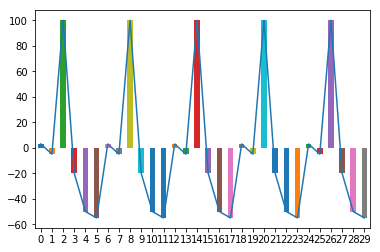
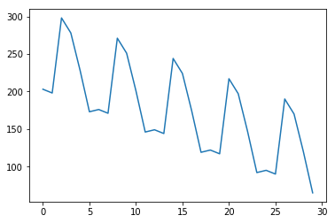
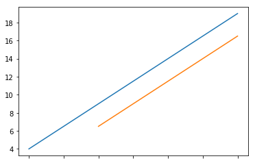

----

Pandas数据运算_ 拓展
===


```python
import numpy as np
import pandas as pd
import matplotlib.pyplot as plt
```


---

算数运算法则
===


根据行列索引,补齐运算(不同索引不运算,行列索引相同才运算)

补齐时默认填充NaN空值

二维和一维,一维和0维之间采用广播运算(低维元素与每一个高维元素运算)

采用 +-*/符号的二元运算会产生新的对象


```python

a = pd.DataFrame(np.arange(12).reshape(3, 4))
a
```


<div>
<style scoped>
    .dataframe tbody tr th:only-of-type {
        vertical-align: middle;
    }

    .dataframe tbody tr th {
        vertical-align: top;
    }

    .dataframe thead th {
        text-align: right;
    }
</style>
<table border="1" class="dataframe">
  <thead>
    <tr style="text-align: right;">
      <th></th>
      <th>0</th>
      <th>1</th>
      <th>2</th>
      <th>3</th>
    </tr>
  </thead>
  <tbody>
    <tr>
      <th>0</th>
      <td>0</td>
      <td>1</td>
      <td>2</td>
      <td>3</td>
    </tr>
    <tr>
      <th>1</th>
      <td>4</td>
      <td>5</td>
      <td>6</td>
      <td>7</td>
    </tr>
    <tr>
      <th>2</th>
      <td>8</td>
      <td>9</td>
      <td>10</td>
      <td>11</td>
    </tr>
  </tbody>
</table>
</div>


```python
b = pd.DataFrame(np.arange(20).reshape(4, 5))
b
```


<div>
<style scoped>
    .dataframe tbody tr th:only-of-type {
        vertical-align: middle;
    }

    .dataframe tbody tr th {
        vertical-align: top;
    }

    .dataframe thead th {
        text-align: right;
    }
</style>
<table border="1" class="dataframe">
  <thead>
    <tr style="text-align: right;">
      <th></th>
      <th>0</th>
      <th>1</th>
      <th>2</th>
      <th>3</th>
      <th>4</th>
    </tr>
  </thead>
  <tbody>
    <tr>
      <th>0</th>
      <td>0</td>
      <td>1</td>
      <td>2</td>
      <td>3</td>
      <td>4</td>
    </tr>
    <tr>
      <th>1</th>
      <td>5</td>
      <td>6</td>
      <td>7</td>
      <td>8</td>
      <td>9</td>
    </tr>
    <tr>
      <th>2</th>
      <td>10</td>
      <td>11</td>
      <td>12</td>
      <td>13</td>
      <td>14</td>
    </tr>
    <tr>
      <th>3</th>
      <td>15</td>
      <td>16</td>
      <td>17</td>
      <td>18</td>
      <td>19</td>
    </tr>
  </tbody>
</table>
</div>


```python
# 维度相同,行列内元素个数不同的运算,自动补齐,缺项NaN

a + b

```


<div>
<style scoped>
    .dataframe tbody tr th:only-of-type {
        vertical-align: middle;
    }

    .dataframe tbody tr th {
        vertical-align: top;
    }

    .dataframe thead th {
        text-align: right;
    }
</style>
<table border="1" class="dataframe">
  <thead>
    <tr style="text-align: right;">
      <th></th>
      <th>0</th>
      <th>1</th>
      <th>2</th>
      <th>3</th>
      <th>4</th>
    </tr>
  </thead>
  <tbody>
    <tr>
      <th>0</th>
      <td>0.0</td>
      <td>2.0</td>
      <td>4.0</td>
      <td>6.0</td>
      <td>NaN</td>
    </tr>
    <tr>
      <th>1</th>
      <td>9.0</td>
      <td>11.0</td>
      <td>13.0</td>
      <td>15.0</td>
      <td>NaN</td>
    </tr>
    <tr>
      <th>2</th>
      <td>18.0</td>
      <td>20.0</td>
      <td>22.0</td>
      <td>24.0</td>
      <td>NaN</td>
    </tr>
    <tr>
      <th>3</th>
      <td>NaN</td>
      <td>NaN</td>
      <td>NaN</td>
      <td>NaN</td>
      <td>NaN</td>
    </tr>
  </tbody>
</table>
</div>


```python
a * b
```


<div>
<style scoped>
    .dataframe tbody tr th:only-of-type {
        vertical-align: middle;
    }

    .dataframe tbody tr th {
        vertical-align: top;
    }

    .dataframe thead th {
        text-align: right;
    }
</style>
<table border="1" class="dataframe">
  <thead>
    <tr style="text-align: right;">
      <th></th>
      <th>0</th>
      <th>1</th>
      <th>2</th>
      <th>3</th>
      <th>4</th>
    </tr>
  </thead>
  <tbody>
    <tr>
      <th>0</th>
      <td>0.0</td>
      <td>1.0</td>
      <td>4.0</td>
      <td>9.0</td>
      <td>NaN</td>
    </tr>
    <tr>
      <th>1</th>
      <td>20.0</td>
      <td>30.0</td>
      <td>42.0</td>
      <td>56.0</td>
      <td>NaN</td>
    </tr>
    <tr>
      <th>2</th>
      <td>80.0</td>
      <td>99.0</td>
      <td>120.0</td>
      <td>143.0</td>
      <td>NaN</td>
    </tr>
    <tr>
      <th>3</th>
      <td>NaN</td>
      <td>NaN</td>
      <td>NaN</td>
      <td>NaN</td>
      <td>NaN</td>
    </tr>
  </tbody>
</table>
</div>


除了使用+-*/,也可使用方法形式,好处是可以增加可选参数
--

* .add(d,**argws) 类型间加法运算,可选参数
* .sub(d,**argws) 类型间减法运算,可选参数
* .mul(d,**argws) 类型间乘法运算,可选参数
* .div(d,**argws) 类型间除法运算,可选参数


```python
a.add(b)
```


<div>
<style scoped>
    .dataframe tbody tr th:only-of-type {
        vertical-align: middle;
    }

    .dataframe tbody tr th {
        vertical-align: top;
    }

    .dataframe thead th {
        text-align: right;
    }
</style>
<table border="1" class="dataframe">
  <thead>
    <tr style="text-align: right;">
      <th></th>
      <th>0</th>
      <th>1</th>
      <th>2</th>
      <th>3</th>
      <th>4</th>
    </tr>
  </thead>
  <tbody>
    <tr>
      <th>0</th>
      <td>0.0</td>
      <td>2.0</td>
      <td>4.0</td>
      <td>6.0</td>
      <td>NaN</td>
    </tr>
    <tr>
      <th>1</th>
      <td>9.0</td>
      <td>11.0</td>
      <td>13.0</td>
      <td>15.0</td>
      <td>NaN</td>
    </tr>
    <tr>
      <th>2</th>
      <td>18.0</td>
      <td>20.0</td>
      <td>22.0</td>
      <td>24.0</td>
      <td>NaN</td>
    </tr>
    <tr>
      <th>3</th>
      <td>NaN</td>
      <td>NaN</td>
      <td>NaN</td>
      <td>NaN</td>
      <td>NaN</td>
    </tr>
  </tbody>
</table>
</div>


```python
b.add(a, fill_value = 100) #将a和b之间的缺失元素用100补齐并参加与运算

# 补齐缺失值后，再次参加运算
```


<div>
<style scoped>
    .dataframe tbody tr th:only-of-type {
        vertical-align: middle;
    }

    .dataframe tbody tr th {
        vertical-align: top;
    }

    .dataframe thead th {
        text-align: right;
    }
</style>
<table border="1" class="dataframe">
  <thead>
    <tr style="text-align: right;">
      <th></th>
      <th>0</th>
      <th>1</th>
      <th>2</th>
      <th>3</th>
      <th>4</th>
    </tr>
  </thead>
  <tbody>
    <tr>
      <th>0</th>
      <td>0.0</td>
      <td>2.0</td>
      <td>4.0</td>
      <td>6.0</td>
      <td>104.0</td>
    </tr>
    <tr>
      <th>1</th>
      <td>9.0</td>
      <td>11.0</td>
      <td>13.0</td>
      <td>15.0</td>
      <td>109.0</td>
    </tr>
    <tr>
      <th>2</th>
      <td>18.0</td>
      <td>20.0</td>
      <td>22.0</td>
      <td>24.0</td>
      <td>114.0</td>
    </tr>
    <tr>
      <th>3</th>
      <td>115.0</td>
      <td>116.0</td>
      <td>117.0</td>
      <td>118.0</td>
      <td>119.0</td>
    </tr>
  </tbody>
</table>
</div>


```python
a.mul(b, fill_value = 0)
```


<div>
<style scoped>
    .dataframe tbody tr th:only-of-type {
        vertical-align: middle;
    }

    .dataframe tbody tr th {
        vertical-align: top;
    }

    .dataframe thead th {
        text-align: right;
    }
</style>
<table border="1" class="dataframe">
  <thead>
    <tr style="text-align: right;">
      <th></th>
      <th>0</th>
      <th>1</th>
      <th>2</th>
      <th>3</th>
      <th>4</th>
    </tr>
  </thead>
  <tbody>
    <tr>
      <th>0</th>
      <td>0.0</td>
      <td>1.0</td>
      <td>4.0</td>
      <td>9.0</td>
      <td>0.0</td>
    </tr>
    <tr>
      <th>1</th>
      <td>20.0</td>
      <td>30.0</td>
      <td>42.0</td>
      <td>56.0</td>
      <td>0.0</td>
    </tr>
    <tr>
      <th>2</th>
      <td>80.0</td>
      <td>99.0</td>
      <td>120.0</td>
      <td>143.0</td>
      <td>0.0</td>
    </tr>
    <tr>
      <th>3</th>
      <td>0.0</td>
      <td>0.0</td>
      <td>0.0</td>
      <td>0.0</td>
      <td>0.0</td>
    </tr>
  </tbody>
</table>
</div>


不同维度运算
===


```python
b

```


<div>
<style scoped>
    .dataframe tbody tr th:only-of-type {
        vertical-align: middle;
    }

    .dataframe tbody tr th {
        vertical-align: top;
    }

    .dataframe thead th {
        text-align: right;
    }
</style>
<table border="1" class="dataframe">
  <thead>
    <tr style="text-align: right;">
      <th></th>
      <th>0</th>
      <th>1</th>
      <th>2</th>
      <th>3</th>
      <th>4</th>
    </tr>
  </thead>
  <tbody>
    <tr>
      <th>0</th>
      <td>0</td>
      <td>1</td>
      <td>2</td>
      <td>3</td>
      <td>4</td>
    </tr>
    <tr>
      <th>1</th>
      <td>5</td>
      <td>6</td>
      <td>7</td>
      <td>8</td>
      <td>9</td>
    </tr>
    <tr>
      <th>2</th>
      <td>10</td>
      <td>11</td>
      <td>12</td>
      <td>13</td>
      <td>14</td>
    </tr>
    <tr>
      <th>3</th>
      <td>15</td>
      <td>16</td>
      <td>17</td>
      <td>18</td>
      <td>19</td>
    </tr>
  </tbody>
</table>
</div>


```python
c = pd.Series(np.arange(4))
c
```


    0    0
    1    1
    2    2
    3    3
    dtype: int32


```python
c + 100  # 1维和 0 维 数据运算
```


    0    100
    1    101
    2    102
    3    103
    dtype: int32


```python
b + c
```


<div>
<style scoped>
    .dataframe tbody tr th:only-of-type {
        vertical-align: middle;
    }

    .dataframe tbody tr th {
        vertical-align: top;
    }

    .dataframe thead th {
        text-align: right;
    }
</style>
<table border="1" class="dataframe">
  <thead>
    <tr style="text-align: right;">
      <th></th>
      <th>0</th>
      <th>1</th>
      <th>2</th>
      <th>3</th>
      <th>4</th>
    </tr>
  </thead>
  <tbody>
    <tr>
      <th>0</th>
      <td>0.0</td>
      <td>2.0</td>
      <td>4.0</td>
      <td>6.0</td>
      <td>NaN</td>
    </tr>
    <tr>
      <th>1</th>
      <td>5.0</td>
      <td>7.0</td>
      <td>9.0</td>
      <td>11.0</td>
      <td>NaN</td>
    </tr>
    <tr>
      <th>2</th>
      <td>10.0</td>
      <td>12.0</td>
      <td>14.0</td>
      <td>16.0</td>
      <td>NaN</td>
    </tr>
    <tr>
      <th>3</th>
      <td>15.0</td>
      <td>17.0</td>
      <td>19.0</td>
      <td>21.0</td>
      <td>NaN</td>
    </tr>
  </tbody>
</table>
</div>


```python
b.add(c)
```


<div>
<style scoped>
    .dataframe tbody tr th:only-of-type {
        vertical-align: middle;
    }

    .dataframe tbody tr th {
        vertical-align: top;
    }

    .dataframe thead th {
        text-align: right;
    }
</style>
<table border="1" class="dataframe">
  <thead>
    <tr style="text-align: right;">
      <th></th>
      <th>0</th>
      <th>1</th>
      <th>2</th>
      <th>3</th>
      <th>4</th>
    </tr>
  </thead>
  <tbody>
    <tr>
      <th>0</th>
      <td>0.0</td>
      <td>2.0</td>
      <td>4.0</td>
      <td>6.0</td>
      <td>NaN</td>
    </tr>
    <tr>
      <th>1</th>
      <td>5.0</td>
      <td>7.0</td>
      <td>9.0</td>
      <td>11.0</td>
      <td>NaN</td>
    </tr>
    <tr>
      <th>2</th>
      <td>10.0</td>
      <td>12.0</td>
      <td>14.0</td>
      <td>16.0</td>
      <td>NaN</td>
    </tr>
    <tr>
      <th>3</th>
      <td>15.0</td>
      <td>17.0</td>
      <td>19.0</td>
      <td>21.0</td>
      <td>NaN</td>
    </tr>
  </tbody>
</table>
</div>


默认按每行的列运算，axis=0按每列的行运算


```python
b.add(c,axis=0)   #默认按每行的列运算，axis=0按每列的行运算
```


<div>
<style scoped>
    .dataframe tbody tr th:only-of-type {
        vertical-align: middle;
    }

    .dataframe tbody tr th {
        vertical-align: top;
    }

    .dataframe thead th {
        text-align: right;
    }
</style>
<table border="1" class="dataframe">
  <thead>
    <tr style="text-align: right;">
      <th></th>
      <th>0</th>
      <th>1</th>
      <th>2</th>
      <th>3</th>
      <th>4</th>
    </tr>
  </thead>
  <tbody>
    <tr>
      <th>0</th>
      <td>0</td>
      <td>1</td>
      <td>2</td>
      <td>3</td>
      <td>4</td>
    </tr>
    <tr>
      <th>1</th>
      <td>6</td>
      <td>7</td>
      <td>8</td>
      <td>9</td>
      <td>10</td>
    </tr>
    <tr>
      <th>2</th>
      <td>12</td>
      <td>13</td>
      <td>14</td>
      <td>15</td>
      <td>16</td>
    </tr>
    <tr>
      <th>3</th>
      <td>18</td>
      <td>19</td>
      <td>20</td>
      <td>21</td>
      <td>22</td>
    </tr>
  </tbody>
</table>
</div>


----

比较运算法则
===

比较运算只能比较相同索引的元素,不进行补齐(尺寸不同会报错)

二维和一维/一维和零维间为广播运算

采用>< >= <= == !=等符号进行的二元运算产生布尔对象


```python
a

```


<div>
<style scoped>
    .dataframe tbody tr th:only-of-type {
        vertical-align: middle;
    }

    .dataframe tbody tr th {
        vertical-align: top;
    }

    .dataframe thead th {
        text-align: right;
    }
</style>
<table border="1" class="dataframe">
  <thead>
    <tr style="text-align: right;">
      <th></th>
      <th>0</th>
      <th>1</th>
      <th>2</th>
      <th>3</th>
    </tr>
  </thead>
  <tbody>
    <tr>
      <th>0</th>
      <td>0</td>
      <td>1</td>
      <td>2</td>
      <td>3</td>
    </tr>
    <tr>
      <th>1</th>
      <td>4</td>
      <td>5</td>
      <td>6</td>
      <td>7</td>
    </tr>
    <tr>
      <th>2</th>
      <td>8</td>
      <td>9</td>
      <td>10</td>
      <td>11</td>
    </tr>
  </tbody>
</table>
</div>


```python
d = pd.DataFrame(np.arange(12, 0, -1).reshape(3, 4))
d
```


<div>
<style scoped>
    .dataframe tbody tr th:only-of-type {
        vertical-align: middle;
    }

    .dataframe tbody tr th {
        vertical-align: top;
    }

    .dataframe thead th {
        text-align: right;
    }
</style>
<table border="1" class="dataframe">
  <thead>
    <tr style="text-align: right;">
      <th></th>
      <th>0</th>
      <th>1</th>
      <th>2</th>
      <th>3</th>
    </tr>
  </thead>
  <tbody>
    <tr>
      <th>0</th>
      <td>12</td>
      <td>11</td>
      <td>10</td>
      <td>9</td>
    </tr>
    <tr>
      <th>1</th>
      <td>8</td>
      <td>7</td>
      <td>6</td>
      <td>5</td>
    </tr>
    <tr>
      <th>2</th>
      <td>4</td>
      <td>3</td>
      <td>2</td>
      <td>1</td>
    </tr>
  </tbody>
</table>
</div>


```python
a > d
```


<div>
<style scoped>
    .dataframe tbody tr th:only-of-type {
        vertical-align: middle;
    }

    .dataframe tbody tr th {
        vertical-align: top;
    }

    .dataframe thead th {
        text-align: right;
    }
</style>
<table border="1" class="dataframe">
  <thead>
    <tr style="text-align: right;">
      <th></th>
      <th>0</th>
      <th>1</th>
      <th>2</th>
      <th>3</th>
    </tr>
  </thead>
  <tbody>
    <tr>
      <th>0</th>
      <td>False</td>
      <td>False</td>
      <td>False</td>
      <td>False</td>
    </tr>
    <tr>
      <th>1</th>
      <td>False</td>
      <td>False</td>
      <td>False</td>
      <td>True</td>
    </tr>
    <tr>
      <th>2</th>
      <td>True</td>
      <td>True</td>
      <td>True</td>
      <td>True</td>
    </tr>
  </tbody>
</table>
</div>


```python
a == d
```


<div>
<style scoped>
    .dataframe tbody tr th:only-of-type {
        vertical-align: middle;
    }

    .dataframe tbody tr th {
        vertical-align: top;
    }

    .dataframe thead th {
        text-align: right;
    }
</style>
<table border="1" class="dataframe">
  <thead>
    <tr style="text-align: right;">
      <th></th>
      <th>0</th>
      <th>1</th>
      <th>2</th>
      <th>3</th>
    </tr>
  </thead>
  <tbody>
    <tr>
      <th>0</th>
      <td>False</td>
      <td>False</td>
      <td>False</td>
      <td>False</td>
    </tr>
    <tr>
      <th>1</th>
      <td>False</td>
      <td>False</td>
      <td>True</td>
      <td>False</td>
    </tr>
    <tr>
      <th>2</th>
      <td>False</td>
      <td>False</td>
      <td>False</td>
      <td>False</td>
    </tr>
  </tbody>
</table>
</div>


```python
a < c
```


<div>
<style scoped>
    .dataframe tbody tr th:only-of-type {
        vertical-align: middle;
    }

    .dataframe tbody tr th {
        vertical-align: top;
    }

    .dataframe thead th {
        text-align: right;
    }
</style>
<table border="1" class="dataframe">
  <thead>
    <tr style="text-align: right;">
      <th></th>
      <th>0</th>
      <th>1</th>
      <th>2</th>
      <th>3</th>
    </tr>
  </thead>
  <tbody>
    <tr>
      <th>0</th>
      <td>False</td>
      <td>False</td>
      <td>False</td>
      <td>False</td>
    </tr>
    <tr>
      <th>1</th>
      <td>False</td>
      <td>False</td>
      <td>False</td>
      <td>False</td>
    </tr>
    <tr>
      <th>2</th>
      <td>False</td>
      <td>False</td>
      <td>False</td>
      <td>False</td>
    </tr>
  </tbody>
</table>
</div>


---

根据索引对齐操作
===

Series类型在运算中会自动对齐不同索引的数据

ndarray基于维度运算，Series基于索引运算，更精确不易出错


```python
e = pd.Series([1,2,3], ['c','d','e'])
e

```


    c    1
    d    2
    e    3
    dtype: int64


```python
f = pd.Series([9,8,7,6], ['a','b','c','d'])
f
```


    a    9
    b    8
    c    7
    d    6
    dtype: int64


#### 结果为两个值的并集,相加时索引对齐加值,索引不对齐的没值,加完也没值


```python
e + f   # 
```


    a    NaN
    b    NaN
    c    8.0
    d    8.0
    e    NaN
    dtype: float64


---

对齐
===


操作不同的维度需要先对齐,Pandas会沿着指定维度执行:

* 这里对齐维度指的是对齐index
* shift(2)指沿着时间轴将数据顺移两位
* 可用于金融数据分析中计算交易盈亏


```python
dates = pd.date_range('20130101', periods = 10)
g = pd.Series([1,3,5,np.nan,6,8,9,10,11,12], index = dates)
g
```


    2013-01-01     1.0
    2013-01-02     3.0
    2013-01-03     5.0
    2013-01-04     NaN
    2013-01-05     6.0
    2013-01-06     8.0
    2013-01-07     9.0
    2013-01-08    10.0
    2013-01-09    11.0
    2013-01-10    12.0
    Freq: D, dtype: float64


```python
g.shift(2)
```


    2013-01-01     NaN
    2013-01-02     NaN
    2013-01-03     1.0
    2013-01-04     3.0
    2013-01-05     5.0
    2013-01-06     NaN
    2013-01-07     6.0
    2013-01-08     8.0
    2013-01-09     9.0
    2013-01-10    10.0
    Freq: D, dtype: float64


模拟计算单笔交易盈利点数

2列，0列卖出价格，1列买入价格


```python
b2 = b.loc[:,:1]
b2
```


<div>
<style scoped>
    .dataframe tbody tr th:only-of-type {
        vertical-align: middle;
    }

    .dataframe tbody tr th {
        vertical-align: top;
    }

    .dataframe thead th {
        text-align: right;
    }
</style>
<table border="1" class="dataframe">
  <thead>
    <tr style="text-align: right;">
      <th></th>
      <th>0</th>
      <th>1</th>
    </tr>
  </thead>
  <tbody>
    <tr>
      <th>0</th>
      <td>0</td>
      <td>1</td>
    </tr>
    <tr>
      <th>1</th>
      <td>5</td>
      <td>6</td>
    </tr>
    <tr>
      <th>2</th>
      <td>10</td>
      <td>11</td>
    </tr>
    <tr>
      <th>3</th>
      <td>15</td>
      <td>16</td>
    </tr>
  </tbody>
</table>
</div>


```python
b2[0] - b2[1]
```


    0   -1
    1   -1
    2   -1
    3   -1
    dtype: int32


对应卖出和买入价格，计算每笔交易盈利


```python
b2[0] - b2[1].shift(1)
```


    0    NaN
    1    4.0
    2    4.0
    3    4.0
    dtype: float64


---

累计运算
===

* 对序列的前1-n个数累计运算
* 可减少for循环的使用

* 可用于金融数据分析中的计算累计盈亏

函数  解释

.cumsum()   依次给出前1/2/.../n个数的和

.cumprod()  依次给出前1/2/.../n个数的积

.cummax()   依次给出前1/2/.../n个数的最大值

.cummin()   依次给出前1/2/.../n个数的最小值


```python
h = pd.DataFrame(np.arange(20).reshape(4,5),index=['c','a','d','b'])
h
```


<div>
<style scoped>
    .dataframe tbody tr th:only-of-type {
        vertical-align: middle;
    }

    .dataframe tbody tr th {
        vertical-align: top;
    }

    .dataframe thead th {
        text-align: right;
    }
</style>
<table border="1" class="dataframe">
  <thead>
    <tr style="text-align: right;">
      <th></th>
      <th>0</th>
      <th>1</th>
      <th>2</th>
      <th>3</th>
      <th>4</th>
    </tr>
  </thead>
  <tbody>
    <tr>
      <th>c</th>
      <td>0</td>
      <td>1</td>
      <td>2</td>
      <td>3</td>
      <td>4</td>
    </tr>
    <tr>
      <th>a</th>
      <td>5</td>
      <td>6</td>
      <td>7</td>
      <td>8</td>
      <td>9</td>
    </tr>
    <tr>
      <th>d</th>
      <td>10</td>
      <td>11</td>
      <td>12</td>
      <td>13</td>
      <td>14</td>
    </tr>
    <tr>
      <th>b</th>
      <td>15</td>
      <td>16</td>
      <td>17</td>
      <td>18</td>
      <td>19</td>
    </tr>
  </tbody>
</table>
</div>


```python
h.sum()  # 求和，默认按行（每一列的每行数据）计算
```


    0    30
    1    34
    2    38
    3    42
    4    46
    dtype: int64


```python
h.sum(axis=1)  #按列运算，一行的每一列
```


    c    10
    a    35
    d    60
    b    85
    dtype: int64


```python
h.cumsum()  #累加
```


<div>
<style scoped>
    .dataframe tbody tr th:only-of-type {
        vertical-align: middle;
    }

    .dataframe tbody tr th {
        vertical-align: top;
    }

    .dataframe thead th {
        text-align: right;
    }
</style>
<table border="1" class="dataframe">
  <thead>
    <tr style="text-align: right;">
      <th></th>
      <th>0</th>
      <th>1</th>
      <th>2</th>
      <th>3</th>
      <th>4</th>
    </tr>
  </thead>
  <tbody>
    <tr>
      <th>c</th>
      <td>0</td>
      <td>1</td>
      <td>2</td>
      <td>3</td>
      <td>4</td>
    </tr>
    <tr>
      <th>a</th>
      <td>5</td>
      <td>7</td>
      <td>9</td>
      <td>11</td>
      <td>13</td>
    </tr>
    <tr>
      <th>d</th>
      <td>15</td>
      <td>18</td>
      <td>21</td>
      <td>24</td>
      <td>27</td>
    </tr>
    <tr>
      <th>b</th>
      <td>30</td>
      <td>34</td>
      <td>38</td>
      <td>42</td>
      <td>46</td>
    </tr>
  </tbody>
</table>
</div>


```python
h.cummin()
```


<div>
<style scoped>
    .dataframe tbody tr th:only-of-type {
        vertical-align: middle;
    }

    .dataframe tbody tr th {
        vertical-align: top;
    }

    .dataframe thead th {
        text-align: right;
    }
</style>
<table border="1" class="dataframe">
  <thead>
    <tr style="text-align: right;">
      <th></th>
      <th>0</th>
      <th>1</th>
      <th>2</th>
      <th>3</th>
      <th>4</th>
    </tr>
  </thead>
  <tbody>
    <tr>
      <th>c</th>
      <td>0</td>
      <td>1</td>
      <td>2</td>
      <td>3</td>
      <td>4</td>
    </tr>
    <tr>
      <th>a</th>
      <td>0</td>
      <td>1</td>
      <td>2</td>
      <td>3</td>
      <td>4</td>
    </tr>
    <tr>
      <th>d</th>
      <td>0</td>
      <td>1</td>
      <td>2</td>
      <td>3</td>
      <td>4</td>
    </tr>
    <tr>
      <th>b</th>
      <td>0</td>
      <td>1</td>
      <td>2</td>
      <td>3</td>
      <td>4</td>
    </tr>
  </tbody>
</table>
</div>


```python
h.cummax()
```


<div>
<style scoped>
    .dataframe tbody tr th:only-of-type {
        vertical-align: middle;
    }

    .dataframe tbody tr th {
        vertical-align: top;
    }

    .dataframe thead th {
        text-align: right;
    }
</style>
<table border="1" class="dataframe">
  <thead>
    <tr style="text-align: right;">
      <th></th>
      <th>0</th>
      <th>1</th>
      <th>2</th>
      <th>3</th>
      <th>4</th>
    </tr>
  </thead>
  <tbody>
    <tr>
      <th>c</th>
      <td>0</td>
      <td>1</td>
      <td>2</td>
      <td>3</td>
      <td>4</td>
    </tr>
    <tr>
      <th>a</th>
      <td>5</td>
      <td>6</td>
      <td>7</td>
      <td>8</td>
      <td>9</td>
    </tr>
    <tr>
      <th>d</th>
      <td>10</td>
      <td>11</td>
      <td>12</td>
      <td>13</td>
      <td>14</td>
    </tr>
    <tr>
      <th>b</th>
      <td>15</td>
      <td>16</td>
      <td>17</td>
      <td>18</td>
      <td>19</td>
    </tr>
  </tbody>
</table>
</div>


```python
h.cumprod()
```


<div>
<style scoped>
    .dataframe tbody tr th:only-of-type {
        vertical-align: middle;
    }

    .dataframe tbody tr th {
        vertical-align: top;
    }

    .dataframe thead th {
        text-align: right;
    }
</style>
<table border="1" class="dataframe">
  <thead>
    <tr style="text-align: right;">
      <th></th>
      <th>0</th>
      <th>1</th>
      <th>2</th>
      <th>3</th>
      <th>4</th>
    </tr>
  </thead>
  <tbody>
    <tr>
      <th>c</th>
      <td>0</td>
      <td>1</td>
      <td>2</td>
      <td>3</td>
      <td>4</td>
    </tr>
    <tr>
      <th>a</th>
      <td>0</td>
      <td>6</td>
      <td>14</td>
      <td>24</td>
      <td>36</td>
    </tr>
    <tr>
      <th>d</th>
      <td>0</td>
      <td>66</td>
      <td>168</td>
      <td>312</td>
      <td>504</td>
    </tr>
    <tr>
      <th>b</th>
      <td>0</td>
      <td>1056</td>
      <td>2856</td>
      <td>5616</td>
      <td>9576</td>
    </tr>
  </tbody>
</table>
</div>


**金融方向应用：计算累计盈亏**


```python
# 每笔交易盈亏

x = pd.Series([3, -5, 100, -20, -50, -55, 3, -5, 100, -20, -50, -55,3, -5, 100, -20, -50, -55,3, -5, 100, -20, -50, -55,3, -5, 100, -20, -50, -55,])
x
```


    0       3
    1      -5
    2     100
    3     -20
    4     -50
    5     -55
    6       3
    7      -5
    8     100
    9     -20
    10    -50
    11    -55
    12      3
    13     -5
    14    100
    15    -20
    16    -50
    17    -55
    18      3
    19     -5
    20    100
    21    -20
    22    -50
    23    -55
    24      3
    25     -5
    26    100
    27    -20
    28    -50
    29    -55
    dtype: int64


求总盈亏


```python
x.sum()
```


    -135


查看盈亏的趋势


```python
x.plot.bar()
x.plot()  #这是每笔盈亏图，不是历史总盈亏趋势图
```


    <matplotlib.axes._subplots.AxesSubplot at 0x66665f8>





```python
x.cumsum() + 200  #成本价 200
```


    0     203
    1     198
    2     298
    3     278
    4     228
    5     173
    6     176
    7     171
    8     271
    9     251
    10    201
    11    146
    12    149
    13    144
    14    244
    15    224
    16    174
    17    119
    18    122
    19    117
    20    217
    21    197
    22    147
    23     92
    24     95
    25     90
    26    190
    27    170
    28    120
    29     65
    dtype: int64


```python
(x.cumsum() + 200).plot()
```


    <matplotlib.axes._subplots.AxesSubplot at 0x91ac908>





滚动计算(窗口计算)
===

可用于金融数据分析中随时间移动指标计算


```python
h
```


<div>
<style scoped>
    .dataframe tbody tr th:only-of-type {
        vertical-align: middle;
    }

    .dataframe tbody tr th {
        vertical-align: top;
    }

    .dataframe thead th {
        text-align: right;
    }
</style>
<table border="1" class="dataframe">
  <thead>
    <tr style="text-align: right;">
      <th></th>
      <th>0</th>
      <th>1</th>
      <th>2</th>
      <th>3</th>
      <th>4</th>
    </tr>
  </thead>
  <tbody>
    <tr>
      <th>c</th>
      <td>0</td>
      <td>1</td>
      <td>2</td>
      <td>3</td>
      <td>4</td>
    </tr>
    <tr>
      <th>a</th>
      <td>5</td>
      <td>6</td>
      <td>7</td>
      <td>8</td>
      <td>9</td>
    </tr>
    <tr>
      <th>d</th>
      <td>10</td>
      <td>11</td>
      <td>12</td>
      <td>13</td>
      <td>14</td>
    </tr>
    <tr>
      <th>b</th>
      <td>15</td>
      <td>16</td>
      <td>17</td>
      <td>18</td>
      <td>19</td>
    </tr>
  </tbody>
</table>
</div>


```python
h.sum()
```


    0    30
    1    34
    2    38
    3    42
    4    46
    dtype: int64


```python
h.rolling(2).sum()
```


<div>
<style scoped>
    .dataframe tbody tr th:only-of-type {
        vertical-align: middle;
    }

    .dataframe tbody tr th {
        vertical-align: top;
    }

    .dataframe thead th {
        text-align: right;
    }
</style>
<table border="1" class="dataframe">
  <thead>
    <tr style="text-align: right;">
      <th></th>
      <th>0</th>
      <th>1</th>
      <th>2</th>
      <th>3</th>
      <th>4</th>
    </tr>
  </thead>
  <tbody>
    <tr>
      <th>c</th>
      <td>NaN</td>
      <td>NaN</td>
      <td>NaN</td>
      <td>NaN</td>
      <td>NaN</td>
    </tr>
    <tr>
      <th>a</th>
      <td>5.0</td>
      <td>7.0</td>
      <td>9.0</td>
      <td>11.0</td>
      <td>13.0</td>
    </tr>
    <tr>
      <th>d</th>
      <td>15.0</td>
      <td>17.0</td>
      <td>19.0</td>
      <td>21.0</td>
      <td>23.0</td>
    </tr>
    <tr>
      <th>b</th>
      <td>25.0</td>
      <td>27.0</td>
      <td>29.0</td>
      <td>31.0</td>
      <td>33.0</td>
    </tr>
  </tbody>
</table>
</div>


```python
h.rolling(3).sum()
# 每 3 项 求和， 那么前两项 的前面不够 3 项 求和，那么他们就为 NaN。
```


<div>
<style scoped>
    .dataframe tbody tr th:only-of-type {
        vertical-align: middle;
    }

    .dataframe tbody tr th {
        vertical-align: top;
    }

    .dataframe thead th {
        text-align: right;
    }
</style>
<table border="1" class="dataframe">
  <thead>
    <tr style="text-align: right;">
      <th></th>
      <th>0</th>
      <th>1</th>
      <th>2</th>
      <th>3</th>
      <th>4</th>
    </tr>
  </thead>
  <tbody>
    <tr>
      <th>c</th>
      <td>NaN</td>
      <td>NaN</td>
      <td>NaN</td>
      <td>NaN</td>
      <td>NaN</td>
    </tr>
    <tr>
      <th>a</th>
      <td>NaN</td>
      <td>NaN</td>
      <td>NaN</td>
      <td>NaN</td>
      <td>NaN</td>
    </tr>
    <tr>
      <th>d</th>
      <td>15.0</td>
      <td>18.0</td>
      <td>21.0</td>
      <td>24.0</td>
      <td>27.0</td>
    </tr>
    <tr>
      <th>b</th>
      <td>30.0</td>
      <td>33.0</td>
      <td>36.0</td>
      <td>39.0</td>
      <td>42.0</td>
    </tr>
  </tbody>
</table>
</div>


### MACD移动平均线


```python
h[4]
```


    c     4
    a     9
    d    14
    b    19
    Name: 4, dtype: int32


```python
h[4].rolling(2).mean()
```


    c     NaN
    a     6.5
    d    11.5
    b    16.5
    Name: 4, dtype: float64


```python
h[4].plot()  #原始价格线
h[4].rolling(2).mean().plot()  #移动平均线
```


    <matplotlib.axes._subplots.AxesSubplot at 0x9491dd8>




