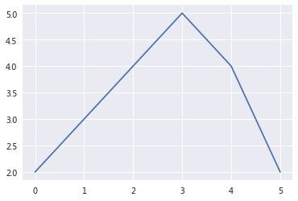
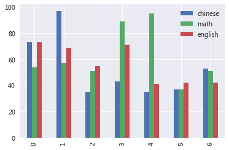
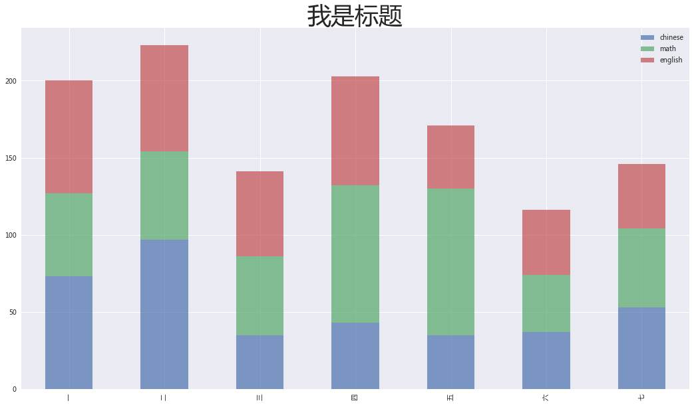

# 完整数据分析必备基本知识点汇集

---

## 载入和配置常用库


```python
import numpy as np
import matplotlib.pyplot as plt
import pandas as pd

plt.style.use('seaborn')
plt.rcParams['font.family'] = ['Arial Unicode MS', 'Microsoft Yahei', 'SimHei', 'sans-serif']
```


```python
plt.plot([2,3,4,5,4,2])
```


    [<matplotlib.lines.Line2D at 0x875f400>]





## 数据载入

常见数据形式

* CSV：.csv
* Excel：.xslx


```python
# pd.read_csv('aaa.csv')  # 载入csv
shop = pd.read_excel('shopmall.xlsx', None)  # 载入Excel文档，所有工作表，使用索引查询对应表
```


```python
# 输出前5行
shop['顾客信息'].head()
```


<div>
<style scoped>
    .dataframe tbody tr th:only-of-type {
        vertical-align: middle;
    }

    .dataframe tbody tr th {
        vertical-align: top;
    }

    .dataframe thead th {
        text-align: right;
    }
</style>
<table border="1" class="dataframe">
  <thead>
    <tr style="text-align: right;">
      <th></th>
      <th>客户ID</th>
      <th>登陆次数</th>
      <th>注册时间(距1970-1-1的秒数)</th>
      <th>本次购买时间(距1970-1-1的秒数)</th>
      <th>经验值</th>
      <th>订单数</th>
    </tr>
  </thead>
  <tbody>
    <tr>
      <th>0</th>
      <td>5245</td>
      <td>55</td>
      <td>1430413266</td>
      <td>1495339734</td>
      <td>206</td>
      <td>1</td>
    </tr>
    <tr>
      <th>1</th>
      <td>5254</td>
      <td>69</td>
      <td>1430413266</td>
      <td>1499041945</td>
      <td>428</td>
      <td>13</td>
    </tr>
    <tr>
      <th>2</th>
      <td>5286</td>
      <td>57</td>
      <td>1430413266</td>
      <td>1509936376</td>
      <td>280</td>
      <td>1</td>
    </tr>
    <tr>
      <th>3</th>
      <td>5292</td>
      <td>184</td>
      <td>1430413266</td>
      <td>1510135868</td>
      <td>643</td>
      <td>5</td>
    </tr>
    <tr>
      <th>4</th>
      <td>5474</td>
      <td>71</td>
      <td>1430413266</td>
      <td>1481185064</td>
      <td>61</td>
      <td>2</td>
    </tr>
  </tbody>
</table>
</div>


## 查询数据


```python
df = pd.DataFrame({
    'name': ['张三','李四','王五','李四','王五','王五','赵六'],
    'chinese':np.random.randint(35,100,7),
    'math':np.random.randint(35,100,7),
    'english':np.random.randint(35,100,7),
    'test': ['一','一','一','二','二','三','一']
})

df
```


<div>
<style scoped>
    .dataframe tbody tr th:only-of-type {
        vertical-align: middle;
    }

    .dataframe tbody tr th {
        vertical-align: top;
    }

    .dataframe thead th {
        text-align: right;
    }
</style>
<table border="1" class="dataframe">
  <thead>
    <tr style="text-align: right;">
      <th></th>
      <th>name</th>
      <th>chinese</th>
      <th>math</th>
      <th>english</th>
      <th>test</th>
    </tr>
  </thead>
  <tbody>
    <tr>
      <th>0</th>
      <td>张三</td>
      <td>73</td>
      <td>54</td>
      <td>73</td>
      <td>一</td>
    </tr>
    <tr>
      <th>1</th>
      <td>李四</td>
      <td>97</td>
      <td>57</td>
      <td>69</td>
      <td>一</td>
    </tr>
    <tr>
      <th>2</th>
      <td>王五</td>
      <td>35</td>
      <td>51</td>
      <td>55</td>
      <td>一</td>
    </tr>
    <tr>
      <th>3</th>
      <td>李四</td>
      <td>43</td>
      <td>89</td>
      <td>71</td>
      <td>二</td>
    </tr>
    <tr>
      <th>4</th>
      <td>王五</td>
      <td>35</td>
      <td>95</td>
      <td>41</td>
      <td>二</td>
    </tr>
    <tr>
      <th>5</th>
      <td>王五</td>
      <td>37</td>
      <td>37</td>
      <td>42</td>
      <td>三</td>
    </tr>
    <tr>
      <th>6</th>
      <td>赵六</td>
      <td>53</td>
      <td>51</td>
      <td>42</td>
      <td>一</td>
    </tr>
  </tbody>
</table>
</div>


检查数据

检查列缺失值，和列数据类型是否正常


```python
df.info()
```

    <class 'pandas.core.frame.DataFrame'>
    RangeIndex: 7 entries, 0 to 6
    Data columns (total 5 columns):
    name       7 non-null object
    chinese    7 non-null int32
    math       7 non-null int32
    english    7 non-null int32
    test       7 non-null object
    dtypes: int32(3), object(2)
    memory usage: 276.0+ bytes
    

###  快速统计
计算指标，发现异常值


```python
df.describe()
```


<div>
<style scoped>
    .dataframe tbody tr th:only-of-type {
        vertical-align: middle;
    }

    .dataframe tbody tr th {
        vertical-align: top;
    }

    .dataframe thead th {
        text-align: right;
    }
</style>
<table border="1" class="dataframe">
  <thead>
    <tr style="text-align: right;">
      <th></th>
      <th>chinese</th>
      <th>math</th>
      <th>english</th>
    </tr>
  </thead>
  <tbody>
    <tr>
      <th>count</th>
      <td>7.000000</td>
      <td>7.000000</td>
      <td>7.000000</td>
    </tr>
    <tr>
      <th>mean</th>
      <td>53.285714</td>
      <td>62.000000</td>
      <td>56.142857</td>
    </tr>
    <tr>
      <th>std</th>
      <td>23.591766</td>
      <td>21.501938</td>
      <td>14.724453</td>
    </tr>
    <tr>
      <th>min</th>
      <td>35.000000</td>
      <td>37.000000</td>
      <td>41.000000</td>
    </tr>
    <tr>
      <th>25%</th>
      <td>36.000000</td>
      <td>51.000000</td>
      <td>42.000000</td>
    </tr>
    <tr>
      <th>50%</th>
      <td>43.000000</td>
      <td>54.000000</td>
      <td>55.000000</td>
    </tr>
    <tr>
      <th>75%</th>
      <td>63.000000</td>
      <td>73.000000</td>
      <td>70.000000</td>
    </tr>
    <tr>
      <th>max</th>
      <td>97.000000</td>
      <td>95.000000</td>
      <td>73.000000</td>
    </tr>
  </tbody>
</table>
</div>


输出前几行


```python
#显示前几行
df.head()
```


<div>
<style scoped>
    .dataframe tbody tr th:only-of-type {
        vertical-align: middle;
    }

    .dataframe tbody tr th {
        vertical-align: top;
    }

    .dataframe thead th {
        text-align: right;
    }
</style>
<table border="1" class="dataframe">
  <thead>
    <tr style="text-align: right;">
      <th></th>
      <th>name</th>
      <th>chinese</th>
      <th>math</th>
      <th>english</th>
      <th>test</th>
    </tr>
  </thead>
  <tbody>
    <tr>
      <th>0</th>
      <td>张三</td>
      <td>73</td>
      <td>54</td>
      <td>73</td>
      <td>一</td>
    </tr>
    <tr>
      <th>1</th>
      <td>李四</td>
      <td>97</td>
      <td>57</td>
      <td>69</td>
      <td>一</td>
    </tr>
    <tr>
      <th>2</th>
      <td>王五</td>
      <td>35</td>
      <td>51</td>
      <td>55</td>
      <td>一</td>
    </tr>
    <tr>
      <th>3</th>
      <td>李四</td>
      <td>43</td>
      <td>89</td>
      <td>71</td>
      <td>二</td>
    </tr>
    <tr>
      <th>4</th>
      <td>王五</td>
      <td>35</td>
      <td>95</td>
      <td>41</td>
      <td>二</td>
    </tr>
  </tbody>
</table>
</div>


#### 查询表格索引和形状


```python
df.index  #行索引
```


    RangeIndex(start=0, stop=7, step=1)


```python
df.columns  #列索引
```


    Index(['name', 'chinese', 'math', 'english', 'test'], dtype='object')


```python
df.shape  #形状
```


    (7, 5)


### 索引查询和切片查询


```python
df['name']  #查询单列
```


    0    张三
    1    李四
    2    王五
    3    李四
    4    王五
    5    王五
    6    赵六
    Name: name, dtype: object


```python
df[['name','test']]  #查询多列
```


<div>
<style scoped>
    .dataframe tbody tr th:only-of-type {
        vertical-align: middle;
    }

    .dataframe tbody tr th {
        vertical-align: top;
    }

    .dataframe thead th {
        text-align: right;
    }
</style>
<table border="1" class="dataframe">
  <thead>
    <tr style="text-align: right;">
      <th></th>
      <th>name</th>
      <th>test</th>
    </tr>
  </thead>
  <tbody>
    <tr>
      <th>0</th>
      <td>张三</td>
      <td>一</td>
    </tr>
    <tr>
      <th>1</th>
      <td>李四</td>
      <td>一</td>
    </tr>
    <tr>
      <th>2</th>
      <td>王五</td>
      <td>一</td>
    </tr>
    <tr>
      <th>3</th>
      <td>李四</td>
      <td>二</td>
    </tr>
    <tr>
      <th>4</th>
      <td>王五</td>
      <td>二</td>
    </tr>
    <tr>
      <th>5</th>
      <td>王五</td>
      <td>三</td>
    </tr>
    <tr>
      <th>6</th>
      <td>赵六</td>
      <td>一</td>
    </tr>
  </tbody>
</table>
</div>


```python
# loc方式  索引查询  自定义索引
df.loc[:,'name']   #查询单列
```


    0    张三
    1    李四
    2    王五
    3    李四
    4    王五
    5    王五
    6    赵六
    Name: name, dtype: object


```python
df.loc[[0,2], ['name','test']]  #多行多列
```


<div>
<style scoped>
    .dataframe tbody tr th:only-of-type {
        vertical-align: middle;
    }

    .dataframe tbody tr th {
        vertical-align: top;
    }

    .dataframe thead th {
        text-align: right;
    }
</style>
<table border="1" class="dataframe">
  <thead>
    <tr style="text-align: right;">
      <th></th>
      <th>name</th>
      <th>test</th>
    </tr>
  </thead>
  <tbody>
    <tr>
      <th>0</th>
      <td>张三</td>
      <td>一</td>
    </tr>
    <tr>
      <th>2</th>
      <td>王五</td>
      <td>一</td>
    </tr>
  </tbody>
</table>
</div>


```python
df.loc[[2, 4], ['name','english']]   #间隔的多行多列，索引查询
```


<div>
<style scoped>
    .dataframe tbody tr th:only-of-type {
        vertical-align: middle;
    }

    .dataframe tbody tr th {
        vertical-align: top;
    }

    .dataframe thead th {
        text-align: right;
    }
</style>
<table border="1" class="dataframe">
  <thead>
    <tr style="text-align: right;">
      <th></th>
      <th>name</th>
      <th>english</th>
    </tr>
  </thead>
  <tbody>
    <tr>
      <th>2</th>
      <td>王五</td>
      <td>55</td>
    </tr>
    <tr>
      <th>4</th>
      <td>王五</td>
      <td>41</td>
    </tr>
  </tbody>
</table>
</div>


```python
# 切片查询

df.loc[1:3,'name':'math']  #连续的多行多列的切片查询
```


<div>
<style scoped>
    .dataframe tbody tr th:only-of-type {
        vertical-align: middle;
    }

    .dataframe tbody tr th {
        vertical-align: top;
    }

    .dataframe thead th {
        text-align: right;
    }
</style>
<table border="1" class="dataframe">
  <thead>
    <tr style="text-align: right;">
      <th></th>
      <th>name</th>
      <th>chinese</th>
      <th>math</th>
    </tr>
  </thead>
  <tbody>
    <tr>
      <th>1</th>
      <td>李四</td>
      <td>97</td>
      <td>57</td>
    </tr>
    <tr>
      <th>2</th>
      <td>王五</td>
      <td>35</td>
      <td>51</td>
    </tr>
    <tr>
      <th>3</th>
      <td>李四</td>
      <td>43</td>
      <td>89</td>
    </tr>
  </tbody>
</table>
</div>


布尔查询

查询所有语文成绩及格同学的信息


```python
df
```


<div>
<style scoped>
    .dataframe tbody tr th:only-of-type {
        vertical-align: middle;
    }

    .dataframe tbody tr th {
        vertical-align: top;
    }

    .dataframe thead th {
        text-align: right;
    }
</style>
<table border="1" class="dataframe">
  <thead>
    <tr style="text-align: right;">
      <th></th>
      <th>name</th>
      <th>chinese</th>
      <th>math</th>
      <th>english</th>
      <th>test</th>
    </tr>
  </thead>
  <tbody>
    <tr>
      <th>0</th>
      <td>张三</td>
      <td>73</td>
      <td>54</td>
      <td>73</td>
      <td>一</td>
    </tr>
    <tr>
      <th>1</th>
      <td>李四</td>
      <td>97</td>
      <td>57</td>
      <td>69</td>
      <td>一</td>
    </tr>
    <tr>
      <th>2</th>
      <td>王五</td>
      <td>35</td>
      <td>51</td>
      <td>55</td>
      <td>一</td>
    </tr>
    <tr>
      <th>3</th>
      <td>李四</td>
      <td>43</td>
      <td>89</td>
      <td>71</td>
      <td>二</td>
    </tr>
    <tr>
      <th>4</th>
      <td>王五</td>
      <td>35</td>
      <td>95</td>
      <td>41</td>
      <td>二</td>
    </tr>
    <tr>
      <th>5</th>
      <td>王五</td>
      <td>37</td>
      <td>37</td>
      <td>42</td>
      <td>三</td>
    </tr>
    <tr>
      <th>6</th>
      <td>赵六</td>
      <td>53</td>
      <td>51</td>
      <td>42</td>
      <td>一</td>
    </tr>
  </tbody>
</table>
</div>


```python
df['chinese'] >= 60
```


    0     True
    1     True
    2    False
    3    False
    4    False
    5    False
    6    False
    Name: chinese, dtype: bool


```python
df[df['chinese'] >= 60]
```


<div>
<style scoped>
    .dataframe tbody tr th:only-of-type {
        vertical-align: middle;
    }

    .dataframe tbody tr th {
        vertical-align: top;
    }

    .dataframe thead th {
        text-align: right;
    }
</style>
<table border="1" class="dataframe">
  <thead>
    <tr style="text-align: right;">
      <th></th>
      <th>name</th>
      <th>chinese</th>
      <th>math</th>
      <th>english</th>
      <th>test</th>
    </tr>
  </thead>
  <tbody>
    <tr>
      <th>0</th>
      <td>张三</td>
      <td>73</td>
      <td>54</td>
      <td>73</td>
      <td>一</td>
    </tr>
    <tr>
      <th>1</th>
      <td>李四</td>
      <td>97</td>
      <td>57</td>
      <td>69</td>
      <td>一</td>
    </tr>
  </tbody>
</table>
</div>


----

## 缺失值和类型转换

视图和副本

直接复制视图


```python
df2 = df.copy()   #副本，修改新变量不改变原值
```


```python
df2
```


<div>
<style scoped>
    .dataframe tbody tr th:only-of-type {
        vertical-align: middle;
    }

    .dataframe tbody tr th {
        vertical-align: top;
    }

    .dataframe thead th {
        text-align: right;
    }
</style>
<table border="1" class="dataframe">
  <thead>
    <tr style="text-align: right;">
      <th></th>
      <th>name</th>
      <th>chinese</th>
      <th>math</th>
      <th>english</th>
      <th>test</th>
    </tr>
  </thead>
  <tbody>
    <tr>
      <th>0</th>
      <td>张三</td>
      <td>73</td>
      <td>54</td>
      <td>73</td>
      <td>一</td>
    </tr>
    <tr>
      <th>1</th>
      <td>李四</td>
      <td>97</td>
      <td>57</td>
      <td>69</td>
      <td>一</td>
    </tr>
    <tr>
      <th>2</th>
      <td>王五</td>
      <td>35</td>
      <td>51</td>
      <td>55</td>
      <td>一</td>
    </tr>
    <tr>
      <th>3</th>
      <td>李四</td>
      <td>43</td>
      <td>89</td>
      <td>71</td>
      <td>二</td>
    </tr>
    <tr>
      <th>4</th>
      <td>王五</td>
      <td>35</td>
      <td>95</td>
      <td>41</td>
      <td>二</td>
    </tr>
    <tr>
      <th>5</th>
      <td>王五</td>
      <td>37</td>
      <td>37</td>
      <td>42</td>
      <td>三</td>
    </tr>
    <tr>
      <th>6</th>
      <td>赵六</td>
      <td>53</td>
      <td>51</td>
      <td>42</td>
      <td>一</td>
    </tr>
  </tbody>
</table>
</div>


### 缺失值表示

np.nan系统底层是浮点数


```python
df2.loc[3,'math'] = np.nan
df2
```


<div>
<style scoped>
    .dataframe tbody tr th:only-of-type {
        vertical-align: middle;
    }

    .dataframe tbody tr th {
        vertical-align: top;
    }

    .dataframe thead th {
        text-align: right;
    }
</style>
<table border="1" class="dataframe">
  <thead>
    <tr style="text-align: right;">
      <th></th>
      <th>name</th>
      <th>chinese</th>
      <th>math</th>
      <th>english</th>
      <th>test</th>
    </tr>
  </thead>
  <tbody>
    <tr>
      <th>0</th>
      <td>张三</td>
      <td>73</td>
      <td>54.0</td>
      <td>73</td>
      <td>一</td>
    </tr>
    <tr>
      <th>1</th>
      <td>李四</td>
      <td>97</td>
      <td>57.0</td>
      <td>69</td>
      <td>一</td>
    </tr>
    <tr>
      <th>2</th>
      <td>王五</td>
      <td>35</td>
      <td>51.0</td>
      <td>55</td>
      <td>一</td>
    </tr>
    <tr>
      <th>3</th>
      <td>李四</td>
      <td>43</td>
      <td>NaN</td>
      <td>71</td>
      <td>二</td>
    </tr>
    <tr>
      <th>4</th>
      <td>王五</td>
      <td>35</td>
      <td>95.0</td>
      <td>41</td>
      <td>二</td>
    </tr>
    <tr>
      <th>5</th>
      <td>王五</td>
      <td>37</td>
      <td>37.0</td>
      <td>42</td>
      <td>三</td>
    </tr>
    <tr>
      <th>6</th>
      <td>赵六</td>
      <td>53</td>
      <td>51.0</td>
      <td>42</td>
      <td>一</td>
    </tr>
  </tbody>
</table>
</div>


```python
df2.rename(index={'3':7})
```


<div>
<style scoped>
    .dataframe tbody tr th:only-of-type {
        vertical-align: middle;
    }

    .dataframe tbody tr th {
        vertical-align: top;
    }

    .dataframe thead th {
        text-align: right;
    }
</style>
<table border="1" class="dataframe">
  <thead>
    <tr style="text-align: right;">
      <th></th>
      <th>name</th>
      <th>chinese</th>
      <th>math</th>
      <th>english</th>
      <th>test</th>
    </tr>
  </thead>
  <tbody>
    <tr>
      <th>0</th>
      <td>张三</td>
      <td>73</td>
      <td>54.0</td>
      <td>73</td>
      <td>一</td>
    </tr>
    <tr>
      <th>1</th>
      <td>李四</td>
      <td>97</td>
      <td>57.0</td>
      <td>69</td>
      <td>一</td>
    </tr>
    <tr>
      <th>2</th>
      <td>王五</td>
      <td>35</td>
      <td>51.0</td>
      <td>55</td>
      <td>一</td>
    </tr>
    <tr>
      <th>3</th>
      <td>李四</td>
      <td>43</td>
      <td>NaN</td>
      <td>71</td>
      <td>二</td>
    </tr>
    <tr>
      <th>4</th>
      <td>王五</td>
      <td>35</td>
      <td>95.0</td>
      <td>41</td>
      <td>二</td>
    </tr>
    <tr>
      <th>5</th>
      <td>王五</td>
      <td>37</td>
      <td>37.0</td>
      <td>42</td>
      <td>三</td>
    </tr>
    <tr>
      <th>6</th>
      <td>赵六</td>
      <td>53</td>
      <td>51.0</td>
      <td>42</td>
      <td>一</td>
    </tr>
  </tbody>
</table>
</div>


## 缺失值填充
fillna()


```python
df2.fillna(0)
```


<div>
<style scoped>
    .dataframe tbody tr th:only-of-type {
        vertical-align: middle;
    }

    .dataframe tbody tr th {
        vertical-align: top;
    }

    .dataframe thead th {
        text-align: right;
    }
</style>
<table border="1" class="dataframe">
  <thead>
    <tr style="text-align: right;">
      <th></th>
      <th>name</th>
      <th>chinese</th>
      <th>math</th>
      <th>english</th>
      <th>test</th>
    </tr>
  </thead>
  <tbody>
    <tr>
      <th>0</th>
      <td>张三</td>
      <td>73</td>
      <td>54.0</td>
      <td>73</td>
      <td>一</td>
    </tr>
    <tr>
      <th>1</th>
      <td>李四</td>
      <td>97</td>
      <td>57.0</td>
      <td>69</td>
      <td>一</td>
    </tr>
    <tr>
      <th>2</th>
      <td>王五</td>
      <td>35</td>
      <td>51.0</td>
      <td>55</td>
      <td>一</td>
    </tr>
    <tr>
      <th>3</th>
      <td>李四</td>
      <td>43</td>
      <td>0.0</td>
      <td>71</td>
      <td>二</td>
    </tr>
    <tr>
      <th>4</th>
      <td>王五</td>
      <td>35</td>
      <td>95.0</td>
      <td>41</td>
      <td>二</td>
    </tr>
    <tr>
      <th>5</th>
      <td>王五</td>
      <td>37</td>
      <td>37.0</td>
      <td>42</td>
      <td>三</td>
    </tr>
    <tr>
      <th>6</th>
      <td>赵六</td>
      <td>53</td>
      <td>51.0</td>
      <td>42</td>
      <td>一</td>
    </tr>
  </tbody>
</table>
</div>


## 值类型转换

astype()

常见类型有： np.int,np.float

字符串类型不能转为数值型


```python
df2.loc[:,['chinese','math', 'english']].fillna(0).astype(np.int)
```


<div>
<style scoped>
    .dataframe tbody tr th:only-of-type {
        vertical-align: middle;
    }

    .dataframe tbody tr th {
        vertical-align: top;
    }

    .dataframe thead th {
        text-align: right;
    }
</style>
<table border="1" class="dataframe">
  <thead>
    <tr style="text-align: right;">
      <th></th>
      <th>chinese</th>
      <th>math</th>
      <th>english</th>
    </tr>
  </thead>
  <tbody>
    <tr>
      <th>0</th>
      <td>73</td>
      <td>54</td>
      <td>73</td>
    </tr>
    <tr>
      <th>1</th>
      <td>97</td>
      <td>57</td>
      <td>69</td>
    </tr>
    <tr>
      <th>2</th>
      <td>35</td>
      <td>51</td>
      <td>55</td>
    </tr>
    <tr>
      <th>3</th>
      <td>43</td>
      <td>0</td>
      <td>71</td>
    </tr>
    <tr>
      <th>4</th>
      <td>35</td>
      <td>95</td>
      <td>41</td>
    </tr>
    <tr>
      <th>5</th>
      <td>37</td>
      <td>37</td>
      <td>42</td>
    </tr>
    <tr>
      <th>6</th>
      <td>53</td>
      <td>51</td>
      <td>42</td>
    </tr>
  </tbody>
</table>
</div>


----

# 分组聚合

* 分组：groupby()
* 聚合：mean(),size()


```python
df
```


<div>
<style scoped>
    .dataframe tbody tr th:only-of-type {
        vertical-align: middle;
    }

    .dataframe tbody tr th {
        vertical-align: top;
    }

    .dataframe thead th {
        text-align: right;
    }
</style>
<table border="1" class="dataframe">
  <thead>
    <tr style="text-align: right;">
      <th></th>
      <th>name</th>
      <th>chinese</th>
      <th>math</th>
      <th>english</th>
      <th>test</th>
    </tr>
  </thead>
  <tbody>
    <tr>
      <th>0</th>
      <td>张三</td>
      <td>73</td>
      <td>54</td>
      <td>73</td>
      <td>一</td>
    </tr>
    <tr>
      <th>1</th>
      <td>李四</td>
      <td>97</td>
      <td>57</td>
      <td>69</td>
      <td>一</td>
    </tr>
    <tr>
      <th>2</th>
      <td>王五</td>
      <td>35</td>
      <td>51</td>
      <td>55</td>
      <td>一</td>
    </tr>
    <tr>
      <th>3</th>
      <td>李四</td>
      <td>43</td>
      <td>89</td>
      <td>71</td>
      <td>二</td>
    </tr>
    <tr>
      <th>4</th>
      <td>王五</td>
      <td>35</td>
      <td>95</td>
      <td>41</td>
      <td>二</td>
    </tr>
    <tr>
      <th>5</th>
      <td>王五</td>
      <td>37</td>
      <td>37</td>
      <td>42</td>
      <td>三</td>
    </tr>
    <tr>
      <th>6</th>
      <td>赵六</td>
      <td>53</td>
      <td>51</td>
      <td>42</td>
      <td>一</td>
    </tr>
  </tbody>
</table>
</div>


```python
x = df.groupby(['name', 'test'])['chinese', 'math'].mean()
x
```


<div>
<style scoped>
    .dataframe tbody tr th:only-of-type {
        vertical-align: middle;
    }

    .dataframe tbody tr th {
        vertical-align: top;
    }

    .dataframe thead th {
        text-align: right;
    }
</style>
<table border="1" class="dataframe">
  <thead>
    <tr style="text-align: right;">
      <th></th>
      <th></th>
      <th>chinese</th>
      <th>math</th>
    </tr>
    <tr>
      <th>name</th>
      <th>test</th>
      <th></th>
      <th></th>
    </tr>
  </thead>
  <tbody>
    <tr>
      <th>张三</th>
      <th>一</th>
      <td>73</td>
      <td>54</td>
    </tr>
    <tr>
      <th rowspan="2" valign="top">李四</th>
      <th>一</th>
      <td>97</td>
      <td>57</td>
    </tr>
    <tr>
      <th>二</th>
      <td>43</td>
      <td>89</td>
    </tr>
    <tr>
      <th rowspan="3" valign="top">王五</th>
      <th>一</th>
      <td>35</td>
      <td>51</td>
    </tr>
    <tr>
      <th>三</th>
      <td>37</td>
      <td>37</td>
    </tr>
    <tr>
      <th>二</th>
      <td>35</td>
      <td>95</td>
    </tr>
    <tr>
      <th>赵六</th>
      <th>一</th>
      <td>53</td>
      <td>51</td>
    </tr>
  </tbody>
</table>
</div>


```python
x = df.groupby(['name', 'test'])['chinese', 'english'].size()
x
```


    name  test
    张三    一       1
    李四    一       1
          二       1
    王五    一       1
          三       1
          二       1
    赵六    一       1
    dtype: int64


## 重塑，轴向旋转
unstack()


```python
x.unstack()
```


<div>
<style scoped>
    .dataframe tbody tr th:only-of-type {
        vertical-align: middle;
    }

    .dataframe tbody tr th {
        vertical-align: top;
    }

    .dataframe thead th {
        text-align: right;
    }
</style>
<table border="1" class="dataframe">
  <thead>
    <tr style="text-align: right;">
      <th>test</th>
      <th>一</th>
      <th>三</th>
      <th>二</th>
    </tr>
    <tr>
      <th>name</th>
      <th></th>
      <th></th>
      <th></th>
    </tr>
  </thead>
  <tbody>
    <tr>
      <th>张三</th>
      <td>1.0</td>
      <td>NaN</td>
      <td>NaN</td>
    </tr>
    <tr>
      <th>李四</th>
      <td>1.0</td>
      <td>NaN</td>
      <td>1.0</td>
    </tr>
    <tr>
      <th>王五</th>
      <td>1.0</td>
      <td>1.0</td>
      <td>1.0</td>
    </tr>
    <tr>
      <th>赵六</th>
      <td>1.0</td>
      <td>NaN</td>
      <td>NaN</td>
    </tr>
  </tbody>
</table>
</div>


```python
# 实现一个完整的交叉表： size
df.groupby(['name','test'])['chinese', 'math'].size().unstack().fillna(0).astype(np.int)
```


<div>
<style scoped>
    .dataframe tbody tr th:only-of-type {
        vertical-align: middle;
    }

    .dataframe tbody tr th {
        vertical-align: top;
    }

    .dataframe thead th {
        text-align: right;
    }
</style>
<table border="1" class="dataframe">
  <thead>
    <tr style="text-align: right;">
      <th>test</th>
      <th>一</th>
      <th>三</th>
      <th>二</th>
    </tr>
    <tr>
      <th>name</th>
      <th></th>
      <th></th>
      <th></th>
    </tr>
  </thead>
  <tbody>
    <tr>
      <th>张三</th>
      <td>1</td>
      <td>0</td>
      <td>0</td>
    </tr>
    <tr>
      <th>李四</th>
      <td>1</td>
      <td>0</td>
      <td>1</td>
    </tr>
    <tr>
      <th>王五</th>
      <td>1</td>
      <td>1</td>
      <td>1</td>
    </tr>
    <tr>
      <th>赵六</th>
      <td>1</td>
      <td>0</td>
      <td>0</td>
    </tr>
  </tbody>
</table>
</div>


```python
# 实现透视表:mean
df.groupby(['name', 'test'])['chinese', 'math'].mean().unstack().fillna(0).astype(np.int)
```


<div>
<style scoped>
    .dataframe tbody tr th:only-of-type {
        vertical-align: middle;
    }

    .dataframe tbody tr th {
        vertical-align: top;
    }

    .dataframe thead tr th {
        text-align: left;
    }

    .dataframe thead tr:last-of-type th {
        text-align: right;
    }
</style>
<table border="1" class="dataframe">
  <thead>
    <tr>
      <th></th>
      <th colspan="3" halign="left">chinese</th>
      <th colspan="3" halign="left">math</th>
    </tr>
    <tr>
      <th>test</th>
      <th>一</th>
      <th>三</th>
      <th>二</th>
      <th>一</th>
      <th>三</th>
      <th>二</th>
    </tr>
    <tr>
      <th>name</th>
      <th></th>
      <th></th>
      <th></th>
      <th></th>
      <th></th>
      <th></th>
    </tr>
  </thead>
  <tbody>
    <tr>
      <th>张三</th>
      <td>73</td>
      <td>0</td>
      <td>0</td>
      <td>54</td>
      <td>0</td>
      <td>0</td>
    </tr>
    <tr>
      <th>李四</th>
      <td>97</td>
      <td>0</td>
      <td>43</td>
      <td>57</td>
      <td>0</td>
      <td>89</td>
    </tr>
    <tr>
      <th>王五</th>
      <td>35</td>
      <td>37</td>
      <td>35</td>
      <td>51</td>
      <td>37</td>
      <td>95</td>
    </tr>
    <tr>
      <th>赵六</th>
      <td>53</td>
      <td>0</td>
      <td>0</td>
      <td>51</td>
      <td>0</td>
      <td>0</td>
    </tr>
  </tbody>
</table>
</div>


## 透视表方法：平均值


mean,len

```python

# 示例：
tips.pivot_table(['tip_pct', 'size'], index=['time', 'day'], columns='smoker', margins=True, aggfunc=len, fill_value=0)
```


```python
df.pivot_table(['chinese', 'math'], index = 'name', columns='test', fill_value=0)
```


<div>
<style scoped>
    .dataframe tbody tr th:only-of-type {
        vertical-align: middle;
    }

    .dataframe tbody tr th {
        vertical-align: top;
    }

    .dataframe thead tr th {
        text-align: left;
    }

    .dataframe thead tr:last-of-type th {
        text-align: right;
    }
</style>
<table border="1" class="dataframe">
  <thead>
    <tr>
      <th></th>
      <th colspan="3" halign="left">chinese</th>
      <th colspan="3" halign="left">math</th>
    </tr>
    <tr>
      <th>test</th>
      <th>一</th>
      <th>三</th>
      <th>二</th>
      <th>一</th>
      <th>三</th>
      <th>二</th>
    </tr>
    <tr>
      <th>name</th>
      <th></th>
      <th></th>
      <th></th>
      <th></th>
      <th></th>
      <th></th>
    </tr>
  </thead>
  <tbody>
    <tr>
      <th>张三</th>
      <td>73</td>
      <td>0</td>
      <td>0</td>
      <td>54</td>
      <td>0</td>
      <td>0</td>
    </tr>
    <tr>
      <th>李四</th>
      <td>97</td>
      <td>0</td>
      <td>43</td>
      <td>57</td>
      <td>0</td>
      <td>89</td>
    </tr>
    <tr>
      <th>王五</th>
      <td>35</td>
      <td>37</td>
      <td>35</td>
      <td>51</td>
      <td>37</td>
      <td>95</td>
    </tr>
    <tr>
      <th>赵六</th>
      <td>53</td>
      <td>0</td>
      <td>0</td>
      <td>51</td>
      <td>0</td>
      <td>0</td>
    </tr>
  </tbody>
</table>
</div>


## 交叉表：个数

```python
# 示例

pd.crosstab(tips.time, [tips.smoker, tips.day], margins=True)
```


```python
pd.crosstab(df['name'],df['test'],margins = True)
```


<div>
<style scoped>
    .dataframe tbody tr th:only-of-type {
        vertical-align: middle;
    }

    .dataframe tbody tr th {
        vertical-align: top;
    }

    .dataframe thead th {
        text-align: right;
    }
</style>
<table border="1" class="dataframe">
  <thead>
    <tr style="text-align: right;">
      <th>test</th>
      <th>一</th>
      <th>三</th>
      <th>二</th>
      <th>All</th>
    </tr>
    <tr>
      <th>name</th>
      <th></th>
      <th></th>
      <th></th>
      <th></th>
    </tr>
  </thead>
  <tbody>
    <tr>
      <th>张三</th>
      <td>1</td>
      <td>0</td>
      <td>0</td>
      <td>1</td>
    </tr>
    <tr>
      <th>李四</th>
      <td>1</td>
      <td>0</td>
      <td>1</td>
      <td>2</td>
    </tr>
    <tr>
      <th>王五</th>
      <td>1</td>
      <td>1</td>
      <td>1</td>
      <td>3</td>
    </tr>
    <tr>
      <th>赵六</th>
      <td>1</td>
      <td>0</td>
      <td>0</td>
      <td>1</td>
    </tr>
    <tr>
      <th>All</th>
      <td>4</td>
      <td>1</td>
      <td>2</td>
      <td>7</td>
    </tr>
  </tbody>
</table>
</div>


-----

表格操作
===

索引修改

* 添加和删除行索引：.set_index()
* 行索引还原为列数据：reset_index()
* 修改行列索引：.rename()

排序

* 按值排序：.sort_values()
* 按列排序：.sort_index()

## 添加行索引


```python
df
```


<div>
<style scoped>
    .dataframe tbody tr th:only-of-type {
        vertical-align: middle;
    }

    .dataframe tbody tr th {
        vertical-align: top;
    }

    .dataframe thead th {
        text-align: right;
    }
</style>
<table border="1" class="dataframe">
  <thead>
    <tr style="text-align: right;">
      <th></th>
      <th>name</th>
      <th>chinese</th>
      <th>math</th>
      <th>english</th>
      <th>test</th>
    </tr>
  </thead>
  <tbody>
    <tr>
      <th>0</th>
      <td>张三</td>
      <td>73</td>
      <td>54</td>
      <td>73</td>
      <td>一</td>
    </tr>
    <tr>
      <th>1</th>
      <td>李四</td>
      <td>97</td>
      <td>57</td>
      <td>69</td>
      <td>一</td>
    </tr>
    <tr>
      <th>2</th>
      <td>王五</td>
      <td>35</td>
      <td>51</td>
      <td>55</td>
      <td>一</td>
    </tr>
    <tr>
      <th>3</th>
      <td>李四</td>
      <td>43</td>
      <td>89</td>
      <td>71</td>
      <td>二</td>
    </tr>
    <tr>
      <th>4</th>
      <td>王五</td>
      <td>35</td>
      <td>95</td>
      <td>41</td>
      <td>二</td>
    </tr>
    <tr>
      <th>5</th>
      <td>王五</td>
      <td>37</td>
      <td>37</td>
      <td>42</td>
      <td>三</td>
    </tr>
    <tr>
      <th>6</th>
      <td>赵六</td>
      <td>53</td>
      <td>51</td>
      <td>42</td>
      <td>一</td>
    </tr>
  </tbody>
</table>
</div>


```python
df.set_index('name')  # 将1列数据设为行索引

```


<div>
<style scoped>
    .dataframe tbody tr th:only-of-type {
        vertical-align: middle;
    }

    .dataframe tbody tr th {
        vertical-align: top;
    }

    .dataframe thead th {
        text-align: right;
    }
</style>
<table border="1" class="dataframe">
  <thead>
    <tr style="text-align: right;">
      <th></th>
      <th>chinese</th>
      <th>math</th>
      <th>english</th>
      <th>test</th>
    </tr>
    <tr>
      <th>name</th>
      <th></th>
      <th></th>
      <th></th>
      <th></th>
    </tr>
  </thead>
  <tbody>
    <tr>
      <th>张三</th>
      <td>73</td>
      <td>54</td>
      <td>73</td>
      <td>一</td>
    </tr>
    <tr>
      <th>李四</th>
      <td>97</td>
      <td>57</td>
      <td>69</td>
      <td>一</td>
    </tr>
    <tr>
      <th>王五</th>
      <td>35</td>
      <td>51</td>
      <td>55</td>
      <td>一</td>
    </tr>
    <tr>
      <th>李四</th>
      <td>43</td>
      <td>89</td>
      <td>71</td>
      <td>二</td>
    </tr>
    <tr>
      <th>王五</th>
      <td>35</td>
      <td>95</td>
      <td>41</td>
      <td>二</td>
    </tr>
    <tr>
      <th>王五</th>
      <td>37</td>
      <td>37</td>
      <td>42</td>
      <td>三</td>
    </tr>
    <tr>
      <th>赵六</th>
      <td>53</td>
      <td>51</td>
      <td>42</td>
      <td>一</td>
    </tr>
  </tbody>
</table>
</div>


```python
df.set_index('name', append=True)  # 保留原索引，创建新索引
```


<div>
<style scoped>
    .dataframe tbody tr th:only-of-type {
        vertical-align: middle;
    }

    .dataframe tbody tr th {
        vertical-align: top;
    }

    .dataframe thead th {
        text-align: right;
    }
</style>
<table border="1" class="dataframe">
  <thead>
    <tr style="text-align: right;">
      <th></th>
      <th></th>
      <th>chinese</th>
      <th>math</th>
      <th>english</th>
      <th>test</th>
    </tr>
    <tr>
      <th></th>
      <th>name</th>
      <th></th>
      <th></th>
      <th></th>
      <th></th>
    </tr>
  </thead>
  <tbody>
    <tr>
      <th>0</th>
      <th>张三</th>
      <td>73</td>
      <td>54</td>
      <td>73</td>
      <td>一</td>
    </tr>
    <tr>
      <th>1</th>
      <th>李四</th>
      <td>97</td>
      <td>57</td>
      <td>69</td>
      <td>一</td>
    </tr>
    <tr>
      <th>2</th>
      <th>王五</th>
      <td>35</td>
      <td>51</td>
      <td>55</td>
      <td>一</td>
    </tr>
    <tr>
      <th>3</th>
      <th>李四</th>
      <td>43</td>
      <td>89</td>
      <td>71</td>
      <td>二</td>
    </tr>
    <tr>
      <th>4</th>
      <th>王五</th>
      <td>35</td>
      <td>95</td>
      <td>41</td>
      <td>二</td>
    </tr>
    <tr>
      <th>5</th>
      <th>王五</th>
      <td>37</td>
      <td>37</td>
      <td>42</td>
      <td>三</td>
    </tr>
    <tr>
      <th>6</th>
      <th>赵六</th>
      <td>53</td>
      <td>51</td>
      <td>42</td>
      <td>一</td>
    </tr>
  </tbody>
</table>
</div>


## 行索引还原为数据列


```python
df.set_index('name')
```


<div>
<style scoped>
    .dataframe tbody tr th:only-of-type {
        vertical-align: middle;
    }

    .dataframe tbody tr th {
        vertical-align: top;
    }

    .dataframe thead th {
        text-align: right;
    }
</style>
<table border="1" class="dataframe">
  <thead>
    <tr style="text-align: right;">
      <th></th>
      <th>chinese</th>
      <th>math</th>
      <th>english</th>
      <th>test</th>
    </tr>
    <tr>
      <th>name</th>
      <th></th>
      <th></th>
      <th></th>
      <th></th>
    </tr>
  </thead>
  <tbody>
    <tr>
      <th>张三</th>
      <td>73</td>
      <td>54</td>
      <td>73</td>
      <td>一</td>
    </tr>
    <tr>
      <th>李四</th>
      <td>97</td>
      <td>57</td>
      <td>69</td>
      <td>一</td>
    </tr>
    <tr>
      <th>王五</th>
      <td>35</td>
      <td>51</td>
      <td>55</td>
      <td>一</td>
    </tr>
    <tr>
      <th>李四</th>
      <td>43</td>
      <td>89</td>
      <td>71</td>
      <td>二</td>
    </tr>
    <tr>
      <th>王五</th>
      <td>35</td>
      <td>95</td>
      <td>41</td>
      <td>二</td>
    </tr>
    <tr>
      <th>王五</th>
      <td>37</td>
      <td>37</td>
      <td>42</td>
      <td>三</td>
    </tr>
    <tr>
      <th>赵六</th>
      <td>53</td>
      <td>51</td>
      <td>42</td>
      <td>一</td>
    </tr>
  </tbody>
</table>
</div>


```python
df.set_index('name').reset_index()  # 行索引还原为列数据
```


<div>
<style scoped>
    .dataframe tbody tr th:only-of-type {
        vertical-align: middle;
    }

    .dataframe tbody tr th {
        vertical-align: top;
    }

    .dataframe thead th {
        text-align: right;
    }
</style>
<table border="1" class="dataframe">
  <thead>
    <tr style="text-align: right;">
      <th></th>
      <th>name</th>
      <th>chinese</th>
      <th>math</th>
      <th>english</th>
      <th>test</th>
    </tr>
  </thead>
  <tbody>
    <tr>
      <th>0</th>
      <td>张三</td>
      <td>73</td>
      <td>54</td>
      <td>73</td>
      <td>一</td>
    </tr>
    <tr>
      <th>1</th>
      <td>李四</td>
      <td>97</td>
      <td>57</td>
      <td>69</td>
      <td>一</td>
    </tr>
    <tr>
      <th>2</th>
      <td>王五</td>
      <td>35</td>
      <td>51</td>
      <td>55</td>
      <td>一</td>
    </tr>
    <tr>
      <th>3</th>
      <td>李四</td>
      <td>43</td>
      <td>89</td>
      <td>71</td>
      <td>二</td>
    </tr>
    <tr>
      <th>4</th>
      <td>王五</td>
      <td>35</td>
      <td>95</td>
      <td>41</td>
      <td>二</td>
    </tr>
    <tr>
      <th>5</th>
      <td>王五</td>
      <td>37</td>
      <td>37</td>
      <td>42</td>
      <td>三</td>
    </tr>
    <tr>
      <th>6</th>
      <td>赵六</td>
      <td>53</td>
      <td>51</td>
      <td>42</td>
      <td>一</td>
    </tr>
  </tbody>
</table>
</div>


```python
df.set_index('name').reset_index(drop=True)  # drop=True,删掉行索引列
```


<div>
<style scoped>
    .dataframe tbody tr th:only-of-type {
        vertical-align: middle;
    }

    .dataframe tbody tr th {
        vertical-align: top;
    }

    .dataframe thead th {
        text-align: right;
    }
</style>
<table border="1" class="dataframe">
  <thead>
    <tr style="text-align: right;">
      <th></th>
      <th>chinese</th>
      <th>math</th>
      <th>english</th>
      <th>test</th>
    </tr>
  </thead>
  <tbody>
    <tr>
      <th>0</th>
      <td>73</td>
      <td>54</td>
      <td>73</td>
      <td>一</td>
    </tr>
    <tr>
      <th>1</th>
      <td>97</td>
      <td>57</td>
      <td>69</td>
      <td>一</td>
    </tr>
    <tr>
      <th>2</th>
      <td>35</td>
      <td>51</td>
      <td>55</td>
      <td>一</td>
    </tr>
    <tr>
      <th>3</th>
      <td>43</td>
      <td>89</td>
      <td>71</td>
      <td>二</td>
    </tr>
    <tr>
      <th>4</th>
      <td>35</td>
      <td>95</td>
      <td>41</td>
      <td>二</td>
    </tr>
    <tr>
      <th>5</th>
      <td>37</td>
      <td>37</td>
      <td>42</td>
      <td>三</td>
    </tr>
    <tr>
      <th>6</th>
      <td>53</td>
      <td>51</td>
      <td>42</td>
      <td>一</td>
    </tr>
  </tbody>
</table>
</div>


## 修改行列索引


```python
df.rename(index={0: 'aaa', 1: 'bbb'}, columns={'chinese': '语文'})
```


<div>
<style scoped>
    .dataframe tbody tr th:only-of-type {
        vertical-align: middle;
    }

    .dataframe tbody tr th {
        vertical-align: top;
    }

    .dataframe thead th {
        text-align: right;
    }
</style>
<table border="1" class="dataframe">
  <thead>
    <tr style="text-align: right;">
      <th></th>
      <th>name</th>
      <th>语文</th>
      <th>math</th>
      <th>english</th>
      <th>test</th>
    </tr>
  </thead>
  <tbody>
    <tr>
      <th>aaa</th>
      <td>张三</td>
      <td>73</td>
      <td>54</td>
      <td>73</td>
      <td>一</td>
    </tr>
    <tr>
      <th>bbb</th>
      <td>李四</td>
      <td>97</td>
      <td>57</td>
      <td>69</td>
      <td>一</td>
    </tr>
    <tr>
      <th>2</th>
      <td>王五</td>
      <td>35</td>
      <td>51</td>
      <td>55</td>
      <td>一</td>
    </tr>
    <tr>
      <th>3</th>
      <td>李四</td>
      <td>43</td>
      <td>89</td>
      <td>71</td>
      <td>二</td>
    </tr>
    <tr>
      <th>4</th>
      <td>王五</td>
      <td>35</td>
      <td>95</td>
      <td>41</td>
      <td>二</td>
    </tr>
    <tr>
      <th>5</th>
      <td>王五</td>
      <td>37</td>
      <td>37</td>
      <td>42</td>
      <td>三</td>
    </tr>
    <tr>
      <th>6</th>
      <td>赵六</td>
      <td>53</td>
      <td>51</td>
      <td>42</td>
      <td>一</td>
    </tr>
  </tbody>
</table>
</div>


# 排序

## 按索引排序


```python
df.sort_index()  # 按行索引排序
```


<div>
<style scoped>
    .dataframe tbody tr th:only-of-type {
        vertical-align: middle;
    }

    .dataframe tbody tr th {
        vertical-align: top;
    }

    .dataframe thead th {
        text-align: right;
    }
</style>
<table border="1" class="dataframe">
  <thead>
    <tr style="text-align: right;">
      <th></th>
      <th>name</th>
      <th>chinese</th>
      <th>math</th>
      <th>english</th>
      <th>test</th>
    </tr>
  </thead>
  <tbody>
    <tr>
      <th>0</th>
      <td>张三</td>
      <td>73</td>
      <td>54</td>
      <td>73</td>
      <td>一</td>
    </tr>
    <tr>
      <th>1</th>
      <td>李四</td>
      <td>97</td>
      <td>57</td>
      <td>69</td>
      <td>一</td>
    </tr>
    <tr>
      <th>2</th>
      <td>王五</td>
      <td>35</td>
      <td>51</td>
      <td>55</td>
      <td>一</td>
    </tr>
    <tr>
      <th>3</th>
      <td>李四</td>
      <td>43</td>
      <td>89</td>
      <td>71</td>
      <td>二</td>
    </tr>
    <tr>
      <th>4</th>
      <td>王五</td>
      <td>35</td>
      <td>95</td>
      <td>41</td>
      <td>二</td>
    </tr>
    <tr>
      <th>5</th>
      <td>王五</td>
      <td>37</td>
      <td>37</td>
      <td>42</td>
      <td>三</td>
    </tr>
    <tr>
      <th>6</th>
      <td>赵六</td>
      <td>53</td>
      <td>51</td>
      <td>42</td>
      <td>一</td>
    </tr>
  </tbody>
</table>
</div>


```python
df.sort_index(axis=1, ascending=False)  # 按列索引排序，倒序
```


<div>
<style scoped>
    .dataframe tbody tr th:only-of-type {
        vertical-align: middle;
    }

    .dataframe tbody tr th {
        vertical-align: top;
    }

    .dataframe thead th {
        text-align: right;
    }
</style>
<table border="1" class="dataframe">
  <thead>
    <tr style="text-align: right;">
      <th></th>
      <th>test</th>
      <th>name</th>
      <th>math</th>
      <th>english</th>
      <th>chinese</th>
    </tr>
  </thead>
  <tbody>
    <tr>
      <th>0</th>
      <td>一</td>
      <td>张三</td>
      <td>54</td>
      <td>73</td>
      <td>73</td>
    </tr>
    <tr>
      <th>1</th>
      <td>一</td>
      <td>李四</td>
      <td>57</td>
      <td>69</td>
      <td>97</td>
    </tr>
    <tr>
      <th>2</th>
      <td>一</td>
      <td>王五</td>
      <td>51</td>
      <td>55</td>
      <td>35</td>
    </tr>
    <tr>
      <th>3</th>
      <td>二</td>
      <td>李四</td>
      <td>89</td>
      <td>71</td>
      <td>43</td>
    </tr>
    <tr>
      <th>4</th>
      <td>二</td>
      <td>王五</td>
      <td>95</td>
      <td>41</td>
      <td>35</td>
    </tr>
    <tr>
      <th>5</th>
      <td>三</td>
      <td>王五</td>
      <td>37</td>
      <td>42</td>
      <td>37</td>
    </tr>
    <tr>
      <th>6</th>
      <td>一</td>
      <td>赵六</td>
      <td>51</td>
      <td>42</td>
      <td>53</td>
    </tr>
  </tbody>
</table>
</div>


## 按值排序


```python
df.sort_values(by='chinese', ascending=False)
```


<div>
<style scoped>
    .dataframe tbody tr th:only-of-type {
        vertical-align: middle;
    }

    .dataframe tbody tr th {
        vertical-align: top;
    }

    .dataframe thead th {
        text-align: right;
    }
</style>
<table border="1" class="dataframe">
  <thead>
    <tr style="text-align: right;">
      <th></th>
      <th>name</th>
      <th>chinese</th>
      <th>math</th>
      <th>english</th>
      <th>test</th>
    </tr>
  </thead>
  <tbody>
    <tr>
      <th>1</th>
      <td>李四</td>
      <td>97</td>
      <td>57</td>
      <td>69</td>
      <td>一</td>
    </tr>
    <tr>
      <th>0</th>
      <td>张三</td>
      <td>73</td>
      <td>54</td>
      <td>73</td>
      <td>一</td>
    </tr>
    <tr>
      <th>6</th>
      <td>赵六</td>
      <td>53</td>
      <td>51</td>
      <td>42</td>
      <td>一</td>
    </tr>
    <tr>
      <th>3</th>
      <td>李四</td>
      <td>43</td>
      <td>89</td>
      <td>71</td>
      <td>二</td>
    </tr>
    <tr>
      <th>5</th>
      <td>王五</td>
      <td>37</td>
      <td>37</td>
      <td>42</td>
      <td>三</td>
    </tr>
    <tr>
      <th>2</th>
      <td>王五</td>
      <td>35</td>
      <td>51</td>
      <td>55</td>
      <td>一</td>
    </tr>
    <tr>
      <th>4</th>
      <td>王五</td>
      <td>35</td>
      <td>95</td>
      <td>41</td>
      <td>二</td>
    </tr>
  </tbody>
</table>
</div>


```python
df.sort_values('chinese', ascending=False)
```


<div>
<style scoped>
    .dataframe tbody tr th:only-of-type {
        vertical-align: middle;
    }

    .dataframe tbody tr th {
        vertical-align: top;
    }

    .dataframe thead th {
        text-align: right;
    }
</style>
<table border="1" class="dataframe">
  <thead>
    <tr style="text-align: right;">
      <th></th>
      <th>name</th>
      <th>chinese</th>
      <th>math</th>
      <th>english</th>
      <th>test</th>
    </tr>
  </thead>
  <tbody>
    <tr>
      <th>1</th>
      <td>李四</td>
      <td>97</td>
      <td>57</td>
      <td>69</td>
      <td>一</td>
    </tr>
    <tr>
      <th>0</th>
      <td>张三</td>
      <td>73</td>
      <td>54</td>
      <td>73</td>
      <td>一</td>
    </tr>
    <tr>
      <th>6</th>
      <td>赵六</td>
      <td>53</td>
      <td>51</td>
      <td>42</td>
      <td>一</td>
    </tr>
    <tr>
      <th>3</th>
      <td>李四</td>
      <td>43</td>
      <td>89</td>
      <td>71</td>
      <td>二</td>
    </tr>
    <tr>
      <th>5</th>
      <td>王五</td>
      <td>37</td>
      <td>37</td>
      <td>42</td>
      <td>三</td>
    </tr>
    <tr>
      <th>2</th>
      <td>王五</td>
      <td>35</td>
      <td>51</td>
      <td>55</td>
      <td>一</td>
    </tr>
    <tr>
      <th>4</th>
      <td>王五</td>
      <td>35</td>
      <td>95</td>
      <td>41</td>
      <td>二</td>
    </tr>
  </tbody>
</table>
</div>


----

合并表格

merge 

按列合并
```python
pd.merge(df,df2,left_on='name', right_index=True) #合并表，左表合并基准是name列，右表合并基准是行索引
```


```python
df

```


<div>
<style scoped>
    .dataframe tbody tr th:only-of-type {
        vertical-align: middle;
    }

    .dataframe tbody tr th {
        vertical-align: top;
    }

    .dataframe thead th {
        text-align: right;
    }
</style>
<table border="1" class="dataframe">
  <thead>
    <tr style="text-align: right;">
      <th></th>
      <th>name</th>
      <th>chinese</th>
      <th>math</th>
      <th>english</th>
      <th>test</th>
    </tr>
  </thead>
  <tbody>
    <tr>
      <th>0</th>
      <td>张三</td>
      <td>73</td>
      <td>54</td>
      <td>73</td>
      <td>一</td>
    </tr>
    <tr>
      <th>1</th>
      <td>李四</td>
      <td>97</td>
      <td>57</td>
      <td>69</td>
      <td>一</td>
    </tr>
    <tr>
      <th>2</th>
      <td>王五</td>
      <td>35</td>
      <td>51</td>
      <td>55</td>
      <td>一</td>
    </tr>
    <tr>
      <th>3</th>
      <td>李四</td>
      <td>43</td>
      <td>89</td>
      <td>71</td>
      <td>二</td>
    </tr>
    <tr>
      <th>4</th>
      <td>王五</td>
      <td>35</td>
      <td>95</td>
      <td>41</td>
      <td>二</td>
    </tr>
    <tr>
      <th>5</th>
      <td>王五</td>
      <td>37</td>
      <td>37</td>
      <td>42</td>
      <td>三</td>
    </tr>
    <tr>
      <th>6</th>
      <td>赵六</td>
      <td>53</td>
      <td>51</td>
      <td>42</td>
      <td>一</td>
    </tr>
  </tbody>
</table>
</div>


```python
df3 = pd.DataFrame(df['name'].loc[[0,6]])  #抽取一列的2行值，转为表格
df3['思想'] = [50,90]   #增加1列
df3 = df3.set_index('name')  #数据列设为行索引
df3
```


<div>
<style scoped>
    .dataframe tbody tr th:only-of-type {
        vertical-align: middle;
    }

    .dataframe tbody tr th {
        vertical-align: top;
    }

    .dataframe thead th {
        text-align: right;
    }
</style>
<table border="1" class="dataframe">
  <thead>
    <tr style="text-align: right;">
      <th></th>
      <th>思想</th>
    </tr>
    <tr>
      <th>name</th>
      <th></th>
    </tr>
  </thead>
  <tbody>
    <tr>
      <th>张三</th>
      <td>50</td>
    </tr>
    <tr>
      <th>赵六</th>
      <td>90</td>
    </tr>
  </tbody>
</table>
</div>


```python
#合并表
#左边表，右边表，左表合并基准，右边合并基准

pd.merge(df,df3,left_on='name',right_index=True)  #默认：交集

```


<div>
<style scoped>
    .dataframe tbody tr th:only-of-type {
        vertical-align: middle;
    }

    .dataframe tbody tr th {
        vertical-align: top;
    }

    .dataframe thead th {
        text-align: right;
    }
</style>
<table border="1" class="dataframe">
  <thead>
    <tr style="text-align: right;">
      <th></th>
      <th>name</th>
      <th>chinese</th>
      <th>math</th>
      <th>english</th>
      <th>test</th>
      <th>思想</th>
    </tr>
  </thead>
  <tbody>
    <tr>
      <th>0</th>
      <td>张三</td>
      <td>73</td>
      <td>54</td>
      <td>73</td>
      <td>一</td>
      <td>50</td>
    </tr>
    <tr>
      <th>6</th>
      <td>赵六</td>
      <td>53</td>
      <td>51</td>
      <td>42</td>
      <td>一</td>
      <td>90</td>
    </tr>
  </tbody>
</table>
</div>


```python
#使用参数 how=inner/outer/left/right  可以分别返回交集，并集，对象1有的行，对象2 有的行
pd.merge(df,df3,left_on='name',right_index=True,how='outer').fillna(0)
```


<div>
<style scoped>
    .dataframe tbody tr th:only-of-type {
        vertical-align: middle;
    }

    .dataframe tbody tr th {
        vertical-align: top;
    }

    .dataframe thead th {
        text-align: right;
    }
</style>
<table border="1" class="dataframe">
  <thead>
    <tr style="text-align: right;">
      <th></th>
      <th>name</th>
      <th>chinese</th>
      <th>math</th>
      <th>english</th>
      <th>test</th>
      <th>思想</th>
    </tr>
  </thead>
  <tbody>
    <tr>
      <th>0</th>
      <td>张三</td>
      <td>73</td>
      <td>54</td>
      <td>73</td>
      <td>一</td>
      <td>50.0</td>
    </tr>
    <tr>
      <th>1</th>
      <td>李四</td>
      <td>97</td>
      <td>57</td>
      <td>69</td>
      <td>一</td>
      <td>0.0</td>
    </tr>
    <tr>
      <th>3</th>
      <td>李四</td>
      <td>43</td>
      <td>89</td>
      <td>71</td>
      <td>二</td>
      <td>0.0</td>
    </tr>
    <tr>
      <th>2</th>
      <td>王五</td>
      <td>35</td>
      <td>51</td>
      <td>55</td>
      <td>一</td>
      <td>0.0</td>
    </tr>
    <tr>
      <th>4</th>
      <td>王五</td>
      <td>35</td>
      <td>95</td>
      <td>41</td>
      <td>二</td>
      <td>0.0</td>
    </tr>
    <tr>
      <th>5</th>
      <td>王五</td>
      <td>37</td>
      <td>37</td>
      <td>42</td>
      <td>三</td>
      <td>0.0</td>
    </tr>
    <tr>
      <th>6</th>
      <td>赵六</td>
      <td>53</td>
      <td>51</td>
      <td>42</td>
      <td>一</td>
      <td>90.0</td>
    </tr>
  </tbody>
</table>
</div>


------

## Pandas 绘图 (结合Matplotlib)

柱状图


```python
df
```


<div>
<style scoped>
    .dataframe tbody tr th:only-of-type {
        vertical-align: middle;
    }

    .dataframe tbody tr th {
        vertical-align: top;
    }

    .dataframe thead th {
        text-align: right;
    }
</style>
<table border="1" class="dataframe">
  <thead>
    <tr style="text-align: right;">
      <th></th>
      <th>name</th>
      <th>chinese</th>
      <th>math</th>
      <th>english</th>
      <th>test</th>
    </tr>
  </thead>
  <tbody>
    <tr>
      <th>0</th>
      <td>张三</td>
      <td>73</td>
      <td>54</td>
      <td>73</td>
      <td>一</td>
    </tr>
    <tr>
      <th>1</th>
      <td>李四</td>
      <td>97</td>
      <td>57</td>
      <td>69</td>
      <td>一</td>
    </tr>
    <tr>
      <th>2</th>
      <td>王五</td>
      <td>35</td>
      <td>51</td>
      <td>55</td>
      <td>一</td>
    </tr>
    <tr>
      <th>3</th>
      <td>李四</td>
      <td>43</td>
      <td>89</td>
      <td>71</td>
      <td>二</td>
    </tr>
    <tr>
      <th>4</th>
      <td>王五</td>
      <td>35</td>
      <td>95</td>
      <td>41</td>
      <td>二</td>
    </tr>
    <tr>
      <th>5</th>
      <td>王五</td>
      <td>37</td>
      <td>37</td>
      <td>42</td>
      <td>三</td>
    </tr>
    <tr>
      <th>6</th>
      <td>赵六</td>
      <td>53</td>
      <td>51</td>
      <td>42</td>
      <td>一</td>
    </tr>
  </tbody>
</table>
</div>


```python
df.plot.bar()
```


    <matplotlib.axes._subplots.AxesSubplot at 0x8c38630>





```python
df.plot.bar(
    figsize = (18,10),  #大小
    alpha = 0.7,  #透明度
    stacked = True,  #stacked = True 堆积(累计)柱状图
)
plt.title('我是标题',fontsize = 36)
plt.xticks(df.index,['一','二','三','四','五','六','七',])
```


    ([<matplotlib.axis.XTick at 0xa805d30>,
      <matplotlib.axis.XTick at 0xa8055c0>,
      <matplotlib.axis.XTick at 0xa833978>,
      <matplotlib.axis.XTick at 0xa827b00>,
      <matplotlib.axis.XTick at 0x9453320>,
      <matplotlib.axis.XTick at 0x9453860>,
      <matplotlib.axis.XTick at 0x9453da0>],
     <a list of 7 Text xticklabel objects>)





## Numpy的np.where方法和Python三元表达式

`np.where`方法是三元表达式 `x if condition else y` 的矢量化版本

三元表达式

条件为真时的结果 if 判定条件 else 条件为假时的结果


```python
if 1 < 0:
    y = 1
else:
    y = 0

y
```


    0


```python
# 效果同上
result = 1 if 1 < 0 else 0
result
```


    0


### np.where

* result2 = np.where(条件, a, b)

* 当条件为真时返回a，为假时返回b

常用于根据一个数组产生另一个新的数组

#### 例子： 输出新数据，语文成绩及格为1，不及格为0.


```python
df['chinese']
```


    0    73
    1    97
    2    35
    3    43
    4    35
    5    37
    6    53
    Name: chinese, dtype: int32


```python
df['chinese'] >= 60
```


    0     True
    1     True
    2    False
    3    False
    4    False
    5    False
    6    False
    Name: chinese, dtype: bool


```python
z2 = np.where(df['chinese'] >= 60,1,0 )
z2
```


    array([1, 1, 0, 0, 0, 0, 0])


-----

# 自定义函数

.apply()

用在什么地方：

    当你想要执行一个数据操作时，首先考虑，能否使用pandas自带的方法实现。如果不能实现，就自定义一个函数用apply调用自定义函数实现效果。

#  如果不方便用自定义函数，那就使用for循环遍历

### 例：查询语文成绩等于97分的同学信息


```python
df['chinese'] == 97
```


    0    False
    1     True
    2    False
    3    False
    4    False
    5    False
    6    False
    Name: chinese, dtype: bool


使用pandas原生方法实现


```python
df[df['chinese'] == 97]
```


<div>
<style scoped>
    .dataframe tbody tr th:only-of-type {
        vertical-align: middle;
    }

    .dataframe tbody tr th {
        vertical-align: top;
    }

    .dataframe thead th {
        text-align: right;
    }
</style>
<table border="1" class="dataframe">
  <thead>
    <tr style="text-align: right;">
      <th></th>
      <th>name</th>
      <th>chinese</th>
      <th>math</th>
      <th>english</th>
      <th>test</th>
    </tr>
  </thead>
  <tbody>
    <tr>
      <th>1</th>
      <td>李四</td>
      <td>97</td>
      <td>57</td>
      <td>69</td>
      <td>一</td>
    </tr>
  </tbody>
</table>
</div>


使用自定义函数实现


```python
def aaa(x):
#     if x == 97:
#         return True
#     return False
    return True if x == 97 else False
df['chinese'].apply(aaa)

```


    0    False
    1     True
    2    False
    3    False
    4    False
    5    False
    6    False
    Name: chinese, dtype: bool


```python
df[df['chinese'].apply(aaa)]
```


<div>
<style scoped>
    .dataframe tbody tr th:only-of-type {
        vertical-align: middle;
    }

    .dataframe tbody tr th {
        vertical-align: top;
    }

    .dataframe thead th {
        text-align: right;
    }
</style>
<table border="1" class="dataframe">
  <thead>
    <tr style="text-align: right;">
      <th></th>
      <th>name</th>
      <th>chinese</th>
      <th>math</th>
      <th>english</th>
      <th>test</th>
    </tr>
  </thead>
  <tbody>
    <tr>
      <th>1</th>
      <td>李四</td>
      <td>97</td>
      <td>57</td>
      <td>69</td>
      <td>一</td>
    </tr>
  </tbody>
</table>
</div>


