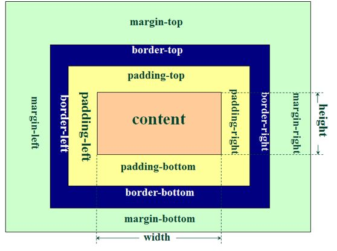

盒子
===

---

* ## 盒子模型解释

    元素在页面中显示成一个方块，类似一个盒子，CSS盒子模型就是使用现实中盒子来做比喻，帮助我们设置元素对应的样式。盒子模型示意图如下：

    


    把元素叫做盒子，设置对应的样式分别为：**盒子的边框(border)**、**盒子内的内容和边框之间的间距(padding)**、**盒子与盒子之间的间距(margin)**。


* ## 盒子模型的尺寸

    * ##### 按照下面代码制作页面：

        ```html
        <!DOCTYPE html>
        <html lang="en">
        <head>
            <meta charset="UTF-8">
            <title>盒子的真实尺寸</title>
            <style type="text/css">
                .box01{width:50px;height:50px;background-color:gold;}
                .box02{width:50px;height:50px;background-color:gold;border:50px
                solid #000}
                .box03{width:50px;height:50px;background-color:gold;border:50px
                solid #000;padding: 50px;}
            </style>
        </head>
        <body>
            <div class="box01">1</div>
            <br />
            <div class="box02">2</div>
            <br />
            <div class="box03">3</div>
        </body>
        </html>
        ```

    * ##### 页面显示效果如下：

        <!DOCTYPE html>
        <html lang="en">
        <head>
            <meta charset="UTF-8">
            <title>盒子的真实尺寸</title>
            <style type="text/css">
                .box01{width:50px;height:50px;background-color:gold;}
                .box02{width:50px;height:50px;background-color:gold;border:50px
                solid #000}
                .box03{width:50px;height:50px;background-color:gold;border:50px
                solid #000;padding: 50px;}
            </style>
        </head>
        <body>
            <div class="box01">1</div>
            <br />
            <div class="box02">2</div>
            <br />
            <div class="box03">3</div>
        </body>
        </html>

    * 通过上面的页面得出结论：盒子的width和height设置的是盒子内容的宽和高，不是盒子本身的宽和高，盒子的真实尺寸计算公式如下：
        
        * 盒子宽度 = width + padding左右 + border左右
        * 盒子高度 = height + padding上下 + border上下

    * **在布局中，如果我想增大内容和边框的距离，又不想改变盒子显示的尺寸，应该怎么做？**

        * 也就是使用padding时会让改变当前元素的尺寸,可以使用
        * box-sizing：content-box | border-box
        * 默认值：content-box

    * **课堂练习 请制作图中所示的标题：**

        


* ## margin相关技巧

    1. 设置元素水平居中： margin:x auto;
    1. margin负值让元素位移及边框合并

* ## 外边距合并

    * 外边距合并指的是，当两个垂直外边距相遇时，它们将形成一个外边距。合并后的外边距的高度等于两个发生合并的外边距的高度中的较大者。解决方法如下：

        * 外部盒子设置一个边框
        * 外部盒子设置 overflow:hidden
        * 使用伪元素类           
            ```css
            .clearfix:before{
                content: '';
                display:table;
            }
            ```