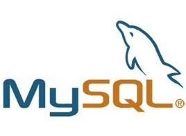

MySQL 数据库管理系统
===

---

* ## 一、 什么是数据库？

    ```sql
    数据库（Database）是按照数据结构来组织、存储和管理数据的仓库，
    
    每个数据库都有一个或多个不同的API用于创建，访问，管理，搜索和复制所保存的数据。
    
    我们也可以将数据存储在文件中，但是在文件中读写数据速度相对较慢。
    
    所以，现在我们使用关系型数据库管理系统（RDBMS）来存储和管理的大数据量。所谓的关系型数据库，
    是建立在关系模型基础上的数据库，借助于集合代数等数学概念和方法来处理数据库中的数据。
    ```

    **RDBMS**即**关系数据库管理系统**(Relational Database Management System)，其特点如下：

    1. 数据以表格的形式出现

    1. 每行为各种记录名称

    1. 每列为记录名称所对应的数据域

    1. 许多的行和列组成一张表单

    1. 若干的表单组成database


* ## 二.数据库作用以及常见数据库

    * ### 作用

        1. 持久保存
        1. 方便查询并提取满足条件的数据, 数据访问速度快
        1. 处理并发访问
        1. 权限管理

    * ### 常见数据库

        * 关系型数据库

            ```python
            MySQL ->库->表->数据     MySQL    Oracle    PostgreSQL    SQL Server ....
            ```
        * 非关系型数据库

            ```python
            Redis ->数据   MongoDB  ...
            ```
    
    * ### 概念

        ```python
        数据： data

        数据库： DB

        数据库管理系统：DBMS

        数据库系统：DBS
        ```

* ## 三.认识Mysql数据库

    

    ```python
    Mysql是最流行的关系型数据库管理系统，在WEB应用方面MySQL是
    最好的RDBMS(Relational Database Management System：关系数据库管理系统)应用软件之一。

    MySQL是一个关系型数据库管理系统，由瑞典MySQL AB公司开发，目前属于Oracle公司。MySQL是一种关联数据库管理
    系统，关联数据库将数据保存在不同的表中，而不是将所有数据放在一个大仓库内，这样就增加了速度并提高了灵活性。

    Mysql是开源的，所以你不需要支付额外的费用。

    Mysql支持大型的数据库。可以处理拥有上千万条记录的大型数据库。

    MySQL使用标准的SQL数据语言形式。

    Mysql可以允许于多个系统上，并且支持多种语言。这些编程语言
    包括C、C++、Python、Java、Perl、PHP、Eiffel、Ruby和Tcl等。

    Mysql对PHP有很好的支持，PHP是目前最流行的Web开发语言。

    MySQL支持大型数据库，支持5000万条记录的数据仓库，
    32位系统表文件最大可支持4GB，64位系统支持最大的表文件为8TB。

    Mysql是可以定制的，采用了GPL协议，你可以修改源码来开发自己的Mysql系统。
    ```


