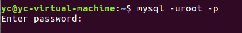

MySQL基础操作
===

---

```sql
使用方法:

    ​方式一: 通过图型界面工具,如 Navicat 等( 高级课使用 )

    ​方式二: 通过在命令行敲命令来操作 ( 基础阶段使用 )
```


* ### SQL ( Structure query language ) 结构化查询语言

    ```sql
    SQL语言分为4个部分：DDL（定义）、DML（操作）、DQL（查询）、DCL（控制）
    ```

* ### SQL语句中的快捷键

    ```sql
    \G 格式化输出（文本式，竖立显示）

    \s 查看服务器端信息

    \c 结束命令输入操作

    \q 退出当前sql命令行模式

    \h 查看帮助
    ```

* ### SQL ( Structure query language ) 结构化查询语言

    ```sql
    SQL语言分为4个部分：DDL（定义）、DML（操作）、DQL（查询）、DCL（控制）
    ```

* ### 操作数据库的步骤

    **连接, 打开库, 操作, 关闭退出**

    * #### 1. 通过命令行连接MySQL

        

        ```sql
        mysql -h 127.0.0.1 -uroot -p123456 -P3306

        -h      服务器地址
        -u      用户名
        -p      密码
        -P      (大写P)端口
        ```

        * #### 数据库语法的特点

            * SQL 语句可以换行, 要以分号结尾
                ```sql
                select * from test;
                ``` 
            * 命令不区分大小写。关键字和函数建议用大写（最好用大写）
                ```sql
                SELECT * FROM user WHERE uid=17;
                ```
            * 如果提示符为 `'>` 那么需要输入一个`'+回车` 
                
                * 

            * 命令打错了换行后不能修改, 可以用 \c 取消
                
                * 

    * #### 2. 数据库操作

        ```sql
        查看数据库 show databases;

        创建数据库 create database 库名 default charset=utf8;

        删除数据库 drop database 库名;

        打开数据库 use 库名;
        ```

    * #### 3. 记录操作 增删改查

        ```sql
        插入
            insert into 表名(字段1,字段2,字段3) values(值1,值2,值3);

            ​insert into 表名(字段1,字段2,字段3) values(a值1,a值2,a值3),(b值1,b值2,b值3);

        ​查询 
            select * from 表名;

            ​select 字段1,字段2,字段3 from 表名;

            ​select * from 表名 where 字段=某个值;

        ​修改 
            update 表名 set 字段=某个值 where 条件;

            ​update 表名 set 字段1=值1,字段2=值2 where 条件;

            ​update 表名 set 字段=字段+值 where 条件;

        ​删除 
            delete from 表名 where 字段=某个值;
        ```

    * #### 4. 数据表操作
        ```sql
        查看表: show tables;

        ​创建表: create table 表名(字段名1 类型,字段名2 类型)engine=innodb default charset=utf8;

        ​创建表: 如果表不存在,则创建, 如果存在就不执行这条命令

        ​create table if not exists 表名(

            ​字段1 类型,

            ​字段2 类型

        ​ );

        ​删除表: drop table 表名;

        ​表结构: desc 表名;
        ```
        * **数据库管理系统中, 可以有很多库, 每个数据库中可以包括多张数据表**

        * 

        * 


    

* ### 退出MySQL

    ```sql
    ​exit; 或者 quit;
    ```