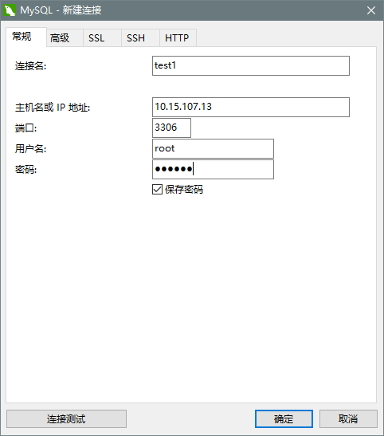

MySQL基础
===

---

> 熟练掌握MySQL的安装及基础使用

* ## 在Ubuntu16.04下安装MySQL

    * ### 首先执行下面三条命令：

        ```bash
        sudo apt-get install mysql-server

        sudo apt install mysql-client

        sudo apt install libmysqlclient-dev
        ```

    * ### 安装成功后可以通过下面的命令测试是否安装成功

        ```bash
        sudo  netstat -tap | grep mysql
        ```

    * ### 出现如下信息证明安装成功

        ```bash
        tcp6       0      0 [::]:mysql              [::]:*                  LISTEN      
        1123/mysqld  
        ```

    * ### 可以通过如下命令进入mysql服务

        ```sql
        mysql -uroot -p你的密码
        ``` 

    * ### 设置mysql允许远程访问

        ```bash
        sudo vi /etc/mysql/mysql.conf.d/mysqld.cnf

        注释掉bind-address = 127.0.0.1：
        ```
    
    * ### 保存退出，然后进入mysql服务，执行授权命令
        
        ```sql
        grant all on *.* to root@'%' identified by '123456' with grant option;

        刷新生效，否则就要重启MySQL服务才可以
        flush privileges;
        ```

    * ### 然后执行quit命令退出mysql服务，执行如下命令重启mysql

        ```sql
        service mysql restart
        ```

* ## 在windows下可以使用navicat远程连接ubuntu下的mysql服务

    

    * 连接名：自己定义
    * 主机名或IP地址：写自己Ubuntu的ip地址
    * 端口：3306
    * 用户名：写自己Ubuntu中MySQL的用户名
    * 密码：写自己Ubuntu中MySQL的密码

    * ### 可能出现的错误

        ```bash
        Ubuntu中更新软件时经常会碰到一个问题：
        E: 无法获得锁 /var/cache/apt/archives/lock - open (11 资源临时不可用)
        E: 无法对下载目录加锁
        造成该问题的原因是系统中只允许有一个apt-get进程，当前的锁已经被占用了。
        我们可以关掉当前的apt-get进程后，再执行我们自己的操作。
        解决方案一：
            先执行命令ps aux | grep apt-get，找出当前的apt-get进行，然后kill掉该进程。
        解决方案二：
            直接rm rm /var/cache/apt/archives/lock 和 rm /var/lib/dpkg/lock。
        ```

* ## Ubuntu16.04完全卸载Mysql 5.7

    ```bash
    sudo apt purge mysql-*

    sudo rm -rf /etc/mysql/ /var/lib/mysql

    sudo apt autoremove
    ```