B+ 树
---

B+ 树 是基于B- 树的一种变体，有着比B- 输更高的查询性能。

---

### 一个m阶的B+树具有如下几个特征：

1. 有k个子树的中间节点包含有k个元素（B树中是k-1个元素），每个元素不保存数据，只用来索引，所有数据都保存在叶子节点。

2. 所有的叶子结点中包含了全部元素的信息，及指向含这些元素记录的指针，且叶子结点本身依关键字的大小自小而大顺序链接。

3. 所有的中间节点元素都同时存在于子节点，在子节点元素中是最大（或最小）元素。

---

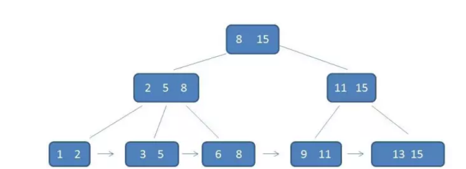

首先，每一个父节点的元素都出现在子节点中，是子节点的最大（或最小）元素。

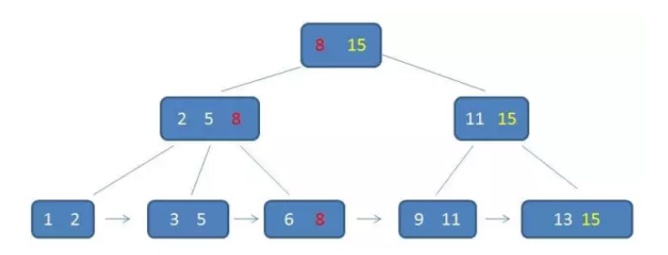

在上面这棵树中，根节点元素8是自己点2,5，8的最大元素，也是叶子节点6,8的最大元素。

根节点元素15 是子节点11,15的最大元素，也是叶子节点13,15的最大元素。

需要注意的是，根节点的最大元素（这里是15），也就是等同于整个B+树的最大元素。以后无论插入删除多少元素，始终要保持最大元素在根节点当中。

至于叶子节点，由于父节点的元素都出现在子节点，因此所以叶子节点包含了全量元素信息。

并且每一个叶子节点都带有指向下一个节点的指针，形成了一个有序链表。

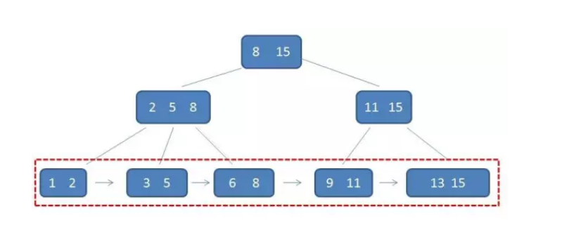

B+ 树还有一个特点，这个特点是在索引之外，确是至关重要的特点。那就是 [ 卫星数据 ] 的位置。

所谓卫星数据，指的是索引元素所指向的数据记录，比如数据库中的某一行。在B- 树中，无论中间节点还是叶子节点都带有卫星数据。

---

#### B-树中的卫星数据（Satellite Information）：

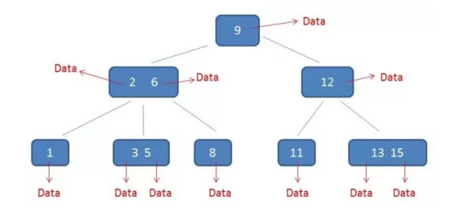

而在B+树当中，只有叶子节点带有卫星数据，其余中间节点仅仅是索引，没有任何数据关联。

---

#### B+树中的卫星数据（Satellite Information）：

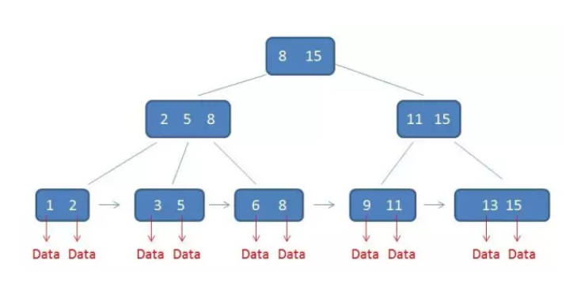

需要补充的是，在数据库的聚集索引（Clustered Index）中，叶子节点直接包含卫星数据。在非聚集索引（NonClustered Index）中，叶子节点带有指向卫星数据的指针。

---

B+ 树设计成这样，究竟有什么好处呢？
---

B+树的好处主要体现在查询性能上。下面我们分别通过单行查询和范围查询来做分析。

在单元素查询的时候，B+树会自顶向下逐层查找节点，最终找到匹配的叶子节点。比如我们要查找的是元素3

第一次磁盘IO：
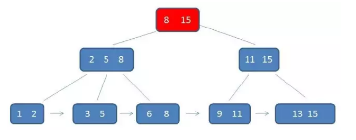
第二次磁盘IO：
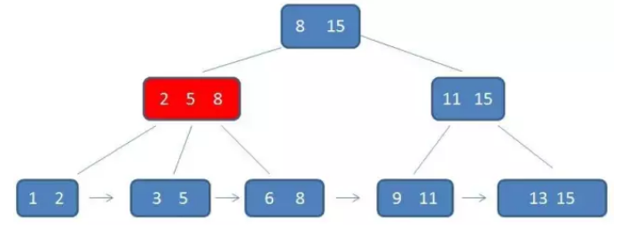
第三次磁盘IO：
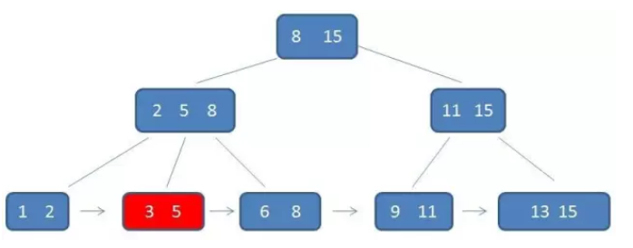

---

查询：

首先，B+树的中间节点没有卫星数据，所以同样大小的磁盘页可以容纳更多的节点元素。

数量相同的情况下，B+树的结构比B- 树更加“矮胖”，因此查询时IO次数也更少。

其次，B+ 树的查询必须最终查找到叶子节点，而B-树只要找到匹配元素即可，无论匹配元素处于中间节点还是叶子节点。

因此，B- 树的查找性能并不稳定（最好情况是指查根节点，最坏情况是查到叶子节点）。而B+树的每一次查找都是稳定的。

---

B- 树做范围查询，依靠繁琐的中序遍历。比如我们要查询范围3到11的元素：

#### B-树的范围查找过程：

自顶向下，查找到范围的下限（3）：

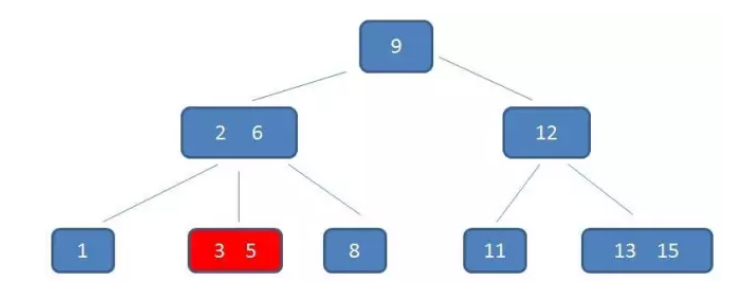

中序遍历到元素6：
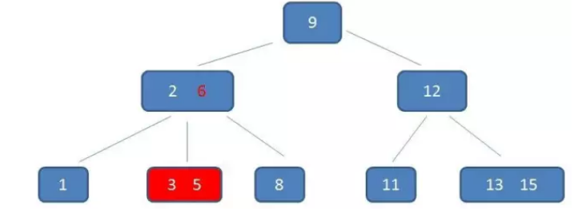
中序遍历到元素8：
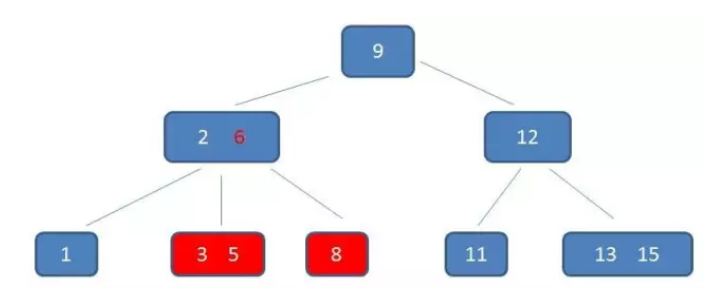
中序遍历到元素9：
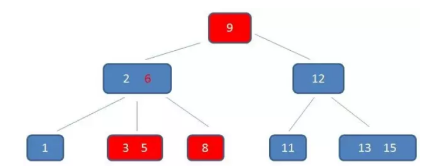
中序遍历到元素11，遍历结束：
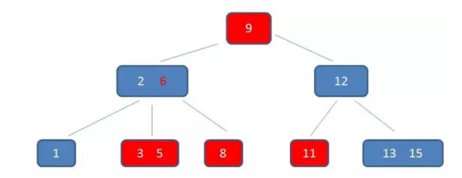

---

B+ 树的范围查询，则要简单的多，只需要在链表上左遍历即可：

#### B+树的范围查找过程：

自顶向下，查找到范围的下限（3）：
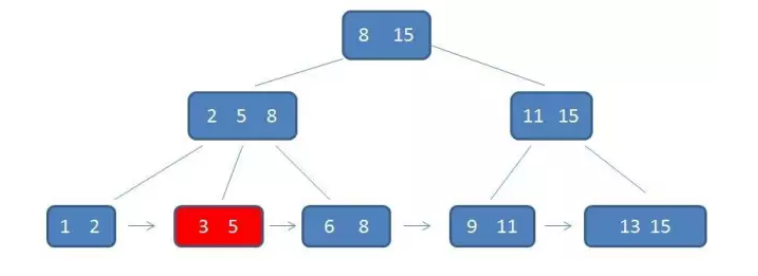
通过链表指针，遍历到元素6, 8：
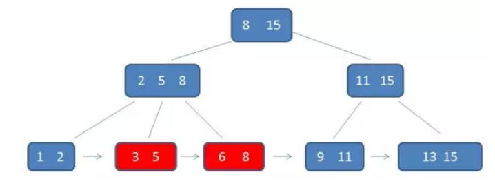
通过链表指针，遍历到元素9, 11，遍历结束：
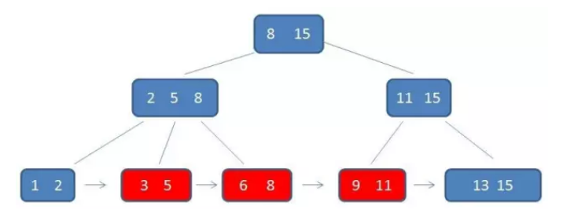

---

综合起来，B+ 树相比B- 树的优势有三个：
1. IO次数更少；
1. 查询性能稳定；
1. 范围查询简便。

至于B+ 树的插入和删除，过程与B- 树大同小异。那么以B- 树 为参考。

---

# 最后总结一下：B+ 树的特征和优势：

B+树的特征：
---

1. 有k个子树的中间节点包含有k个元素（B树中是k-1个元素），每个元素不保存数据，只用来索引，所有数据都保存在叶子节点。

2. 所有的叶子结点中包含了全部元素的信息，及指向含这些元素记录的指针，且叶子结点本身依关键字的大小自小而大顺序链接。

3. 所有的中间节点元素都同时存在于子节点，在子节点元素中是最大（或最小）元素。

---

B+树的优势：
---

1. 单一节点存储更多的元素，使得查询的IO次数更少。
2. 所有查询都要查找到叶子节点，查询性能稳定。
3. 所有叶子节点形成有序链表，便于范围查询。

