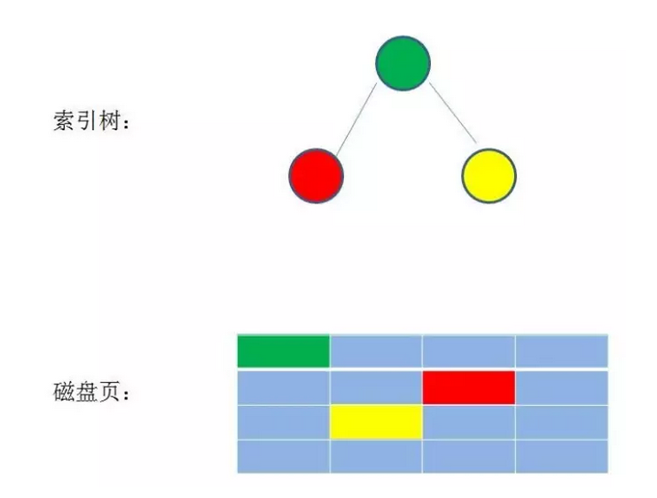
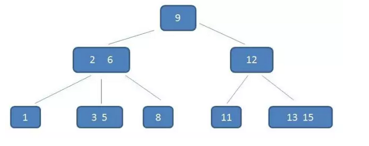
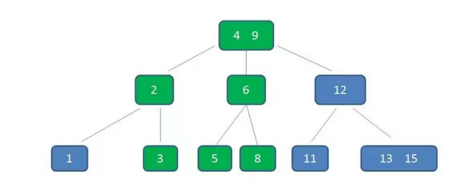
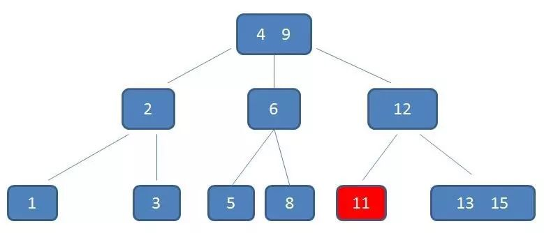
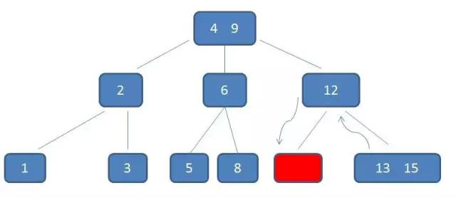
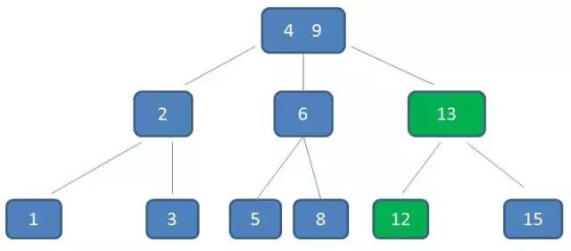

## 什么是B-Tree?

##### mysql 数据库用过吧?里面的索引是基于什么数据结构？

答：索引主要是基于Hash 表或者 B+ 树

##### 那么 说一说 B+ 树 的实现细节是什么样？ B- 树和B+ 树 有什么区别？联合索引在B+ 树 中如何存储的？

答：首先需要注意的是，B- 树就是B 树，中间的横线并不是减号。

数据库索引使用树结构存储，是因为树的查询效率高，而且可以保持有序。

---

##### 既然这样，为什么索引没有使用二叉树来实现呢？

二叉查找树查询的事件复杂度是o(logN)，从算法逻辑上来讲，二叉查找树的查找速度和比较次数都是最小的。但是我们不得不考虑一下一个现实问题，那就是磁盘IO。

数据库索引是存储在磁盘上的，当数据量比较大的时候，索引的大小可能有几个G甚至更多。

当我们利用索引查询的时候，不可能把整个索引全部加载到内存，能做到的只有逐一加载每一页磁盘页，这里的磁盘页对应索引树的节点.

---

#####如果我们利用二叉查找树作为索引结构，情形是什么样的呢？

假设树的高度是4，查找的值是10，那么磁盘IO 的次数是4次，索引树的高度也是4，所以最坏情况下，磁盘IO次数等于索引树的高度。

既然这样，为了减少磁盘IO次数，我们需要把原本“瘦高”的树结构变得"矮胖".这就是B-树的特征之一。

B 树 是一种多路平衡查找树，它的每个节点最多包含K个孩子，K被称为B树的阶，k的大小取决于磁盘页的大小。

---

#### B-树（Balance Tree）特点：

下面来具体介绍一下B-树（Balance Tree），一个m阶的B树具有如下几个特征：

1.根结点至少有两个子女。

2.每个中间节点都包含k-1个元素和k个孩子，其中 m/2 <= k <= m

3.每一个叶子节点都包含k-1个元素，其中 m/2 <= k <= m

4.所有的叶子结点都位于同一层。

5.每个节点中的元素从小到大排列，节点当中k-1个元素正好是k个孩子包含的元素的值域分划。

我们以一个3 阶 B- 树为例，来看看B- 树 的具体结构，树中的具体元素和刚才的二叉查找树是一样的。

我们来细看一下树中的 元素 1 小于2 ， 3 5 位于2 和6 之间，8 大于6，8 大于（3,5），正好符合刚好所列的几条特征。

当我们要查找一个元素 5 的时候，那么我们去比较我们要查找的元素和树的结点的值比较大小，下于根节点的话，就去左边查找，5位于2和6 之间，那么我们就去中间的结点查找，然后就能找到5.

通过整个流程我们可以看出，B- 树在查询中的比较次数其实不比二叉查找树少，尤其是当一节点中的元素数量很多的时候。

可是相比于磁盘IO的速度，内存中的比较韩式几乎可以忽略的，所以只要树的高度足够低，IO次数足够少，就可以提升查找性能。相比之下节点内部元素所以写也没有关系，仅仅是多了几次内存交互，只要不超过磁盘页的大小即可，这就是B- 树的优势之一。

---

##### 插入元素4：

假如我们要插入4 ，节点3，5已经是两元素节点，无法再增加。父亲节点 2， 6 也是两元素节点，也无法再增加。根节点9是单元素节点，可以升级为两元素节点。于是**拆分**节点3，5与节点2，6，让根节点9升级为两元素节点4，9。节点6独立为根节点的第二个孩子。

让B- 树能够始终维持多路平衡，这也是B-树的一大优势：自平衡。

---

##### 删除元素11：

自顶向下查找元素11的节点位置。

删除11后，节点12只有一个孩子，不符合B树规范。因此找出12,13,15三个节点的中位数13，取代节点12，而节点12自身下移成为第一个孩子。（这个过程称为**左旋**）

以上就是B-树的插入和删除。

---

##### B-树都有哪些实际应用的?

B-树主要用于文件系统以及部分数据库索引，比如著名的非关系型数据库`MongoDB`。

而大部分关系型数据库，比如Mysql，则使用B+ 树作为索引。

磁盘的存储是用B+ 树。

---

