二叉查找树（BST）具备什么特性呢？
---

1. 左子树上所有结点的值均小于或等于它的根结点的值。

1. 右子树上所有结点的值均大于或等于它的根结点的值。

1. 左、右子树也分别为二叉排序树。

下图中这棵树，就是一颗典型的二叉查找树：

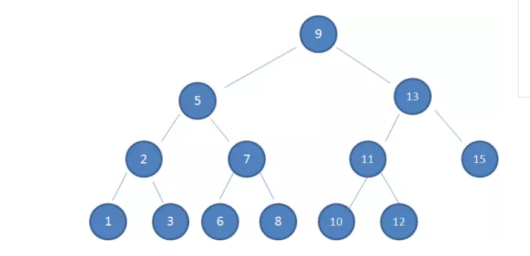

二叉查找树的思想：查找所需的最大次数等同于二叉查找树的高度。

在插入节点的时候也是利用类似的方法，通过一层一层比较大小，找到新节点合适插入的位置。

二叉查找树也存在缺陷：

假设初始的二叉查找树只有三个节点，根节点值为9，左孩子值为8，右孩子值为12：

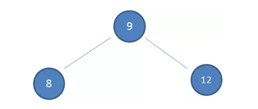

接下来我们依次插入如下五个节点：7,6,5,4,3。依照二叉查找树的特性，结果会变成什么样呢？

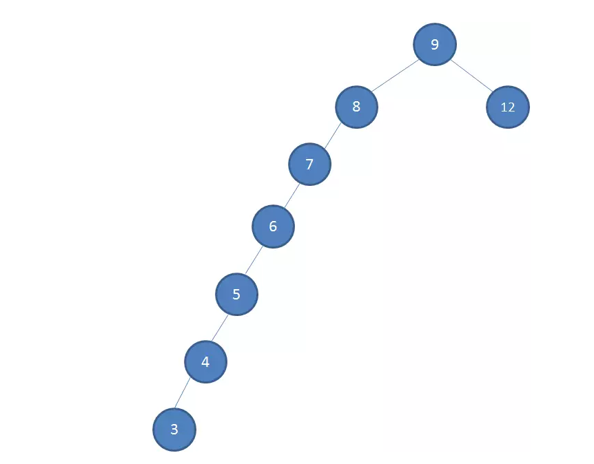

正是如此，这样的形态虽然也符合二叉查找树的特性，但是查找的性能大打折扣，几乎变成了线性。

那么为了解决多次插入新节点而导致的不平衡，红黑树就应运而生了。

不均衡的情况会严重影响搜索效率。将2-3树的思想铺开，能够得到2-3-4树。这次要说的是红黑树，红黑树是根据2-3-4树的思想，对2-3-4树进行实现。先来看看红黑树的样子。

---

下图中这棵树，就是一颗典型的红黑树：

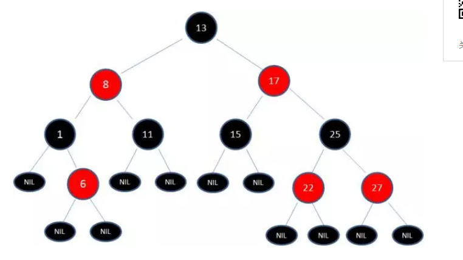

---

红黑树和2-3-4树的关系：

红色节点可以看作是与其父节点组成的多元节点，比如 3 右子树是 4，4是红色，所以可以看作是 3，4多元节点

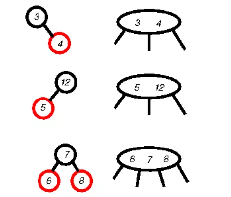

按照上面的红黑树与2-3-4树的关系，我们可以这样来看红黑树：

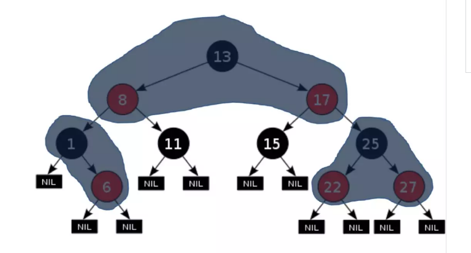

**Red Black Tree 红黑树 **是一种自平衡的二叉查找树，吃了符合二叉查找树的基本特性外，它还具有下列的附加特性：

1. 节点是红色或黑色。

1. 根节点是黑色。

1. 每个叶子节点都是黑色的空节点（NIL节点）。

1. 每个红色节点的两个子节点都是黑色。(从每个叶子到根的所有路径上不能有两个连续的红色节点)

1. 从任一节点到其每个叶子的所有路径都包含相同数目的黑色节点。

### 经过上面的定义，我们可以发现下面几个事实：

1. 两个红节点不能相连

2. 从 x 到 x 的后代叶节点的路径上，黑色节点的数量是相同的。我们可以把这个数量定义称为 bh(x). 其中不包含x。

3. 从跟节点到叶节点的长度差不会超过一倍。

4. 包含n个内部节点的红黑树，height <= 2log(n+1)

正因为这些规则限制，才保证了红黑树的自平衡。红黑树从根到叶子的最长路径不会超过最短路径的2倍。

当插入或删除节点的时候，红黑树的规则有可能被打破，这时候就需要作出一些调整，来继续维持我的规则。

什么情况下会破坏红黑树的规则，什么情况下不会破坏规则呢？我们举两个简单的栗子：

1.向原红黑树插入值为14的新节点：

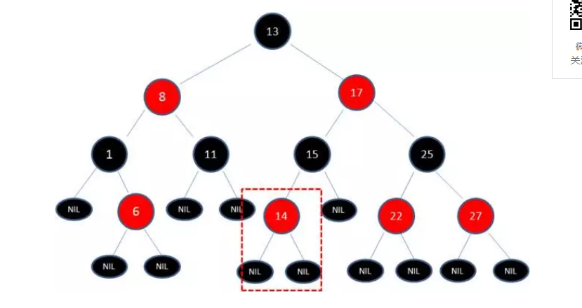

由于父节点15是黑色节点，因此这种情况并不会破坏红黑树的规则，无需做任何调整。

---

2.向原红黑树插入值为21的新节点：

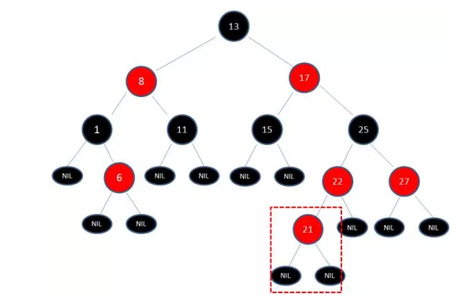

由于父节点22是红色节点，因此这种情况打破了红黑树的规则4（每个红色节点的两个子节点都是黑色），必须进行调整，使之重新符合红黑树的规则。

---

插入：
---

将需要插入的元素z按照常规的二叉搜索树进行插入，颜色是红色。

然后需要处理对于红黑树的定义违反之处。

    a) 跟节点是红色的，那么就让跟节点变成黑色。

    b) z 和 z 的父节点都是红色的。处理这种情况，总共有三种

---

##### 六种冲突情况的处理，假设新加入的节点是z：

1. 父节点和父节点的兄弟节点都是红色的处理方法

    a) 将z的父节点和父的兄弟节点都变成黑色

    b) 将z的祖父节点变成红色

    c) z的祖父节点变成红色后，循环处理冲突

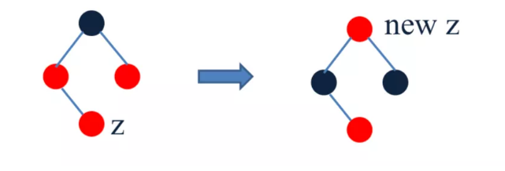

---

2. z的父节点是红色，叔叔节点是黑色, z 的父节点是左孩子，z是右孩子。

    a) 在z的父节点执行左移操作

    b) 让 z 的左孩子成为新的新插入的z节点，继续处理冲突。

 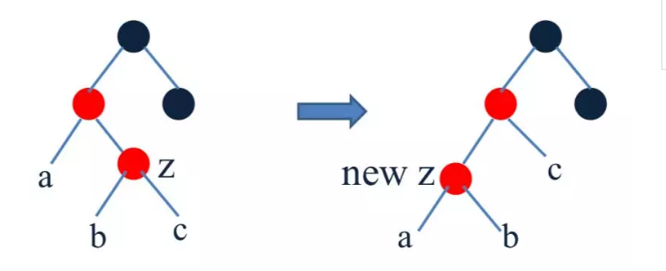   

    z的父节点是红色，叔叔节点是黑色, z 的父节点是右孩子，z是左孩子。

        a. 在z的父节点执行右移操作
        b. 让 z 的右孩子成为新的新插入的z节点，继续处理冲突。

---

3. z的父节点是红色，叔叔节点是黑色, z 的父节点是左孩子，z是左孩子。

    a) 在z的祖父节点右移一次
    b) 将z的parent和z的兄弟节点交换颜色

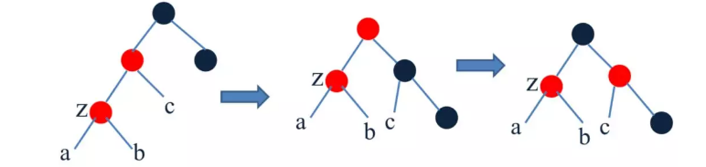 

z的父节点是红色，叔叔节点是黑色, z 的父节点是右孩子，z是右孩子。

    a) 在z的祖父节点左移一次
    b) 将z的parent和z的兄弟节点交换颜色

---

删除：
---

#### 先回顾二叉搜索树的删除操作：

1. 如果删除的节点是z，z没有孩子节点，直接删除

2. 如果z包含有一个孩子, 那么就将z去除掉，让z的这个孩子替代之前z的位置。

3. 如果z包含两个孩子，我们就去寻找一个successor y 来替代z，然后将y删除。又是一个递归的过程。

successor y 的寻找顺序：

z右孩子的最左节点

z左孩子的最右节点

举个例子（删除节点中的32）：
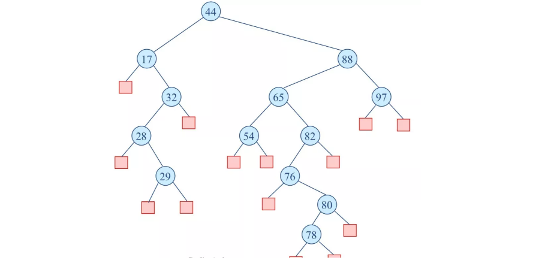 

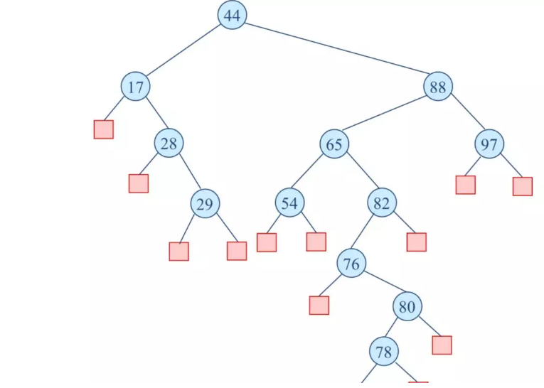 

下面的过程是删除节点65:
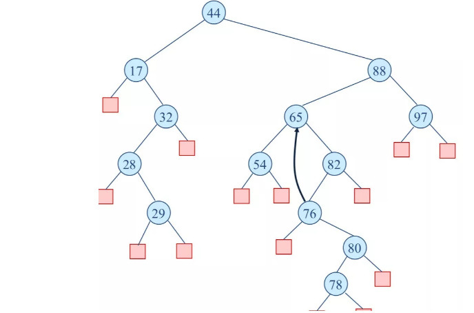 
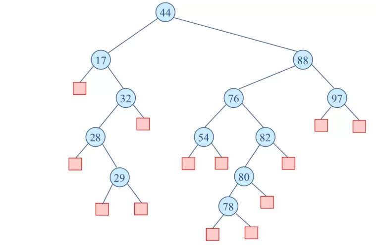 

---

红黑树的删除操作：
---

1. 就像是普通的搜索二叉树一样删除一个节点z
2. 如果z包含有两个孩子，那么拷贝y的值给z的时候，不要复制颜色
3. 让y成为需要被删除的那个节点
4. 如果 y 是红色的，那么不影响红黑树的属性
5. 如果 y 是黑色的，那么就一定产生了红黑树的冲突。
6. 假设 x 是 y 的那个唯一的孩子节点，x也有可能为空。
    * 假设 x 是 红色的, 直接将x改成黑色即可
    * 假设 x 是黑色的
        1. x的兄弟节点 w 是红色的。
                左移一位，然后修改B和D的颜色，就变成了 2，3，4
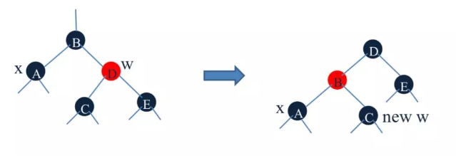

        2. x的兄弟节点 w 是黑色的，w的两个孩子也是黑色的。w变为红色
            将 x 变成它的父节点，继续循环第六步

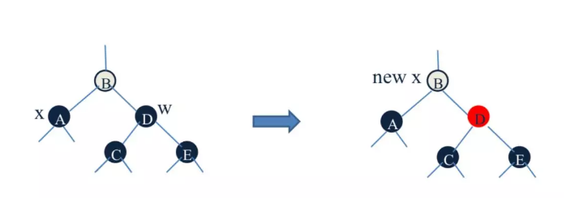

        3. x的兄弟节点 w 是黑的，w的左孩子是红色的，右孩子是黑色的

            右旋转w，交换w和它的孩子的颜色。转变成了 4

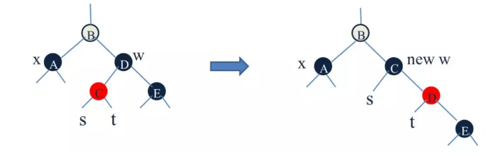

         4. x的兄弟节点 w 是黑色的，w的右孩子是红色的。
            以x的父节点为基准左旋转，然后改变w的的右孩子的颜色。
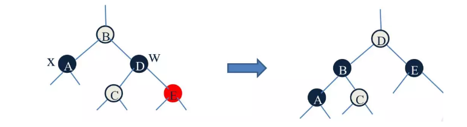
    以上就是红黑树的删除操作。

---

红黑树在哪些地方被实际应用到？
---

红黑树的应用有很多，其中JDK的结合类TreeMap 和TreeSet 底层就是红黑树实现的。

---

内存中的搜索树是用红黑树来实现的。
如果在内存中存储数据，就用到了红黑树。
