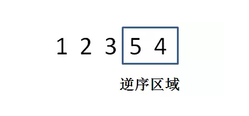
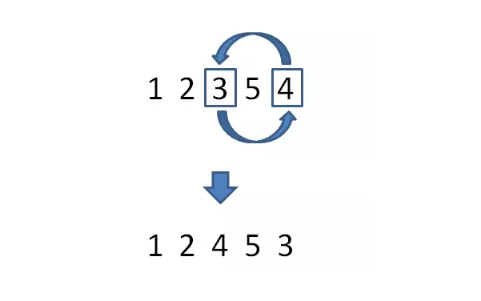
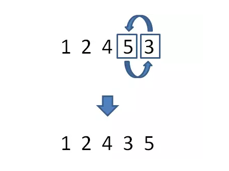

算法题目：
---

###### 给定一个正整数，实现一个方法来求出离该整数最近的大于自身的“换位数”。

什么是换位数呢？就是把一个整数各个数位的数字进行全排列，从而得到新的整数。例如53241和23541。

这种经过换位的整数应该如何称呼，所以姑且称其为“换位数”。

---

题目要求写一个方法来寻找最近的且大于自身的换位数。比如下面这样： 

#####输入12345，返回12354

#####输入12354，返回12435

#####输入12435，返回12453

---

思路分析：
--

如果是固定的几个数字，应该是 `逆序` 情况下最大， `顺序` 情况下最小。

---

##### 举一个栗子：

给定1,2,3,4,5这几个数字。

最大的组合：54321

最小的组合：12345

顺序和逆序是两种极端的组合。

---

比如给定整数12354，如何找到离它最近且大于它的换位数呢？

为了和原数接近，我们需要尽量保持**高位不变，低位在最小的范围内变换顺序**。

那么，究竟需要变换多少位呢？这取决于当前整数的**逆序区域**。

如图所示，12354 的逆序区域是最后两位，仅看到这两位，已经是当前的最大组合，若想最接近原数，又比原数更大，必须从**倒数第3位**开始改变。

怎样改变呢？12345 的倒数第三位是3，我们需要从后面的逆序区域中寻找到刚刚大于3的数字，和3的位置进行互换：

互换后的临时结果是12453，倒数第3位已经确定，这时候最后两位仍然是逆序状态。我们需要把最后两位**转变回顺序**，以此保证在倒数第3位数值为4的情况下，后两位尽可能小：

这样一来，我们就得到了想要的结果12435。

---

总结：
---

 #### 获取最近换位数的三个步骤：
1. 从后向前查看逆序区域，找到逆序区域的前一位，也就是数字置换的边界

1. 把逆序区域的前一位和逆序区域中刚刚大于它的数字交换位置

1. 把原来的逆序区域转为顺序。

这种解法拥有一个高大上的名字：字典序算法，从左往右依次增大，对这就是字典序法。

---
~~~python
# -*- coding: UTF-8 -*-
import copy
def findTransferPoint(numbers):
    for i in range(len(numbers)-1,-1,-1):           #从后往前查找，找到逆序区域的前一位
        if numbers[i]>numbers[i-1]:
            return i
    return 0                                        #逆序返回0
 
 
def exchangeHead(numbers,index):
    head=numbers[index-1]
    for i in range(len(numbers)-1,-1,-1):
        if head<numbers[i]:
            numbers[index - 1] = numbers[i]
            numbers[i] = head
            break
    return numbers
 
 
def reverse(num,index):
    a = len(num)
    for k in range(index, a):
        for j in range(k+ 1, a):
            if num[k] > num[j]:
                num[k], num[j] = num[j], num[k]
    return num
 
 
def run():                                              #执行的函数
    numbers = [1,2,3,5,4]
    index=findTransferPoint(numbers)                    #找到交换的点
    if index:
        num=exchangeHead(numbers,index)                 #交换
        a=reverse(num,index)                            #逆序区域转化成有序
        print a
    else:
        print"没有更大的换位数"
 
run()

~~~

