布隆算法
---

---

首先在爬虫中我们爬取出来的URL 有可能存在重复，那么爬虫的总结上面已有，若不来理解爬虫的原理，那么请仔细阅读上面的章节。

那么爬虫爬取出来的URL有可能存在重复你，需要被丢弃掉，如何实现URL的去重呢？

---

#### URL 去重方案第一版：**HashSet**

创建一个HashSet集合，把每一个URL字符串作为HashSet的key插入到集合当中，利用HashSet的Key唯一性来对URL做去重

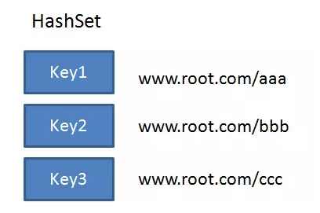

这个方案看似没毛病，但是经过几轮压测之后......

爬取的URL有好几亿个，HashSet 占内存空间太多了。

每一个URL按照20字节来算，一亿个URL就是20亿字节，也就是大约占了1.8G以上的空间。这么大的HashSet集合显然是不可取的。

那么python爬虫中就是用set来去重的。所以对于大量的数据它是有弊端的。

---

#### URL去重方案第二版：**Bitmap**

Bitmap是一种节省空间的数据结构：

具体怎么做呢？获取每一个URL的HashCode，根据HashCode的值来插入到Bitmap的对应位置。如果要插入位置的值已经是1，说明该URL已重复。

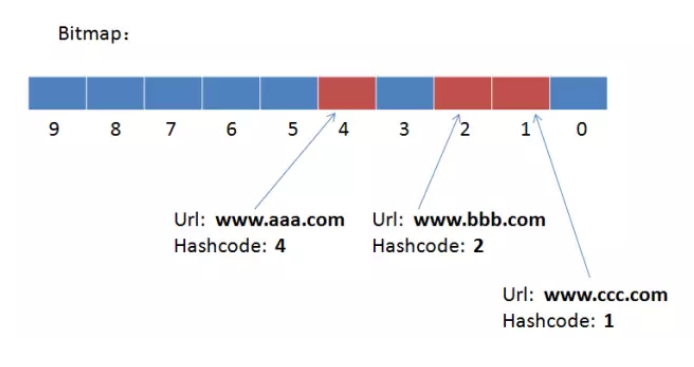

使用Bitmap以后，每一个Url只占了1个Bit，一亿个Url占约12MB。假设整个Bitmap的空隙比较多，额外空间占90%，总空间也不过是120MB，相比HashSet来说大大节省了内存空间。

---

但是字符串的HashCode 是会有重复的，不同的Url 的HashCode 很可能相同。。。

String的Hashcode方法虽然尽可能做到均匀分布，但仍然免不了会有冲突的情况。HashCode的冲突意味着什么呢？意味着两个原本并不相同的Url被误判为重复Url。

因此我们的Hash存在着一定的误判率。

---

布隆算法
---

布隆算法由BloomFilter音译二来，是另一种Bitmap集合为基础的排重算法。

布隆算法有许多的应用场景，比如URL的排重，垃圾邮箱地址的过滤等领域。

字符串的HashCode会有一定几率出现重复，要减少HaskCode重复的几率，

那么布隆算法 就会把每一个Hash结果都映射到同一个Bitmap上面。

具体怎样映射呢？流程如下：

1.创建一个空的Bitmap集合。
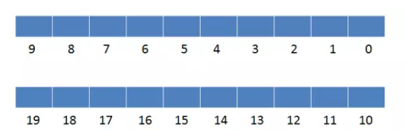

2.把第一个URL按照三种Hash算法，分别生成三个不同的Hash值。

3.分别判断5，17， 9 在Bitmap的对应位置是否为1，只要不同时为1，就认为该Url没有重复，于是把5，17，9的对应位置设置为1。

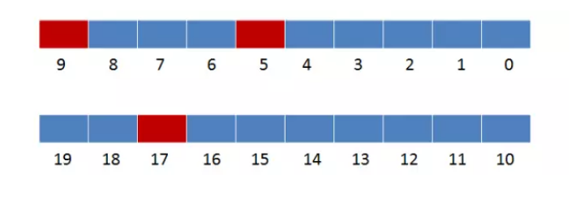

4.把第二个URL按照三种Hash算法，分别生成三个不同的Hash值。

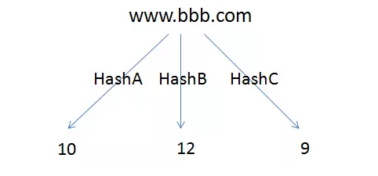

5.分别判断10，12， 9 在Bitmap的对应位置是否为1，只要不同时为1，就认为该Url没有重复，于是把10，12， 9 的对应位置设置为1。

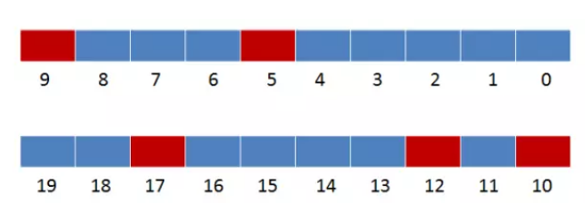

6.把第三个URL按照三种Hash算法，分别生成三个不同的Hash值。

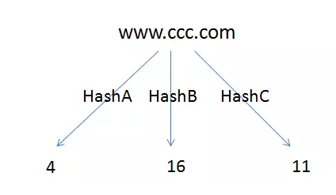

7.分别判断4，16， 11 在Bitmap的对应位置是否为1，只要不同时为1，就认为该Url没有重复，于是把4，16， 11 的对应位置设置为1。

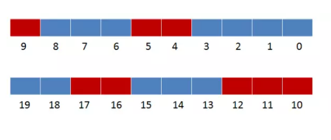

8.把第四个URL按照三种Hash算法，分别生成三个不同的Hash值。
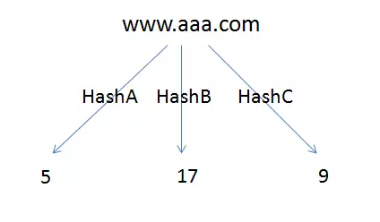

9.分别判断5，17， 9 在Bitmap的对应位置是否为1。判断的结果是 5，17， 9 在Bitmap对应位置的值都是1，所以判定该Url是一个重复的Url。

----

假如有一个新的url 【www.ddd.com】
要插进来，结果如下：

1.URL按照三个Hash算法得到三个结果。
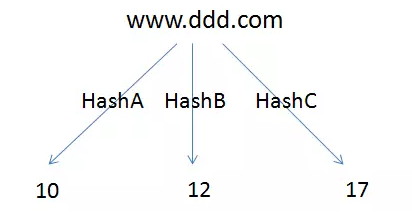

2.分别判断10，12， 17 在Bitmap的对应位置是否为1。判断的结果是 10，12， 17 在Bitmap对应位置的值都是1，所以判定该Url是一个重复的Url。

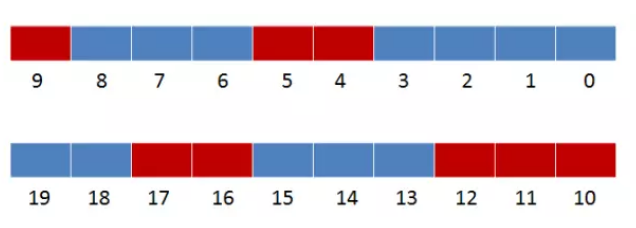

---

这种情况叫做【误判】。由此可见，布隆算法虽然极力降低了Hash冲突的几率，但是仍然有一定的误判率。

为了减少误判的几率，可以让Bitmap的空间更大一下，单个url所做的hash更多一些（一般是8次），总之是空间和准确率上做出一些取舍。

---

既然使用同一个Bitmap会出现误判，为什么不让每一种hash 算法的结果对应一个独立的Bitmap呢？
---

那样的话，占用的空间也会相应增加几倍，反而不如用HashSet了。

---

如何做到完全杜绝误判的情况？
---

对于爬虫来说，可以容许极少量的url误判为重复，如果是用于垃圾邮箱的过滤，可以考虑加上一个白名单，专门存储那些被误判的正常邮箱。

---

